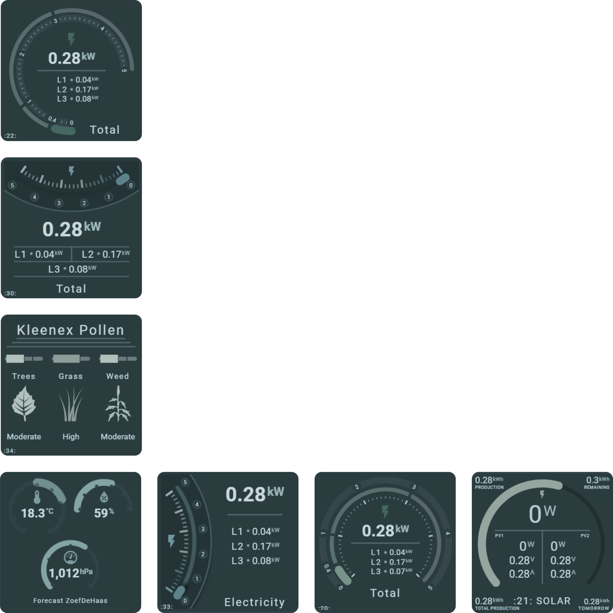

#   Flexible Horseshoe Card

[![stable][stable-badge]][release-url]
[![stable date][stable-date-badge]][release-url]
[![latest][latest-badge]][release-url]
[![latest date][latest-date-badge]][release-url]
[![downloads][downloads-badge]][release-url]

The Flexible Horseshoe Card is a highly configurable custom dashboard card for [Home Assistant][home-assistant]. It combines entity data, horseshoe gauges, text, icons, shapes, color behavior, animations, and history graphs in layouts that you control.

**[Read the Flexible Horseshoe Card manual][manual]** | **[Install the card][installation]** | **[Explore card examples][examples]**

<p align="center">
  <a href="https://flexible-horseshoe-card-manual.amoebelabs.com/">
    
  </a>
</p>

## What is the Flexible Horseshoe Card?

The card turns Home Assistant entity states and attributes into compact visual dashboard components. A card can contain one simple gauge and value, or combine multiple entities, horseshoes, labels, icons, shapes, and graphs into a complete reusable dashboard element.

Unlike cards with a fixed layout, Flexible Horseshoe Card lets you position every item individually or organize related items into groups. SVG-based rendering keeps layouts scalable, while Home Assistant integration supplies entity names, units, icons, localization, state colors, actions, and theme variables.

The refreshed horseshoe implementation remains compatible with the original YAML configuration. Existing cards should continue to work, although custom CSS or card-mod rules targeting the previous internal HTML or SVG structure may require adjustments.

## Installation

[](https://my.home-assistant.io/redirect/hacs_repository/?owner=AmoebeLabs&repository=flex-horseshoe-card&category=Dashboard)

Installing through [HACS][hacs] is recommended because it also manages future updates. The [installation guide][installation] covers HACS, manual installation, the Lovelace resource, and installation checks.

## Your first card

Replace the example entity with one from your Home Assistant instance:

```yaml
type: custom:flex-horseshoe-card
entities:
  - entity: sensor.living_room_temperature
    name: Living room
    unit: '°C'
    decimals: 1

layout:
  states:
    - id: temperature
      entity_index: 0
      xpos: 50
      ypos: 55
      styles:
        font-size: 3em

horseshoe_scale:
  min: 0
  max: 40

color_stops:
  0: '#2196f3'
  20: '#4caf50'
  30: '#ff9800'
  40: '#f44336'
```

Continue with [Card Structure][card-structure], [Entity Definitions][entity-definitions], [Layout Overview][layout-overview], and [Horseshoe Gauges][horseshoes].

## What can you build?

- **Flexible layouts and groups**: position items independently with the [positioning and groups guide][positioning-groups], then use the [groups section][groups] to move, scale, or rotate related items together.
- **Multiple horseshoe gauges**: add one or more [horseshoe gauges][horseshoes], configure their [scales and state arcs][horseshoe-scale-state], and finish them with [tick marks and labels][horseshoe-ticks-labels].
- **Entity content**: select states and attributes through [entity definitions][entity-definitions], then display values, names, areas, and icons with the available [entity parts][entity-parts].
- **Visual structure**: add circles, rectangles, arcs, horizontal lines, and vertical lines using the [visual shapes guide][visual-shapes].
- **History and sparkline graphs**: display [line][line-chart], [area][area-chart], [bar][bar-chart], and [dots][dots-chart] charts, or use advanced visual history components such as [equalizer][equalizer-chart], [graded][graded-chart], [barcode][barcode-chart], [radial barcode][radial-barcode-chart], and [state-band charts][state-bands-chart].
- **State-based colors and gradients**: define reusable [color stops and gradients][color-stops], combine them with [external color palettes][external-palettes], and apply them to horseshoes, graphs, icons, labels, and shapes.
- **Styling and movement**: control SVG and card appearance through [CSS styling][css-styling], then add transitions and state-driven behavior with [animations][animations].
- **Dynamic Home Assistant cards**: use [JavaScript templating][templating] for supported configuration values while retaining Home Assistant [localization, formatting, icons, and units][localization].
- **Reusable YAML**: start with the [reuse introduction][reuse], then reduce duplication with card templates, `same_as`, constants, `ref()`, and `calc()` from the [reuse reference][reuse-reference].

## Card gallery

<table>
  <tr>
    <td align="center">
      <a href="https://flexible-horseshoe-card-manual.amoebelabs.com/examples/demo-cards/demo-card-electricity-many/">
        
      </a><br>
      <a href="https://flexible-horseshoe-card-manual.amoebelabs.com/examples/demo-cards/demo-card-electricity-many/">Electricity card examples</a>
    </td>
    <td align="center">
      <a href="https://flexible-horseshoe-card-manual.amoebelabs.com/examples/demo-cards/demo-card-kleenex-pollen-many/">
        
      </a><br>
      <a href="https://flexible-horseshoe-card-manual.amoebelabs.com/examples/demo-cards/demo-card-kleenex-pollen-many/">Pollen radar card examples</a>
    </td>
  </tr>
  <tr>
    <td align="center">
      <a href="https://flexible-horseshoe-card-manual.amoebelabs.com/sections/sparkline-cartesian-charts/">
        
      </a><br>
      <a href="https://flexible-horseshoe-card-manual.amoebelabs.com/sections/sparkline-cartesian-charts/">Cartesian history charts</a>
    </td>
    <td align="center">
      <a href="https://flexible-horseshoe-card-manual.amoebelabs.com/sections/sparkline-specialized-charts/">
        
      </a><br>
      <a href="https://flexible-horseshoe-card-manual.amoebelabs.com/sections/sparkline-specialized-charts/">Specialized history charts</a>
    </td>
  </tr>
</table>

## Documentation

### Getting started

Read the [introduction to the Flexible Horseshoe Card][introduction] for an overview of its layout, styling, and Home Assistant integration. Follow the [installation guide][installation] to install the card through HACS or manually, then browse the [card examples overview][examples]. The complete [electricity card examples][electricity-examples] and [pollen radar card examples][pollen-examples] show how the individual features work together in larger cards.

### Configure a card

Start with the [card structure][card-structure] and define the Home Assistant data through [entity definitions][entity-definitions]. The [layout overview][layout-overview] explains how the available sections form a card, while [positioning and groups][positioning-groups] covers the shared coordinate system. Use the dedicated [groups section][groups] for grouped transformations, add values and labels from [entity parts][entity-parts], and complete the layout with [visual shapes][visual-shapes].

### Configure horseshoe gauges

The [horseshoe gauges overview][horseshoes] introduces single and multiple gauges. Continue with [horseshoe scale and state configuration][horseshoe-scale-state] to control geometry and value display, then add [tick marks and labels][horseshoe-ticks-labels]. The [color stops and gradients guide][color-stops] explains fixed colors, value ranges, segmented colors, and smooth gradients.

### Add history and sparkline graphs

Begin with the [sparkline graphs overview][sparklines] and select the required time range through [history periods and bins][history-periods]. The [Cartesian charts and axes guide][cartesian-charts] covers [line][line-chart], [area][area-chart], [bar][bar-chart], and [dots][dots-chart] charts. The [specialized sparkline charts guide][specialized-charts] covers [equalizer][equalizer-chart], [graded][graded-chart], [barcode][barcode-chart], [radial barcode][radial-barcode-chart], and [state-band displays][state-bands-chart].

### Style dynamic cards

Use [CSS styling][css-styling] for card and SVG presentation, and add state-driven movement through [animations][animations]. Shared colors can come from [external color palettes][external-palettes], while [color filters][color-filters] provide another way to alter visual elements. The card follows Home Assistant [localization and formatting][localization], and [JavaScript templating][templating] can make supported configuration values respond to entity states.

### Reuse configuration

The [introduction to reusable configuration][reuse] explains the available reuse layers and when to use them. Continue with the [reusable card examples][reuse-examples] for practical YAML, then use the [reuse reference][reuse-reference] when configuring templates, `same_as`, constants, `ref()`, or `calc()`.

## Releases and support

Use the [stable release][release-url] for normal dashboards. The latest release can be a development or pre-release version intended for testing new functionality. Browse all [GitHub releases][release-url] for version details or report reproducible problems through the [issue tracker][issues]. Flexible Horseshoe Card is built for [Home Assistant][home-assistant] and is distributed through the [Home Assistant Community Store][hacs].

## License and credits

Flexible Horseshoe Card is available under the MIT license.

The project builds on Home Assistant, Lit, SVG, CSS, and the work shared by the Home Assistant custom-card community. The archived historical README under `dev/reference/` preserves the original extended credits and legacy configuration reference.

<!-- Badges -->

[latest-badge]: https://img.shields.io/github/v/release/AmoebeLabs/flex-horseshoe-card?include_prereleases&logo=github&label=latest
[latest-date-badge]: https://img.shields.io/github/release-date-pre/AmoebeLabs/flex-horseshoe-card?logo=github&label=latest%20date
[stable-badge]: https://img.shields.io/github/v/release/AmoebeLabs/flex-horseshoe-card?logo=github&label=stable&cacheSeconds=3600
[stable-date-badge]: https://img.shields.io/github/release-date/AmoebeLabs/flex-horseshoe-card?logo=github&label=stable%20date
[downloads-badge]: https://img.shields.io/github/downloads/AmoebeLabs/flex-horseshoe-card/total?logo=github&label=downloads%20since%20May%202026

<!-- Project links -->

[home-assistant]: https://www.home-assistant.io/
[hacs]: https://hacs.xyz/
[issues]: https://github.com/AmoebeLabs/flex-horseshoe-card/issues
[release-url]: https://github.com/AmoebeLabs/flex-horseshoe-card/releases

<!-- Manual links -->

[manual]: https://flexible-horseshoe-card-manual.amoebelabs.com/
[introduction]: https://flexible-horseshoe-card-manual.amoebelabs.com/getting-started/introduction/
[installation]: https://flexible-horseshoe-card-manual.amoebelabs.com/getting-started/installation/
[examples]: https://flexible-horseshoe-card-manual.amoebelabs.com/examples/overview/
[electricity-examples]: https://flexible-horseshoe-card-manual.amoebelabs.com/examples/demo-cards/demo-card-electricity-many/
[pollen-examples]: https://flexible-horseshoe-card-manual.amoebelabs.com/examples/demo-cards/demo-card-kleenex-pollen-many/
[card-structure]: https://flexible-horseshoe-card-manual.amoebelabs.com/core-concepts/card-structure/
[entity-definitions]: https://flexible-horseshoe-card-manual.amoebelabs.com/core-concepts/entity-definitions/
[external-palettes]: https://flexible-horseshoe-card-manual.amoebelabs.com/core-concepts/external-palettes/
[positioning-groups]: https://flexible-horseshoe-card-manual.amoebelabs.com/core-concepts/positioning-and-groups/
[localization]: https://flexible-horseshoe-card-manual.amoebelabs.com/core-concepts/localization/
[animations]: https://flexible-horseshoe-card-manual.amoebelabs.com/core-concepts/animations/
[color-stops]: https://flexible-horseshoe-card-manual.amoebelabs.com/core-concepts/color-stops/
[color-filters]: https://flexible-horseshoe-card-manual.amoebelabs.com/core-concepts/color-filters/
[css-styling]: https://flexible-horseshoe-card-manual.amoebelabs.com/core-concepts/css-styling/
[templating]: https://flexible-horseshoe-card-manual.amoebelabs.com/core-concepts/templating/
[layout-overview]: https://flexible-horseshoe-card-manual.amoebelabs.com/sections/layout-overview/
[groups]: https://flexible-horseshoe-card-manual.amoebelabs.com/sections/groups-section/
[visual-shapes]: https://flexible-horseshoe-card-manual.amoebelabs.com/sections/visual-shapes-section/
[entity-parts]: https://flexible-horseshoe-card-manual.amoebelabs.com/sections/entities-section/
[horseshoes]: https://flexible-horseshoe-card-manual.amoebelabs.com/sections/horseshoes-section/
[horseshoe-scale-state]: https://flexible-horseshoe-card-manual.amoebelabs.com/sections/horseshoe-scale-and-state/
[horseshoe-ticks-labels]: https://flexible-horseshoe-card-manual.amoebelabs.com/sections/horseshoe-ticks-and-labels/
[sparklines]: https://flexible-horseshoe-card-manual.amoebelabs.com/sections/sparklines-section/
[history-periods]: https://flexible-horseshoe-card-manual.amoebelabs.com/sections/sparkline-history-periods/
[cartesian-charts]: https://flexible-horseshoe-card-manual.amoebelabs.com/sections/sparkline-cartesian-charts/
[specialized-charts]: https://flexible-horseshoe-card-manual.amoebelabs.com/sections/sparkline-specialized-charts/
[line-chart]: https://flexible-horseshoe-card-manual.amoebelabs.com/sections/sparkline-cartesian-charts/#line-chart
[area-chart]: https://flexible-horseshoe-card-manual.amoebelabs.com/sections/sparkline-cartesian-charts/#area-chart
[dots-chart]: https://flexible-horseshoe-card-manual.amoebelabs.com/sections/sparkline-cartesian-charts/#dots-chart
[bar-chart]: https://flexible-horseshoe-card-manual.amoebelabs.com/sections/sparkline-cartesian-charts/#bar-chart
[equalizer-chart]: https://flexible-horseshoe-card-manual.amoebelabs.com/sections/sparkline-specialized-charts/#equalizer-chart
[graded-chart]: https://flexible-horseshoe-card-manual.amoebelabs.com/sections/sparkline-specialized-charts/#graded-chart
[state-bands-chart]: https://flexible-horseshoe-card-manual.amoebelabs.com/sections/sparkline-specialized-charts/#state-bands-chart
[barcode-chart]: https://flexible-horseshoe-card-manual.amoebelabs.com/sections/sparkline-specialized-charts/#barcode-chart
[radial-barcode-chart]: https://flexible-horseshoe-card-manual.amoebelabs.com/sections/sparkline-specialized-charts/#radial-barcode-chart
[reuse]: https://flexible-horseshoe-card-manual.amoebelabs.com/reuse/reuse-introduction/
[reuse-examples]: https://flexible-horseshoe-card-manual.amoebelabs.com/reuse/reuse-card-examples/
[reuse-reference]: https://flexible-horseshoe-card-manual.amoebelabs.com/reuse/reuse-reference/
