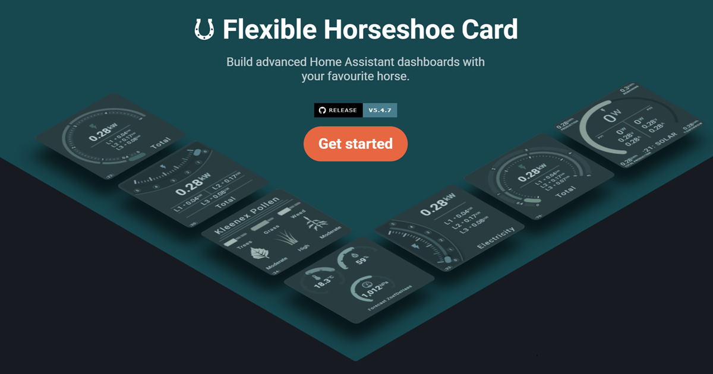
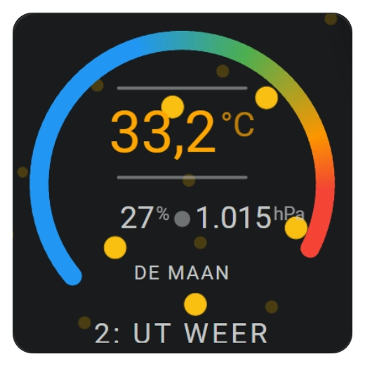
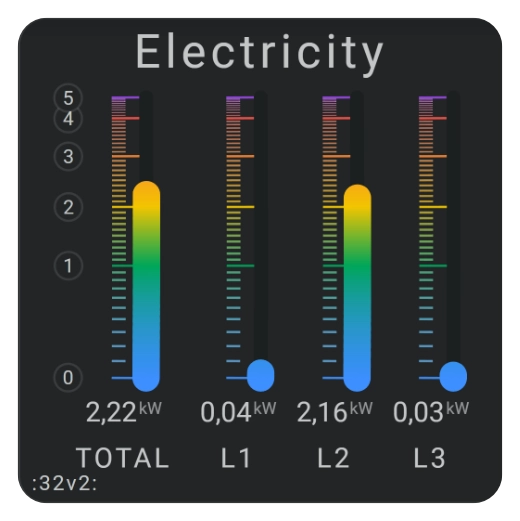
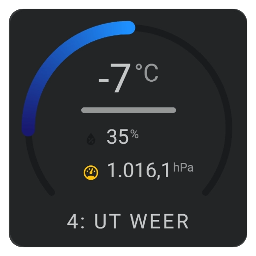
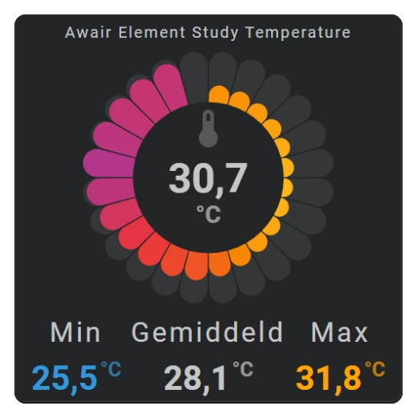

#   Flexible Horseshoe Card

[![stable][stable-badge]][release-url]
[![stable date][stable-date-badge]][release-url]
[![latest][latest-badge]][release-url]
[![latest date][latest-date-badge]][release-url]
[![downloads][downloads-badge]][release-url]

Flexible Horseshoe Card is a highly configurable dashboard card for [Home Assistant][home-assistant]. Use it to combine entity data, horseshoe gauges, text, icons, shapes, colors, animations, and history graphs in a layout that is entirely your own.

Build a simple gauge with a single value, or create a complete reusable dashboard element with multiple entities and visual layers.

**-- IMPORTANT NOTE --**
<br>The manual and this README is based on the latest v5.4-7.dev.\* version. A new stable version will be released in August and will not be very different from the current dev version. You can install any dev version and revert if necessary using HACS! No harm done.

**[Read the manual][manual]** | **[Install the card][installation]** | **[Browse examples][examples]**

<p align="center">
  <a href="https://flexible-horseshoe-card-manual.amoebelabs.com/">
    
  </a>
</p>

## What is the Flexible Horseshoe Card?

The card turns Home Assistant entity states and attributes into compact visual dashboard components. A card can contain one simple gauge and value, or combine multiple entities, horseshoes, labels, icons, shapes, and graphs into a complete reusable dashboard element.

Unlike cards with a fixed layout, the Flexible Horseshoe Card lets you position every item individually or organize related items into groups. SVG-based rendering keeps layouts scalable, while Home Assistant integration supplies entity names, units, icons, localization, state colors, actions, and theme variables.

### ⚙️ Powerful and highly configurable

Configure custom card dimensions and populate a layout with any number of entities, horseshoes, lines, circles, and other [visual shapes][visual-shapes]. Position items individually with the [layout overview][layout-overview], or use [positioning and groups][positioning-groups] to move, scale, and rotate related elements together.

### 🧩 Build faster with less YAML

Reuse similar section items with `same_as` instead of copying complete YAML blocks. Shared constants, `ref()`, and `calc()` keep colors, positions, and dimensions consistent. The [reuse introduction][reuse] explains the available layers, while the [reuse reference][reuse-reference] documents each option.

### 🏠 Built with and for Home Assistant

Flexible Horseshoe Card uses Home Assistant entity names, units, icons, areas, state colors, actions, themes, and [localization and formatting][localization]. Override precision, units, icons, names, and other values through [entity definitions][entity-definitions] whenever a card needs more control.

### 💻 Dynamic templating

Use [JavaScript templating][templating] throughout supported areas of the card configuration to change icons, colors, styles, positions, and behavior from current entity states. Card templates, color stops, and state maps make the same design reusable for different sensors.

### 🎨 Color stops and gradients

Apply fixed colors, state-based thresholds, segmented colors, or smooth gradients through [color stops][color-stops]. The same color configuration can style horseshoes, graphs, icons, states, names, labels, lines, circles, and other supported elements.

### 🖌️ Themes and palettes

Use existing Home Assistant theme variables or load [external color palettes][external-palettes] with separate light and dark mode colors. This keeps related cards visually consistent without repeating the complete palette in every configuration.

### 📈 History and sparkline graphs

Display [line][line-chart], [area][area-chart], [bar][bar-chart], and [dots][dots-chart] charts, or use advanced visual history components such as [equalizer][equalizer-chart], [graded][graded-chart], [barcode][barcode-chart], [radial barcode][radial-barcode-chart], and [state-band charts][state-bands-chart]. Configure their time range through [history periods and bins][history-periods].

### 📐 Built with SVG and CSS

Scalable Vector Graphics keep horseshoes, text, shapes, and charts sharp at different card sizes. Use [CSS styling][css-styling] to control their appearance and add transitions or state-driven behavior through [animations][animations].

### ↩️ Backwards compatible

The refreshed [horseshoe implementation][horseshoes] remains compatible with the original horseshoe YAML configuration, so existing cards should continue to work. Custom CSS or card-mod rules targeting the previous internal HTML or SVG structure may require adjustments.

## Installation

[](https://my.home-assistant.io/redirect/hacs_repository/?owner=AmoebeLabs&repository=flex-horseshoe-card&category=Dashboard)

Installing through [HACS][hacs] is the recommended option, as HACS also manages future updates. The [installation guide][installation] explains how to install the card through HACS or manually, add the Lovelace resource, and check that everything is working.

## Create your first card

Replace the example entity with one from your own Home Assistant instance:

```yaml
type: custom:flex-horseshoe-card
entities:
  - entity: sensor.living_room_temperature
    name: Living room

layout:
  icons:
    - id: temperature
      entity_index: 0
      xpos: 50 # Centre of a 100x100 default size square card
      ypos: 45 # just above the centre
      icon_size: 2

  states:
    - id: temperature
      entity_index: 0
      xpos: 50 # Centre of a 100x100 default size square card
      ypos: 55 # just below the centre
      styles:
        font-size: 3em

  horseshoes:
    - id: temperature
      show:
        style: colorstopgradient # Full gradient from color_stops

      horseshoe_scale:
        min: 0 # Scale runs from 0 to 40
        max: 40

      color_stops:
        0: '#2196f3' # blue from 0..20
        20: '#4caf50' # green from 20..30
        30: '#ff9800' # orange from 30..40
        40: '#f44336' # and red for anything above 40 degrees
```

Ready to go further? Continue with [Card Structure][card-structure], [Entity Definitions][entity-definitions], [Layout Overview][layout-overview], and [Horseshoe Gauges][horseshoes].

## Card gallery

<table>
  <tr>
    <td align="center">
      <a href="https://flexible-horseshoe-card-manual.amoebelabs.com/examples/demo-cards/demo-card-electricity-many/">
        
      </a><br>
      <a href="https://flexible-horseshoe-card-manual.amoebelabs.com/examples/demo-cards/demo-card-electricity-many/">Horseshoe Examples</a>
    </td>
    <td align="center">
      <a href="https://flexible-horseshoe-card-manual.amoebelabs.com/examples/demo-cards/demo-card-electricity-many/">
        
      </a><br>
      <a href="https://flexible-horseshoe-card-manual.amoebelabs.com/examples/demo-cards/demo-card-electricity-many/">Electricity card examples</a>
    </td>
    <td align="center">
      <a href="https://flexible-horseshoe-card-manual.amoebelabs.com/examples/demo-cards/demo-card-kleenex-pollen-many/">
        
      </a><br>
      <a href="https://flexible-horseshoe-card-manual.amoebelabs.com/examples/demo-cards/demo-card-kleenex-pollen-many/">Pollen radar card examples</a>
    </td>
  </tr>
  <tr>
    <td align="center">
      <a href="https://flexible-horseshoe-card-manual.amoebelabs.com/sections/sparkline-cartesian-charts/">
        
      </a><br>
      <a href="https://flexible-horseshoe-card-manual.amoebelabs.com/sections/sparkline-cartesian-charts/">Horseshoes</a>
    </td>
    <td align="center">
      <a href="https://flexible-horseshoe-card-manual.amoebelabs.com/sections/sparkline-cartesian-charts/">
        
      </a><br>
      <a href="https://flexible-horseshoe-card-manual.amoebelabs.com/sections/sparkline-cartesian-charts/">Cartesian history charts</a>
    </td>
    <td align="center">
      <a href="https://flexible-horseshoe-card-manual.amoebelabs.com/sections/sparkline-specialized-charts/">
        
      </a><br>
      <a href="https://flexible-horseshoe-card-manual.amoebelabs.com/sections/sparkline-specialized-charts/">Specialized history charts</a>
    </td>

  </tr>
</table>

## Documentation

### Getting started

New to the card? Start with the [introduction to Flexible Horseshoe Card][introduction] for a clear overview of its layout, styling, and Home Assistant integration. Then follow the [installation guide][installation] and explore the [card examples overview][examples].

For complete real-world configurations, see the [electricity card examples][electricity-examples] and [pollen radar card examples][pollen-examples]. They show how the individual features work together in larger cards.

### Configure a card

Begin with the [card structure][card-structure], then connect your Home Assistant data through [entity definitions][entity-definitions]. The [layout overview][layout-overview] explains how the available sections form a card, while [positioning and groups][positioning-groups] introduces the shared coordinate system.

Use the dedicated [groups section][groups] for grouped transformations, add values and labels from [entity parts][entity-parts], and finish the layout with [visual shapes][visual-shapes].

### Configure horseshoe gauges

The [horseshoe gauges overview][horseshoes] covers both single and multiple gauges. Next, use [horseshoe scale and state configuration][horseshoe-scale-state] to control geometry and value display, then add [tick marks and labels][horseshoe-ticks-labels].

To bring the gauge to life, the [color stops and gradients guide][color-stops] explains fixed colors, value ranges, segmented colors, and smooth gradients.

### Add history and sparkline graphs

Start with the [sparkline graphs overview][sparklines], then choose the required time range with [history periods and bins][history-periods].

The [Cartesian charts and axes guide][cartesian-charts] covers [line][line-chart], [area][area-chart], [bar][bar-chart], and [dots][dots-chart] charts. For alternative visualizations, the [specialized sparkline charts guide][specialized-charts] covers [equalizer][equalizer-chart], [graded][graded-chart], [barcode][barcode-chart], [radial barcode][radial-barcode-chart], and [state-band displays][state-bands-chart].

### Style dynamic cards

Use [CSS styling][css-styling] to customize the card and its SVG elements, then add state-driven motion with [animations][animations]. Shared colors can come from [external color palettes][external-palettes], while [color filters][color-filters] offer another way to change visual elements.

The card follows Home Assistant [localization and formatting][localization]. With [JavaScript templating][templating], supported configuration values can also respond dynamically to entity states.

### Reuse configuration

The [introduction to reusable configuration][reuse] explains the available reuse layers and when each one is useful. Continue with the [reusable card examples][reuse-examples] for practical YAML, and keep the [reuse reference][reuse-reference] nearby when working with templates, `same_as`, constants, `ref()`, or `calc()`.

## Releases and support

For everyday dashboards, use the [stable release][release-url]. The latest release may be a development or pre-release version intended for testing new functionality.

Browse all [GitHub releases][release-url] for version details. Found a reproducible problem? Report it through the [issue tracker][issues].

Flexible Horseshoe Card is built for [Home Assistant][home-assistant] and distributed through the [Home Assistant Community Store][hacs].

## License and credits

Flexible Horseshoe Card is available under the MIT license.

- The project builds on Home Assistant, Lit, SVG, CSS, and the work shared by the Home Assistant custom-card community. The archived README in `dev/reference/` preserves the original extended credits and legacy configuration reference.
- Original "Human Imagination" image created by Agata from [Good Stuff, No Nonsense.](https://goodstuffnononsense.com/), and customized to use the Amoebelabs colors.

<p align="center">
  
</p>

<!-- Badges -->

[latest-badge]: https://img.shields.io/github/v/release/AmoebeLabs/flex-horseshoe-card?include_prereleases&logo=github&label=latest
[latest-date-badge]: https://img.shields.io/github/release-date-pre/AmoebeLabs/flex-horseshoe-card?logo=github&label=latest%20date
[stable-badge]: https://img.shields.io/github/v/release/AmoebeLabs/flex-horseshoe-card?logo=github&label=stable&cacheSeconds=3600
[stable-date-badge]: https://img.shields.io/github/release-date/AmoebeLabs/flex-horseshoe-card?logo=github&label=stable%20date
[downloads-badge]: https://img.shields.io/github/downloads/AmoebeLabs/flex-horseshoe-card/total?logo=github&label=downloads%20since%20May%202026

<!-- Project links -->

[home-assistant]: https://www.home-assistant.io/
[hacs]: https://hacs.xyz/
[issues]: https://github.com/AmoebeLabs/flex-horseshoe-card/issues
[release-url]: https://github.com/AmoebeLabs/flex-horseshoe-card/releases

<!-- Manual links -->

[manual]: https://flexible-horseshoe-card-manual.amoebelabs.com/
[introduction]: https://flexible-horseshoe-card-manual.amoebelabs.com/getting-started/introduction/
[installation]: https://flexible-horseshoe-card-manual.amoebelabs.com/getting-started/installation/
[examples]: https://flexible-horseshoe-card-manual.amoebelabs.com/examples/overview/
[electricity-examples]: https://flexible-horseshoe-card-manual.amoebelabs.com/examples/demo-cards/demo-card-electricity-many/
[pollen-examples]: https://flexible-horseshoe-card-manual.amoebelabs.com/examples/demo-cards/demo-card-kleenex-pollen-many/
[card-structure]: https://flexible-horseshoe-card-manual.amoebelabs.com/core-concepts/card-structure/
[entity-definitions]: https://flexible-horseshoe-card-manual.amoebelabs.com/core-concepts/entity-definitions/
[external-palettes]: https://flexible-horseshoe-card-manual.amoebelabs.com/core-concepts/external-palettes/
[positioning-groups]: https://flexible-horseshoe-card-manual.amoebelabs.com/core-concepts/positioning-and-groups/
[localization]: https://flexible-horseshoe-card-manual.amoebelabs.com/core-concepts/localization/
[animations]: https://flexible-horseshoe-card-manual.amoebelabs.com/core-concepts/animations/
[color-stops]: https://flexible-horseshoe-card-manual.amoebelabs.com/core-concepts/color-stops/
[color-filters]: https://flexible-horseshoe-card-manual.amoebelabs.com/core-concepts/color-filters/
[css-styling]: https://flexible-horseshoe-card-manual.amoebelabs.com/core-concepts/css-styling/
[templating]: https://flexible-horseshoe-card-manual.amoebelabs.com/core-concepts/templating/
[layout-overview]: https://flexible-horseshoe-card-manual.amoebelabs.com/sections/layout-overview/
[groups]: https://flexible-horseshoe-card-manual.amoebelabs.com/sections/groups-section/
[visual-shapes]: https://flexible-horseshoe-card-manual.amoebelabs.com/sections/visual-shapes-section/
[entity-parts]: https://flexible-horseshoe-card-manual.amoebelabs.com/sections/entities-section/
[horseshoes]: https://flexible-horseshoe-card-manual.amoebelabs.com/sections/horseshoes-section/
[horseshoe-scale-state]: https://flexible-horseshoe-card-manual.amoebelabs.com/sections/horseshoe-scale-and-state/
[horseshoe-ticks-labels]: https://flexible-horseshoe-card-manual.amoebelabs.com/sections/horseshoe-ticks-and-labels/
[sparklines]: https://flexible-horseshoe-card-manual.amoebelabs.com/sections/sparklines-section/
[history-periods]: https://flexible-horseshoe-card-manual.amoebelabs.com/sections/sparkline-history-periods/
[cartesian-charts]: https://flexible-horseshoe-card-manual.amoebelabs.com/sections/sparkline-cartesian-charts/
[specialized-charts]: https://flexible-horseshoe-card-manual.amoebelabs.com/sections/sparkline-specialized-charts/
[line-chart]: https://flexible-horseshoe-card-manual.amoebelabs.com/sections/sparkline-cartesian-charts/#line-chart
[area-chart]: https://flexible-horseshoe-card-manual.amoebelabs.com/sections/sparkline-cartesian-charts/#area-chart
[dots-chart]: https://flexible-horseshoe-card-manual.amoebelabs.com/sections/sparkline-cartesian-charts/#dots-chart
[bar-chart]: https://flexible-horseshoe-card-manual.amoebelabs.com/sections/sparkline-cartesian-charts/#bar-chart
[equalizer-chart]: https://flexible-horseshoe-card-manual.amoebelabs.com/sections/sparkline-specialized-charts/#equalizer-chart
[graded-chart]: https://flexible-horseshoe-card-manual.amoebelabs.com/sections/sparkline-specialized-charts/#graded-chart
[state-bands-chart]: https://flexible-horseshoe-card-manual.amoebelabs.com/sections/sparkline-specialized-charts/#state-bands-chart
[barcode-chart]: https://flexible-horseshoe-card-manual.amoebelabs.com/sections/sparkline-specialized-charts/#barcode-chart
[radial-barcode-chart]: https://flexible-horseshoe-card-manual.amoebelabs.com/sections/sparkline-specialized-charts/#radial-barcode-chart
[reuse]: https://flexible-horseshoe-card-manual.amoebelabs.com/reuse/reuse-introduction/
[reuse-examples]: https://flexible-horseshoe-card-manual.amoebelabs.com/reuse/reuse-card-examples/
[reuse-reference]: https://flexible-horseshoe-card-manual.amoebelabs.com/reuse/reuse-reference/
