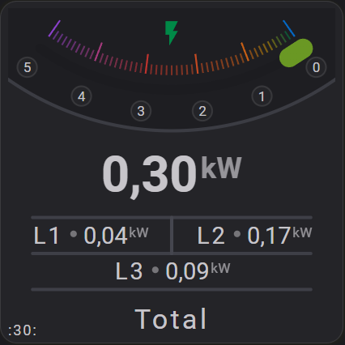

# Less YAML with Reuse

Flex Horseshoe Card configurations can become large when a card contains multiple layout items, repeated styles, repeated color stops, or carefully positioned elements.

A common pattern is that many items are almost the same. Only one or two fields are different, such as `xpos`, `ypos`, `radius`, `length`, or a small style override.


Now check the next example, with its three horizontal lines.



Without reuse, this often leads to repeated YAML and repeatedly changing xpos/ypos while designing the card until it is right:

=== "Without reuse"
    ```yaml linenums="1" hl_lines="2 9 16"
    hlines:
      - xpos: 50
        ypos: 64
        length: 85
        styles:
          stroke: var(--disabled-text-color)
          stroke-width: 2

      - xpos: 50
        ypos: 75
        length: 85
        styles:
          stroke: var(--disabled-text-color)
          stroke-width: 2

      - xpos: 50
        ypos: 86
        length: 85
        styles:
          stroke: var(--disabled-text-color)
          stroke-width: 2
    ```


This works, but it is sometimes harder to maintain.

If the line length changes, every repeated item must be checked. If the style changes, every copy must be updated. If one copy is missed, the layout becomes inconsistent.

The reuse features are intended to solve this.

=== "With reuse \#1"
    ```yaml linenums="1" hl_lines="1 8 15 18"
    constants:
      lineStep: 11                   # Height between lines
      defaultLineStyle:
        stroke: var(--disabled-text-color)
        stroke-width: 2

    hlines:
      - xpos: 50
        ypos: 64
        length: 85
        styles:
          - ref(defaultLineStyle)
          - opacity: 0.8

      - same_as: 0                    # Same as hline 0
        same_as_dypos: calc(1 * lineStep)

      - same_as: 0                    # Same as hline 0
        same_as_dypos: calc(2 * lineStep)
    ```
=== "With reuse \#2"
    ```yaml linenums="1" hl_lines="1 8 15 18"
    constants:
      lineStep: 11                   # Height between lines
      defaultLineStyle:
        stroke: var(--disabled-text-color)
        stroke-width: 2

    hlines:
      - xpos: 50                      # Using auto-ID, so 0
        ypos: 64
        length: 85
        styles:
          - ref(defaultLineStyle)
          - opacity: 0.8

      - same_as: 0                    # Same as hline 0
        same_as_dypos: calc(lineStep) # Shift down

      - same_as: 1                    # Same as hline 1
        same_as_dypos: calc(lineStep) # Shift down
    ```

The benefit becomes even larger for larger section items.

A simple line may only contain a few fields, but a horseshoe can contain many nested settings: scale, state, tickmarks, labels, show options, colors, widths, min/max values, and styles.

When multiple horseshoes share the same visual setup, `same_as` allows one base horseshoe to define the common structure. The other horseshoes only need to override what is different, such as `entity_index`, `color_stops`, `min`, or `max`.

The horseshoe in the above example is about 60 lines of YAML.

Even if you take a mini horseshoe, the power of the `same_as` and `ref` functionality becomes clearly visible.

```yaml linenums="1" hl_lines="2 16 25"
horseshoes:
  - id: base
    group: base              # Group will position the horseshoe (and more)
    radius: 45
    horseshoe_scale:
      min: 0
      max: 100
      width: 6
    horseshoe_state:
      width: 8
    show:
      horseshoe: true
      ticks: true
    color_stops: ref(defaultColorStops)

  - id: power
    group: power             # Group will position the horseshoe (and more)
    same_as: base
    entity_index: 1
    color_stops: ref(powerColorStops)
    horseshoe_scale:
      min: 0
      max: 5000

  - id: temperature
    group: temperatur        # Group will position the horseshoe (and more)
    same_as: base
    entity_index: 2
    color_stops: ref(temperatureColorStops)
    horseshoe_scale:
      min: -10
      max: 40
```

!!! Success "The larger the repeated item, the more useful reuse becomes."

## Goal 

The goal is not to make the configuration more complicated.

The goal is to make repeated configuration shorter, clearer, and easier to maintain.

Instead of repeating full YAML blocks, you can define common parts once and reuse them.

This makes the external configuration compact, while the card still converts it into a complete internal configuration before rendering.

## Main ideas

| Feature        | Purpose                                              |
| :------------- | :--------------------------------------------------- |
| `same_as`      | Reuse another item from the same section             |
| `same_as_d...` | Reuse an item and apply a numeric offset             |
| `calc()`       | Use static calculations in numeric fields            |
| `constants`    | Define reusable static values or config fragments    |
| `ref()`        | Copy a value from `constants` into the configuration |

These features are processed during card setup.

They are not runtime rendering tricks. By the time the card renders, the configuration has already been expanded into normal values.

## Why this helps

Reuse is useful when a card layout contains patterns.

Examples:

* multiple lines with the same length and style
* multiple circles with the same center but different radius
* repeated icon positions around a shared center point
* shared color stops
* shared styles
* spacing based on a fixed step size
* layout values derived from one shared parameter

For example, instead of manually calculating positions:

```yaml
icons:
  - xpos: 46
    ypos: 50

  - xpos: 54
    ypos: 50
```

you can keep the intent visible:

```yaml
constants:
  centerX: 50
  iconOffset: 4

icons:
  - xpos: calc(centerX - iconOffset)
    ypos: 50

  - xpos: calc(centerX + iconOffset)
    ypos: 50
```

Now the configuration explains itself.

The icons are positioned around `centerX`, with an offset of `4`.

If the center changes later, only one value has to be changed.

## Static first, render simple

The reuse system follows a simple principle:

1. The user writes compact YAML.
2. The card expands and calculates static values during setup.
3. The renderer receives complete configuration.

This keeps the render code simple.

The renderer does not need to know whether a value originally came from `same_as`, `calc()`, `constants`, or `ref()`. It only receives the final resolved value.

## When to use reuse

Use reuse when it makes the layout easier to understand.

Good use cases:

* repeated items
* shared styles
* shared color stops
* repeated spacing
* derived positions
* one base item with small variations

Avoid reuse when it makes the configuration harder to read than writing the value directly.

For one-off values, plain YAML is often clearer.

## Related pages

This section introduces the idea of reducing YAML through reuse.

The following pages describe the individual features in more detail:

* **Reuse of Section Items**
  Explains `same_as` and `same_as_d...`.

* **Reuse with `calc()` and `ref()`**
  Explains static calculations, constants, and references.

* **Combining the two**
  Shows how these features can be used together in practical card layouts.
