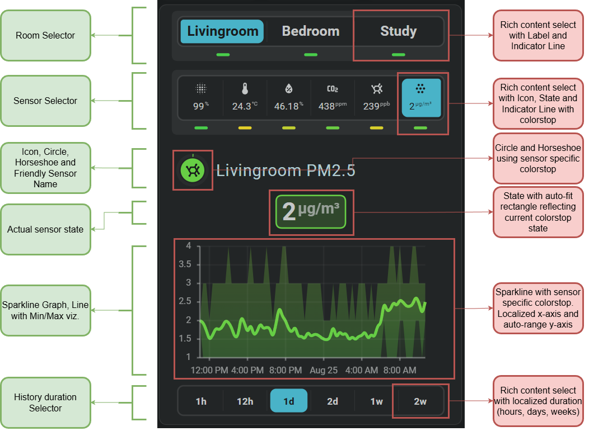

<!-- GT/GL -->

# Awair card examples

## :material-horseshoe: Visualization

This interactive Awair card brings several indoor air quality measurements together in one view. Use the controls to select a room, choose the measurement you want to inspect, and change the displayed history period.

{{ loop_video(
  "fhs-demo-card-awair-selectable--dark.mp4",
  "Interactive Awair showcase build with Flexible Horseshoe Card in Home Assistant",
  "A complete demonstration of the Flexible Horseshoe Card using three Awair Elements. Select a room and sensor to explore their current values, history, and history duration.",
  "fhs-demo-card-awair-selectable--dark.png",
  "2026-08-15",
  "PT0M30S",
  "720px") }}

The current value, horseshoe, colors, name, unit, and history graph follow the selected measurement. This makes it possible to explore several Awair devices without filling the dashboard with a separate card for every sensor.

| Description                                                                  | Aspect ratio |
| :--------------------------------------------------------------------------- | :----------- |
| Displays selectable measurements and history from several Awair air sensors. | `1/1.4`      |

## :material-horseshoe: The card's building blocks


!!! info "The card is built on the typical Awair Integration naming conventions for entity id's"
    The definition can handle 1-3 rooms. Not more, not less!
    It is currently using the names of my three Awair Elements (livingroom, bedroom and study)





!!! warning "Be aware that this is an advanced card"
    It uses almost all of the specific functionality of the Flexible Horseshoe Card like `JavaScript` templates, `entity slots` for easier entity index access, `same_as, ref() and calc()` functions to reduce YAML and enhance maintenance, the `sparkline` tool, card local `FHS entities` for storing input selects, the rich content `input select control`, and of course the `Horseshoe` itself!

### Available controls

| Control     | type   | Options                                                 |
| :---------- | :----- | :------------------------------------------------------ |
| Room        | select | Living room, study, or bedroom.                         |
| Measurement | select | Awair score, temperature, humidity, CO2, VOC, or PM2.5. |
| History     | select | 1 hour, 12 hours, 1 day, 2 days, 1 week, or 2 weeks.    |

Selections can be shared by multiple FHS cards on the same dashboard. Changing a control can therefore update several related cards at once and keep their displayed room, measurement, or history period synchronized.

### Demonstrated functionality

| Feature            | Demonstrated use                                                                |
| :----------------- | :------------------------------------------------------------------------------ |
| Selection controls | Switches between rooms, measurements, and history periods directly on the card. |
| Horseshoe          | Displays the current measurement using its matching scale and colors.           |
| Sparkline history  | Shows the selected measurement over the chosen period.                          |
| Adaptive layout    | Keeps labels, values, and controls readable when their content changes.         |
| Shared selections  | Keeps multiple cards synchronized while browsing the dashboard.                 |

## :material-horseshoe: Required entities

This example uses Awair sensors for the available rooms and measurements. Change the `fhs_card_awair_rooms` to match the names used by your Awair integration.

!!! success "The card can handle 1 to 3 rooms."

## :material-horseshoe: YAML definition for card #41

Example definition to use within view
```yaml linenums="1"
- type: custom:flex-horseshoe-card
  template:
    name: fhs_card_041_awair_interactive
    variables:
      # The names of the rooms that your Awair integration uses
      # Format used:
      #   `sensor.awair_element_${room.toLowerCase()}_${sensor}`
      - fhs_card_awair_rooms:
          - Livingroom
          - Bedroom
          - Study
```

!!! info "[Link to Github System Template definition](https://github.com/AmoebeLabs/home-assistant-config/blob/master/lovelace/fhs_sys_templates/templates/51-cards/040-049/fhs-card-041-awair-interactive.yaml)"

