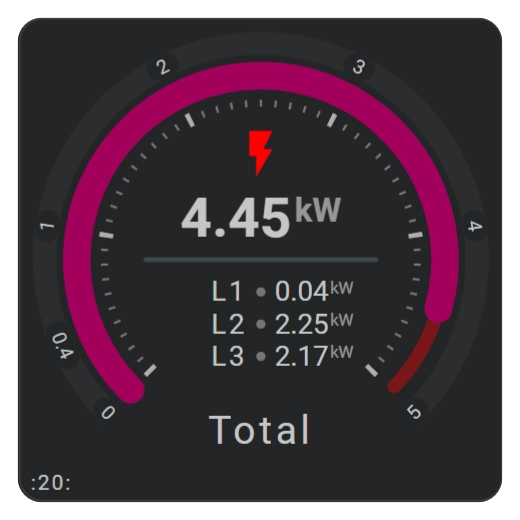
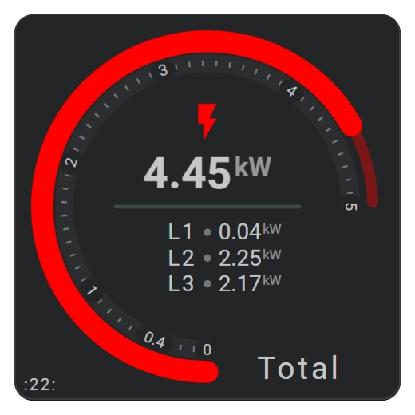
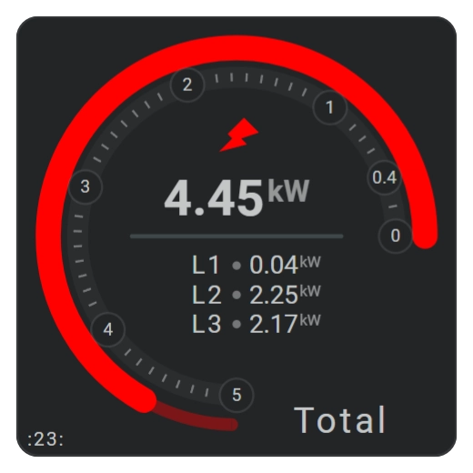
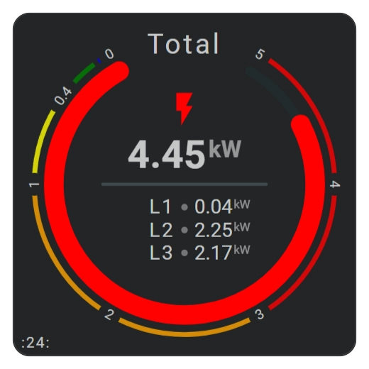
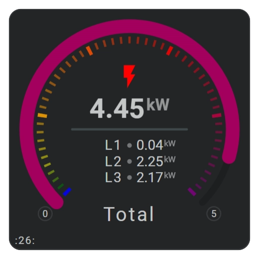
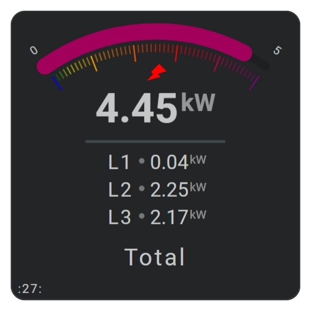
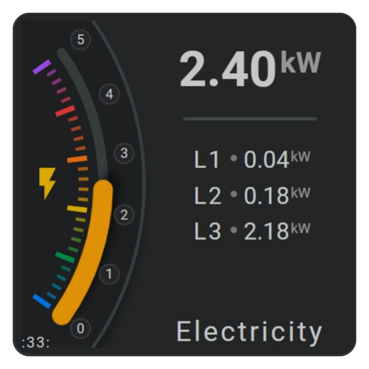

<!-- GT/GL -->
##:material-horseshoe: Visualizations
9 electricity cards showing mostly the possibilities for the horseshoes arc size, start point (CW/CCW), flipping (x, y, both), rotation and major and minor ticks and labels.

Cards 20 to 26 show regular arc sizes. Cards 27, 30 and 33 show smaller arc sizes, but still recognizable as an arc, were card 32 shows a very small arc size (0.3 degrees) resulting in a straight line.

{width="185"}
{width="185"}
{width="185"}
{width="185"}
{width="185"}
{width="185"}
{width="185"}
{width="185"}
{width="185"}

| Description| Aspect Ratio|
|-|-|
| Several cards showing electricity values from the DSMR Integration: Total usage, and the usage from phases L1, L2 and L3.| 1/1 |

| FHS | Card | Demonstrated Functionality |
|-|-|-|
| `same_as` | All | Repeated phase names, circles, states |
| `same_as` | 32 | Repeated horseshoes with colored scale and large radius to look vertical|
| `ref()`   | | Some of the Icon state maps are defined as constants, and used via the `ref()` function |
| `calc()`  | | Extensive use of the `calc()` function to calculate positions and radiuses |
| Groups | Many | Grouping and placing of L1, L2 and L3 stuff |
| Icon      | 27 | Rotated Icon. |
| Color stops | All | Horseshoes with various forms of color stops (hard and gradient). |

##:material-horseshoe: Integrations
This demo card requires:

- The DSMR Reader Integration.
- An external color palette for cards 30, 32 and 33.

##:material-horseshoe: Interaction

| Part | Description|
|-|-|
| Card | All tools connected to an entity do show by default the "more-info" dialog once clicked |

##:material-horseshoe: External JSON dark and light color palette
??? Info "External Color Palette rainbow-palette-new.json"
    ```json
    {
      "ref": {
        "fhs-ref-rainbow-red0": "#000000ff",
        "fhs-ref-rainbow-red10": "#410002ff",
        "fhs-ref-rainbow-red20": "#690005ff",
        "fhs-ref-rainbow-red30": "#93000aff",
        "fhs-ref-rainbow-red40": "#ba1a1aff",
        "fhs-ref-rainbow-red50": "#de3730ff",
        "fhs-ref-rainbow-red60": "#ff5449ff",
        "fhs-ref-rainbow-red70": "#ff897dff",
        "fhs-ref-rainbow-red80": "#ffb4abff",
        "fhs-ref-rainbow-red90": "#ffdad6ff",
        "fhs-ref-rainbow-red95": "#ffedeaff",
        "fhs-ref-rainbow-red99": "#fffbffff",
        "fhs-ref-rainbow-red100": "#ffffffff",

        "fhs-ref-rainbow-orange0": "#000000ff",
        "fhs-ref-rainbow-orange10": "#330300ff",
        "fhs-ref-rainbow-orange20": "#5c0b00ff",
        "fhs-ref-rainbow-orange30": "#851c06ff",
        "fhs-ref-rainbow-orange40": "#a84a00ff",
        "fhs-ref-rainbow-orange50": "#c45100ff",
        "fhs-ref-rainbow-orange60": "#e66a12ff",
        "fhs-ref-rainbow-orange70": "#ff8833ff",
        "fhs-ref-rainbow-orange80": "#ffaa66ff",
        "fhs-ref-rainbow-orange90": "#ffdcc2ff",
        "fhs-ref-rainbow-orange95": "#ffefe0ff",
        "fhs-ref-rainbow-orange99": "#fffbf7ff",
        "fhs-ref-rainbow-orange100": "#ffffffff",

        "fhs-ref-rainbow-yellow0": "#000000ff",
        "fhs-ref-rainbow-yellow10": "#341f00ff",
        "fhs-ref-rainbow-yellow20": "#5b3700ff",
        "fhs-ref-rainbow-yellow30": "#7d5200ff",
        "fhs-ref-rainbow-yellow40": "#9c6f00ff",
        "fhs-ref-rainbow-yellow50": "#bc8b00ff",
        "fhs-ref-rainbow-yellow60": "#d9a800ff",
        "fhs-ref-rainbow-yellow70": "#f2c500ff",
        "fhs-ref-rainbow-yellow80": "#ffde4dff",
        "fhs-ref-rainbow-yellow90": "#fff29eff",
        "fhs-ref-rainbow-yellow95": "#fff9cfff",
        "fhs-ref-rainbow-yellow99": "#fffdf0ff",
        "fhs-ref-rainbow-yellow100": "#ffffffff",

        "fhs-ref-rainbow-green0": "#000000ff",
        "fhs-ref-rainbow-green10": "#00210bff",
        "fhs-ref-rainbow-green20": "#003918ff",
        "fhs-ref-rainbow-green30": "#005227ff",
        "fhs-ref-rainbow-green40": "#006d36ff",
        "fhs-ref-rainbow-green50": "#008947ff",
        "fhs-ref-rainbow-green60": "#00a65aff",
        "fhs-ref-rainbow-green70": "#2fc371ff",
        "fhs-ref-rainbow-green80": "#53e089ff",
        "fhs-ref-rainbow-green90": "#73fca3ff",
        "fhs-ref-rainbow-green95": "#c2ffd0ff",
        "fhs-ref-rainbow-green99": "#f7fff5ff",
        "fhs-ref-rainbow-green100": "#ffffffff",

        "fhs-ref-rainbow-blue0": "#000000ff",
        "fhs-ref-rainbow-blue10": "#001b3fff",
        "fhs-ref-rainbow-blue20": "#003063ff",
        "fhs-ref-rainbow-blue30": "#00468bff",
        "fhs-ref-rainbow-blue40": "#005db5ff",
        "fhs-ref-rainbow-blue50": "#0075e1ff",
        "fhs-ref-rainbow-blue60": "#3c8fffff",
        "fhs-ref-rainbow-blue70": "#73aaffff",
        "fhs-ref-rainbow-blue80": "#a8c7ffff",
        "fhs-ref-rainbow-blue90": "#d6e3ffff",
        "fhs-ref-rainbow-blue95": "#ecf0ffff",
        "fhs-ref-rainbow-blue99": "#fefbffff",
        "fhs-ref-rainbow-blue100": "#ffffffff",

        "fhs-ref-rainbow-purple0": "#000000ff",
        "fhs-ref-rainbow-purple10": "#2b0052ff",
        "fhs-ref-rainbow-purple20": "#47007fff",
        "fhs-ref-rainbow-purple30": "#6500adff",
        "fhs-ref-rainbow-purple40": "#7f2bcaff",
        "fhs-ref-rainbow-purple50": "#9b46e7ff",
        "fhs-ref-rainbow-purple60": "#b762ffff",
        "fhs-ref-rainbow-purple70": "#cc8affff",
        "fhs-ref-rainbow-purple80": "#deb5ffff",
        "fhs-ref-rainbow-purple90": "#f0dbffff",
        "fhs-ref-rainbow-purple95": "#f9edffff",
        "fhs-ref-rainbow-purple99": "#fffbffff",
        "fhs-ref-rainbow-purple100": "#ffffffff"
      },
      "modes": {
        "light": {
          "fhs-sys-rainbow-red": "var(--fhs-ref-rainbow-red50)",
          "fhs-sys-rainbow-orange": "var(--fhs-ref-rainbow-orange60)",
          "fhs-sys-rainbow-yellow": "var(--fhs-ref-rainbow-yellow60)",
          "fhs-sys-rainbow-green": "var(--fhs-ref-rainbow-green50)",
          "fhs-sys-rainbow-blue": "var(--fhs-ref-rainbow-blue50)",
          "fhs-sys-rainbow-purple": "var(--fhs-ref-rainbow-purple50)"
        },
        "dark": {
          "fhs-sys-rainbow-red": "var(--fhs-ref-rainbow-red70)",
          "fhs-sys-rainbow-orange": "var(--fhs-ref-rainbow-orange70)",
          "fhs-sys-rainbow-yellow": "var(--fhs-ref-rainbow-yellow70)",
          "fhs-sys-rainbow-green": "var(--fhs-ref-rainbow-green70)",
          "fhs-sys-rainbow-blue": "var(--fhs-ref-rainbow-blue70)",
          "fhs-sys-rainbow-purple": "var(--fhs-ref-rainbow-purple70)"
        }
      }
    }    
    ```

##:material-horseshoe: YAML Card Definitions
[:octicons-tag-24: 5.4.7][github-releases]


{width="300"}
??? Info "YAML Definition for card \#20"
    ```yaml  linenums="1" hl_lines="1"

    ```
{width="300"}
??? Info "YAML Definition for card \#22"
    ```yaml  linenums="1" hl_lines="1"

    ```
{width="300"}
??? Info "YAML Definition for card \#23"
    ```yaml  linenums="1" hl_lines="1"

    ```
{width="300"}
??? Info "YAML Definition for card \#24"
    ```yaml  linenums="1" hl_lines="1"

    ```

{width="300"}
??? Info "YAML Definition for card \#26"
    ```yaml  linenums="1" hl_lines="1"

    ```
{width="300"}

??? Info "YAML Definition for card \#27"
    ```yaml  linenums="1" hl_lines="1"

    ```
{width="300"}
??? Info "YAML Definition for card \#30"
    ```yaml  linenums="1" hl_lines="1"

    ```
{width="300"}
??? Info "YAML Definition for card \#32"
    ```yaml  linenums="1" hl_lines="1"

    ```
{width="300"}
??? Info "YAML Definition for card \#33"
    ```yaml  linenums="1" hl_lines="1"

    ```            
<!-- Image references -->

<!--- Internal References... --->
[Swiss Army Knife Tutorial 02]: ../tutorials/10-step-tutorial-02-intro.md
[Swiss Army Knife Javascript Snippets]: ../basics/templates/javascript-snippets.md

<!--- External References... --->
[ham3-d06-url]: https://material3-themes-manual.amoebelabs.com/examples/material3-example-theme-d06-tealblue/
[github-releases]: https://github.com/amoebelabs/swiss-army-knife-card/releases/
