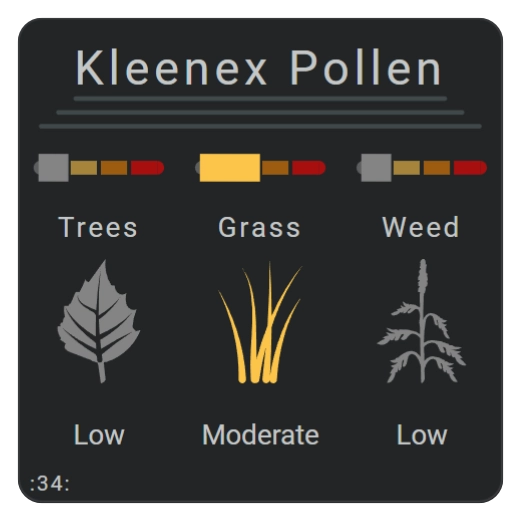
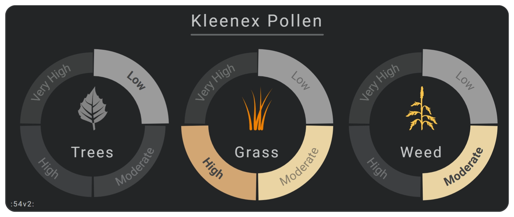
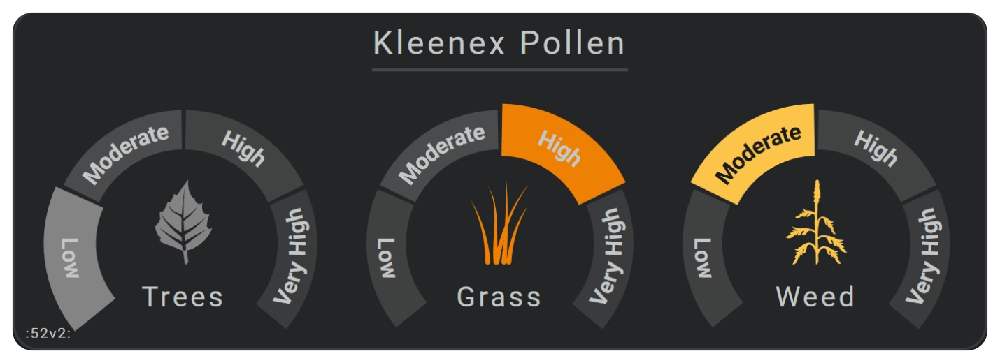

<!-- GT/GL -->

# Pollen Radar card examples

## :material-horseshoe: Visualization

These examples show several ways to display tree, grass, and weed pollen levels with horseshoes, mapped states, external SVG icons, and reusable YAML.

{width="300"}
{width="300"}

| Description                                                            | Aspect ratio |
| :--------------------------------------------------------------------- | :----------- |
| Displays pollen information from the Kleenex Pollen Radar integration. | `1/1`        |

### Demonstrated functionality

| Feature           | Demonstrated use                                                                    |
| :---------------- | :---------------------------------------------------------------------------------- |
| `same_as`         | Reuses horizontal lines with different positions and lengths.                       |
| `same_as`         | Reuses horseshoes with colored scales and a large radius to create horizontal bars. |
| `same_as_replace` | Replaces inherited icon state maps on reused items.                                 |
| `ref()`           | Inserts shared icon state maps defined under `constants`.                           |
| `calc()`          | Calculates positions, offsets, dimensions, and radii.                               |
| Icons             | Uses state maps and external SVG files for tree, grass, and weed illustrations.     |
| Horseshoes        | Combines mapped states with color stops.                                            |

## :material-horseshoe: More visualizations

The following variations were created for version [:octicons-tag-24: 5.4.7-dev.12][github-releases].

### Card 55

Card 55 uses three horseshoes to display the current pollen level for trees, grass, and weeds.

* Pollen values appear as ordered levels.
* Labels are placed directly on the horseshoe states.
* The active state uses bold text.
* Two arc shapes create a background for each external SVG icon and label.


### Card 54

Card 54 is a variation of card 55. It applies a grayscale color filter to reduce the intensity of the horseshoe colors.

!!! info "Color filters do not affect external images or SVG files."


### Card 53

Card 53 uses a more traditional horseshoe layout.

* Labels appear separately around the horseshoe.
* A grayscale color filter softens the displayed colors.


### Card 52

Card 52 displays the pollen level as a single mutually exclusive state. Only the currently active state is shown.


## :material-horseshoe: Required integration and files

These examples require:

* The Kleenex Pollen Radar custom integration, available through HACS.
* External SVG files stored in `www/images/kleenex`.

Add the following SVG variants:

* `/local/images/kleenex/pollen_tree_low.svg`
* `/local/images/kleenex/pollen_tree_moderate.svg`
* `/local/images/kleenex/pollen_tree_high.svg`
* `/local/images/kleenex/pollen_tree_very_high.svg`
* `/local/images/kleenex/pollen_grass_low.svg`
* `/local/images/kleenex/pollen_grass_moderate.svg`
* `/local/images/kleenex/pollen_grass_high.svg`
* `/local/images/kleenex/pollen_grass_very_high.svg`
* `/local/images/kleenex/pollen_weed_low.svg`
* `/local/images/kleenex/pollen_weed_moderate.svg`
* `/local/images/kleenex/pollen_weed_high.svg`
* `/local/images/kleenex/pollen_weed_very_high.svg`

!!! warning "The Kleenex integration does not translate the `very_high` state"
    Override this label in the horseshoe label configuration when a translated or more readable label is needed.

!!! info "The images and colors used by these cards are adapted from Isabella Alström’s pollen illustrations."

## :material-horseshoe: Interaction

| Part                      | Behavior                                                                                 |
| :------------------------ | :--------------------------------------------------------------------------------------- |
| Entity-connected elements | Clicking or tapping an element opens the Home Assistant **More info** dialog by default. |

## :material-horseshoe: YAML card definitions

### Card 34

{width="300"}

This configuration was created for version [:octicons-tag-24: 5.4.7][github-releases].

Example definition to use within view
```yaml linenums="1"
- type: custom:flex-horseshoe-card
  entities:
    - entity: sensor.kleenex_pollen_radar_zoefdehaas_bomen_niveau
      area: ':34v2:'
      name: 'Trees'
      # format:
      #   raw_state_keep: true
    - entity: sensor.kleenex_pollen_radar_zoefdehaas_gras_niveau
      name: 'Grass'
      area: 'Kleenex Pollen'
    - entity: sensor.kleenex_pollen_radar_zoefdehaas_kruiden_niveau
      name: 'Weed'
  template:
    name: fhs_card_034_horseshoe_pollen
```

!!! info "[Link to Github System Template definition](https://github.com/AmoebeLabs/home-assistant-config/blob/master/lovelace/fhs_sys_templates/templates/51-cards/030-039/fhs-card-034-horseshoe-pollen.yaml)"

### Card 55


This configuration was created for version [:octicons-tag-24: 5.4.7-dev.12][github-releases].

Example definition to use within view
```yaml linenums="1"
- type: custom:flex-horseshoe-card
  entities:
    - entity: sensor.kleenex_pollen_radar_zoefdehaas_bomen_niveau
    # - entity: input_select.fake_pollen_trees
      area: ':55:'
      name: 'Trees'
    - entity: sensor.kleenex_pollen_radar_zoefdehaas_gras_niveau
      name: 'Grass'
      area: 'Kleenex Pollen'
    - entity: sensor.kleenex_pollen_radar_zoefdehaas_kruiden_niveau
      name: 'Weed'
  template:
    name: fhs_card_055_horseshoe_pollen
```

!!! info "[Link to Github System Template definition](https://github.com/AmoebeLabs/home-assistant-config/blob/master/lovelace/fhs_sys_templates/templates/51-cards/050-059/fhs-card-055-horseshoe-pollen.yaml)"


### Card 54



This configuration was created for version [:octicons-tag-24: 5.4.7-dev.12][github-releases].

Example definition to use within view
```yaml linenums="1"
- type: custom:flex-horseshoe-card
  entities:
    - entity: sensor.kleenex_pollen_radar_zoefdehaas_bomen_niveau
    # - entity: input_select.fake_pollen_trees
      area: ':54:'
      name: 'Trees'
    - entity: sensor.kleenex_pollen_radar_zoefdehaas_gras_niveau
      name: 'Grass'
      area: 'Kleenex Pollen'
    - entity: sensor.kleenex_pollen_radar_zoefdehaas_kruiden_niveau
      name: 'Weed'
  template:
    name: fhs_card_054_horseshoe_pollen
```

!!! info "[Link to Github System Template definition](https://github.com/AmoebeLabs/home-assistant-config/blob/master/lovelace/fhs_sys_templates/templates/51-cards/050-059/fhs-card-054-horseshoe-pollen.yaml)"

### Card 53


This configuration was created for version [:octicons-tag-24: 5.4.7-dev.12][github-releases].

Example definition to use within view
```yaml linenums="1"
- type: custom:flex-horseshoe-card
  entities:
    - entity: sensor.kleenex_pollen_radar_zoefdehaas_bomen_niveau
    # - entity: input_select.fake_pollen_trees
      area: ':53:'
      name: 'Trees'
    - entity: sensor.kleenex_pollen_radar_zoefdehaas_gras_niveau
      name: 'Grass'
      area: 'Kleenex Pollen'
    - entity: sensor.kleenex_pollen_radar_zoefdehaas_kruiden_niveau
      name: 'Weed'
  template:
    name: fhs_card_053_horseshoe_pollen
```

!!! info "[Link to Github System Template definition](https://github.com/AmoebeLabs/home-assistant-config/blob/master/lovelace/fhs_sys_templates/templates/51-cards/050-059/fhs-card-053-horseshoe-pollen.yaml)"


### Card 52



This configuration was created for version [:octicons-tag-24: 5.4.7-dev.12][github-releases].

Example definition to use within view
```yaml linenums="1"
- type: custom:flex-horseshoe-card
  entities:
    - entity: sensor.kleenex_pollen_radar_zoefdehaas_bomen_niveau
    # - entity: input_select.fake_pollen_trees
      area: ':52:'
      name: 'Trees'
    - entity: sensor.kleenex_pollen_radar_zoefdehaas_gras_niveau
      name: 'Grass'
      area: 'Kleenex Pollen'
    - entity: sensor.kleenex_pollen_radar_zoefdehaas_kruiden_niveau
      name: 'Weed'
  template:
    name: fhs_card_055_horseshoe_pollen
```

!!! info "[Link to Github System Template definition](https://github.com/AmoebeLabs/home-assistant-config/blob/master/lovelace/fhs_sys_templates/templates/51-cards/050-059/fhs-card-052-horseshoe-pollen.yaml)"

## :material-horseshoe: Related documentation

* Configure threshold colors and gradients with [Color stops](../../appearance/color-stops.md).
* Transform palette colors for alternate card designs with [Color filters](../../appearance/color-filters.md).
* Configure state arcs and mapped states with [Horseshoe gauges](../../tools/horseshoe/horseshoe-overview.md).
* Reduce repeated definitions with the [Reuse Reference](../../reuse/reuse-reference.md).

<!-- Image references -->

<!--- Internal References... --->

[Swiss Army Knife Tutorial 02]: ../tutorials/10-step-tutorial-02-intro.md
[Swiss Army Knife Javascript Snippets]: ../basics/templates/javascript-snippets.md

<!--- External References... --->

[ham3-d06-url]: https://material3-themes-manual.amoebelabs.com/examples/material3-example-theme-d06-tealblue/
[github-releases]: https://github.com/amoebelabs/swiss-army-knife-card/releases/
