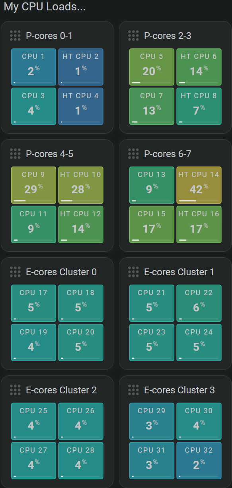

<!-- GT/GL -->

# Server card examples

## :material-horseshoe: Visualization

These server cards are intended to bring the most important system information together in one compact Home Assistant dashboard. The completed set will cover CPU load, memory use, network traffic, and disk activity, making it possible to check both the current state and recent changes without opening a separate monitoring application.

The first card in the set focuses on individual CPU cores. It places four related values in one grid and uses color to make rising load immediately visible. The next cards will use horseshoes and history graphs where they best fit the measurement: gauges for values with a clear capacity, and sparklines for activity and trends over time.

This example is still being expanded. The CPU card below is available now; memory, network, and disk cards will be added to the same server overview.



| Description                                                                  | Aspect ratio |
| :--------------------------------------------------------------------------- | :----------- |
| Displays the load of four CPU cores from one server. | `1/1`      |

## :material-horseshoe: The card's building blocks


### Demonstrated functionality

| Feature            | Demonstrated use                                                                |
| :----------------- | :------------------------------------------------------------------------------ |

## :material-horseshoe: Required entities

This example uses the entities supplied by the Beszel API integration. 

## :material-horseshoe: YAML definition for card #070

Example definition to use within view
```yaml linenums="1"
- type: custom:flex-horseshoe-card
  grid_options:
    columns: 6
  entities:
    - entity: sensor.domiducus_agent_cpu_1
    - entity: sensor.domiducus_agent_cpu_2
      name:
        - type: text
          text: HT
        - type: entity
    - entity: sensor.domiducus_agent_cpu_3
    - entity: sensor.domiducus_agent_cpu_4
      name:
        - type: text
          text: HT
        - type: entity

  template:
    name: fhs_card_070_sensor_grid_4
    variables:
      - var_colorstop_template: fhs_colorstops_cpu_load
      - var_title: 'P-cores 0-1'
```

!!! info "[Link to Github System Template definition](https://github.com/AmoebeLabs/home-assistant-config/blob/master/lovelace/fhs_sys_templates/templates/51-cards/070-079/fhs-card-070-sensor-grid-4.yaml)"
