# Examples

Use the examples to compare visual results and find a card close to what you want to build.

## :material-horseshoe: Featured examples

| Example | What it demonstrates |
| --- | --- |
| [Pollen cards](demo-cards/demo-card-kleenex-pollen-many.md) | State-based horseshoes, labels, icons, and reusable layouts |
| [Electricity cards](demo-cards/demo-card-electricity-many.md) | Horseshoe geometry, scales, ticks, groups, and palettes |
| [Awair card](demo-cards/demo-card-awair-many.md) | Select controls, browser-local inputs, dynamic entities, and history |

The complete demo pages include the required entities or integrations and links to their YAML definitions.

## :material-horseshoe: Template catalog

Use this catalog to find a visual starting point without searching through the individual example pages. Each template link opens the complete system-template YAML on GitHub. The linked card pages contain the corresponding view configuration, requirements, and explanation.

| Card | Preview | GitHub system template |
| --- | --- | --- |
| Pollen 34 | {width="120"} | [fhs-card-034-horseshoe-pollen.yaml](https://github.com/AmoebeLabs/home-assistant-config/blob/master/lovelace/fhs_sys_templates/templates/51-cards/030-039/fhs-card-034-horseshoe-pollen.yaml) |
| Pollen 55 | 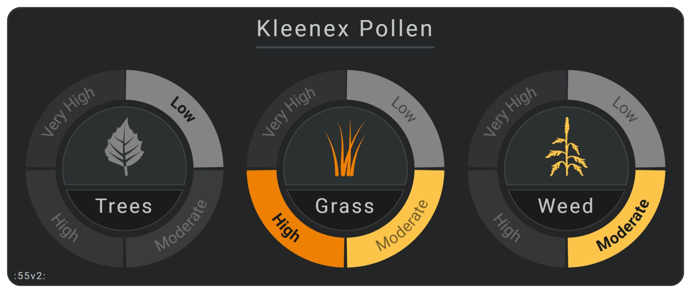{width="120"} | [fhs-card-055-horseshoe-pollen.yaml](https://github.com/AmoebeLabs/home-assistant-config/blob/master/lovelace/fhs_sys_templates/templates/51-cards/050-059/fhs-card-055-horseshoe-pollen.yaml) |
| Pollen 54 | {width="120"} | [fhs-card-054-horseshoe-pollen.yaml](https://github.com/AmoebeLabs/home-assistant-config/blob/master/lovelace/fhs_sys_templates/templates/51-cards/050-059/fhs-card-054-horseshoe-pollen.yaml) |
| Pollen 53 | 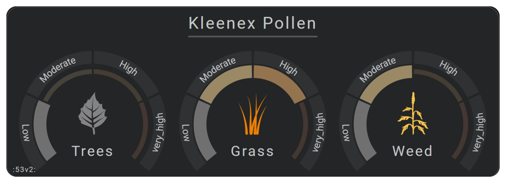{width="120"} | [fhs-card-053-horseshoe-pollen.yaml](https://github.com/AmoebeLabs/home-assistant-config/blob/master/lovelace/fhs_sys_templates/templates/51-cards/050-059/fhs-card-053-horseshoe-pollen.yaml) |
| Pollen 52 | {width="120"} | [fhs-card-052-horseshoe-pollen.yaml](https://github.com/AmoebeLabs/home-assistant-config/blob/master/lovelace/fhs_sys_templates/templates/51-cards/050-059/fhs-card-052-horseshoe-pollen.yaml) |
| Electricity 20 | 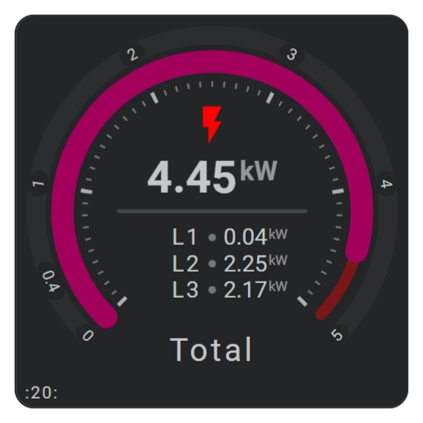{width="120"} | [fhs-card-020-horseshoe-power.yaml](https://github.com/AmoebeLabs/home-assistant-config/blob/master/lovelace/fhs_sys_templates/templates/51-cards/020-029/fhs-card-020-horseshoe-power.yaml) |
| Electricity 22 | 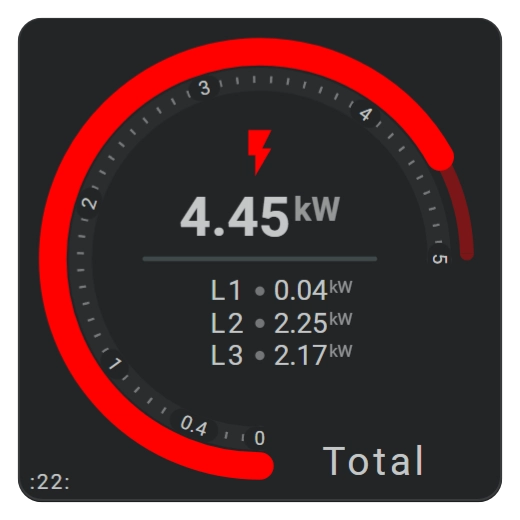{width="120"} | [fhs-card-022-horseshoe-power.yaml](https://github.com/AmoebeLabs/home-assistant-config/blob/master/lovelace/fhs_sys_templates/templates/51-cards/020-029/fhs-card-022-horseshoe-power.yaml) |
| Electricity 23 | 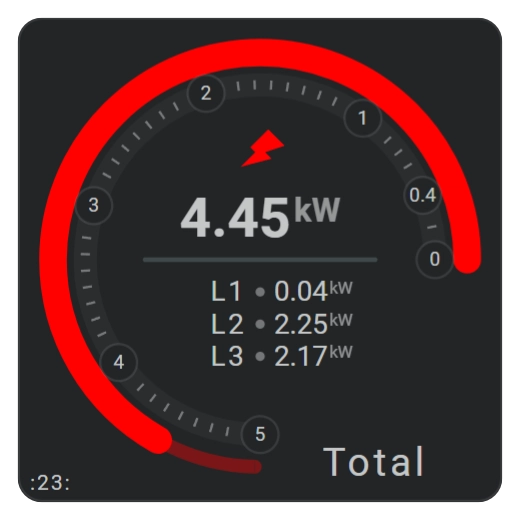{width="120"} | [fhs-card-023-horseshoe-power.yaml](https://github.com/AmoebeLabs/home-assistant-config/blob/master/lovelace/fhs_sys_templates/templates/51-cards/020-029/fhs-card-023-horseshoe-power.yaml) |
| Electricity 24 | 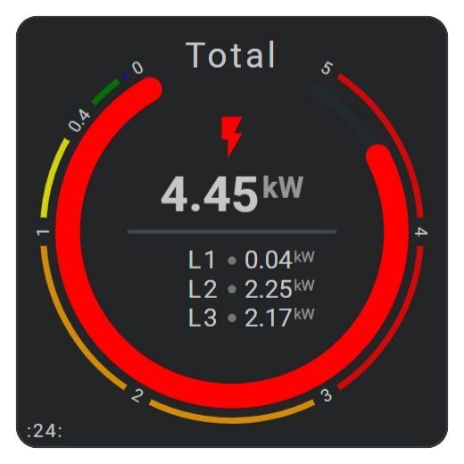{width="120"} | [fhs-card-023-horseshoe-power.yaml](https://github.com/AmoebeLabs/home-assistant-config/blob/master/lovelace/fhs_sys_templates/templates/51-cards/020-029/fhs-card-023-horseshoe-power.yaml) |
| Electricity 26 | 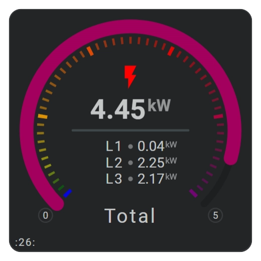{width="120"} | [fhs-card-026-horseshoe-power.yaml](https://github.com/AmoebeLabs/home-assistant-config/blob/master/lovelace/fhs_sys_templates/templates/51-cards/020-029/fhs-card-026-horseshoe-power.yaml) |
| Electricity 27 | 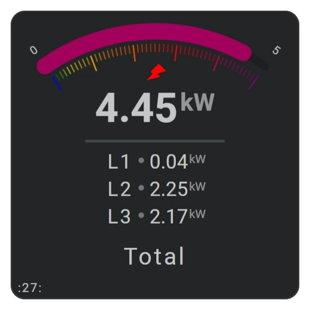{width="120"} | [fhs-card-027-horseshoe-power.yaml](https://github.com/AmoebeLabs/home-assistant-config/blob/master/lovelace/fhs_sys_templates/templates/51-cards/020-029/fhs-card-027-horseshoe-power.yaml) |
| Electricity 30 | 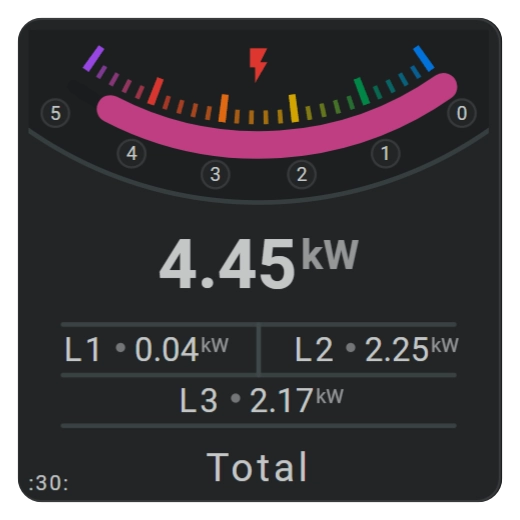{width="120"} | [fhs-card-030-horseshoe-power.yaml](https://github.com/AmoebeLabs/home-assistant-config/blob/master/lovelace/fhs_sys_templates/templates/51-cards/030-039/fhs-card-030-horseshoe-power.yaml) |
| Electricity 32 | 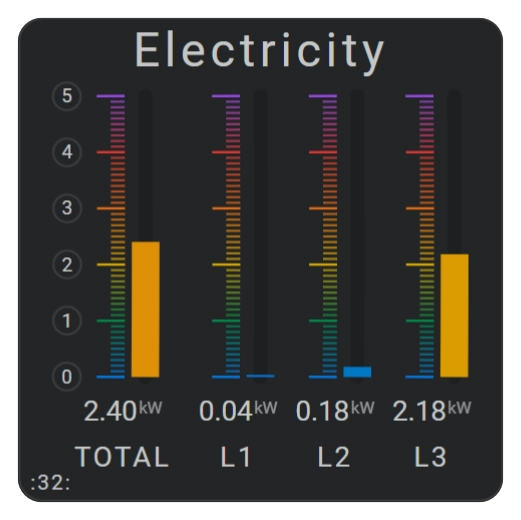{width="120"} | [fhs-card-032-horseshoe-power.yaml](https://github.com/AmoebeLabs/home-assistant-config/blob/master/lovelace/fhs_sys_templates/templates/51-cards/030-039/fhs-card-032-horseshoe-power.yaml) |
| Electricity 33 | 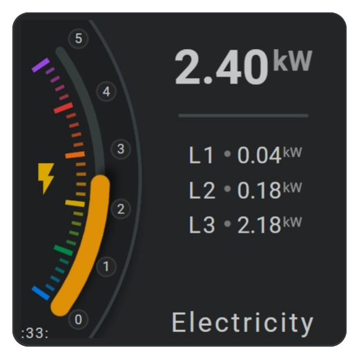{width="120"} | [fhs-card-033-horseshoe-power.yaml](https://github.com/AmoebeLabs/home-assistant-config/blob/master/lovelace/fhs_sys_templates/templates/51-cards/030-039/fhs-card-033-horseshoe-power.yaml) |
| Awair 41 | 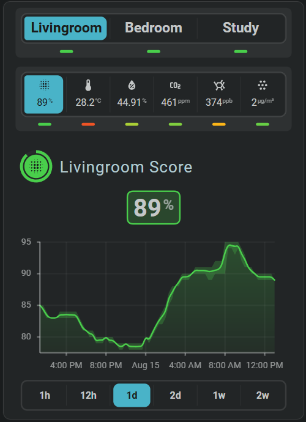{width="120"} | [fhs-card-041-awair-interactive.yaml](https://github.com/AmoebeLabs/home-assistant-config/blob/master/lovelace/fhs_sys_templates/templates/51-cards/040-049/fhs-card-041-awair-interactive.yaml) |

## :material-horseshoe: Showcases

Showcase cards let you change options directly on the card. Use them to compare horseshoe styles, chart types, controls, periods, bins, axes, colors, and other settings before adding them to your own YAML.

## :material-horseshoe: Start your own card

- [Your first card](../getting-started/your-first-card.md)
- [Card tools](../tools/tools-overview.md)
- [Appearance](../appearance/appearance-overview.md)
- [Reuse](../reuse/reuse-introduction.md)
