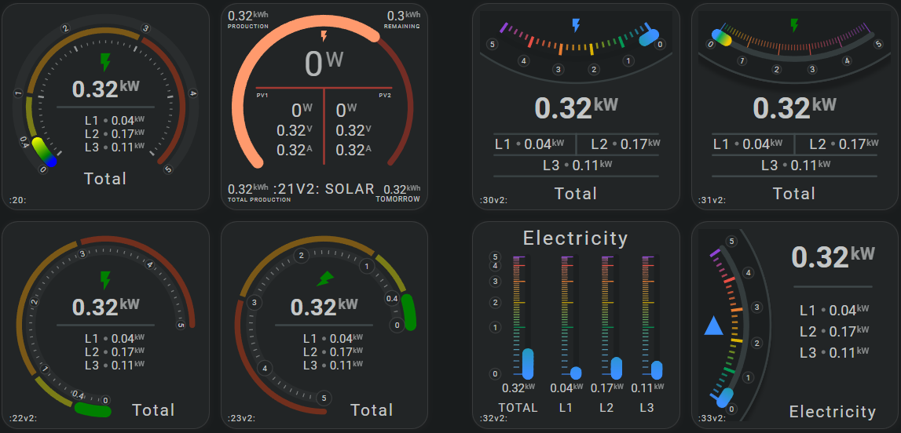
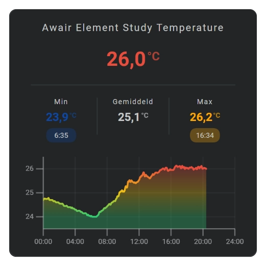

# Introduction to the Flexible Horseshoe Card

The Flexible Horseshoe Card is a highly customizable Home Assistant card for visualizing and controlling entity data. Cards can range from a simple horseshoe gauge to complete interactive displays with multiple entities, history graphs, controls, and other visual elements.

Card size, layout, and the position and appearance of individual tools can all be configured. Reusable templates make it possible to create consistent cards without repeating the same configuration.

## :material-horseshoe: From a simple gauge to advanced visualizations

The card started with the horseshoe gauge shown in the second image below.

!!! success "All cards are available as card templates in my Home Assistant repository"
    Each card has a card number that you can use to find its template in my [Home Assistant Config repository](https://github.com/AmoebeLabs/home-assistant-config/tree/master/lovelace/fhs_sys_templates).

Horseshoes can have different sizes and radii, with detailed tick marks and labels.

More specialized horseshoes can also show non-numerical states, as in this Kleenex Pollen Radar example:

Sparkline graphs show current and historical values over time. [Several graph types](../tools/sparkline/sparkline-overview.md) are available.

The example shows the full sparkline functionality, including axes, labels, and a grid. These elements are optional, so a graph can also be used as a simple sparkline to provide additional historical context.

The card also supports [tap actions](../interaction/interaction-overview.md) and [predefined controls](../tools/controls/controls-overview.md), so values can be displayed and controlled from the same card.

[Predefined controls](../tools/controls/controls-overview.md) make it possible to build interactive cards, such as the Awair card below that shows data from three Awair Elements. Check [this page](../examples/demo-cards/demo-card-awair-many.md) for this advanced card.

{{ loop_video(
"fhs-demo-card-awair-selectable--dark.mp4",
"Interactive Awair showcase built with Flexible Horseshoe Card in Home Assistant",
"A complete demonstration of the Flexible Horseshoe Card using three Awair Elements. Select a room and sensor to explore their current values, history, and history duration.",
"fhs-demo-card-awair-selectable--dark.png",
"2026-08-15",
"PT0M30S",
"720px") }}

## :material-horseshoe: Flexible layouts

Each tool has its own position, size, and appearance. Tools can be combined freely, allowing the same card to be used for a compact gauge, a larger dashboard element, or a more detailed interactive display.

Groups can be used to position related tools together.

## :material-horseshoe: Built around Home Assistant

Flexible Horseshoe Card uses Home Assistant entities and can follow their names, units, precision, icons, areas, locale, themes, and actions.

This means a card can start with the information already available in Home Assistant and only override what needs to look or behave differently.

## :material-horseshoe: Reuse card designs

Reusable templates and shared configuration help keep larger configurations manageable.

A design can be created once and reused for different entities while keeping the same layout and appearance.

## :material-horseshoe: Start here

1. [Install the card](installation.md).
2. [Build your first horseshoe](your-first-card.md).
3. [Choose card tools](../tools/tools-overview.md).
4. Explore the [examples](../examples/overview.md).
