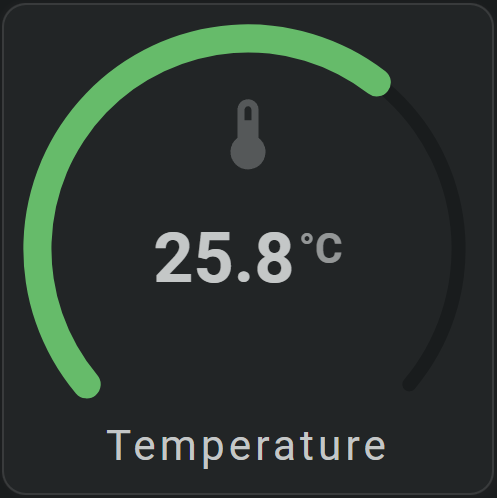

# Your first card

Create a horseshoe gauge that shows an entity icon, its current state in the center and the name below.

<!-- Add a screenshot of the completed first card here. -->


## :material-horseshoe: Add the card

Open a dashboard in edit mode, add a Manual card, and enter:

```yaml linenums="1"
- type: custom:flex-horseshoe-card

  entities:
    - entity: sensor.__your_temperature_sensor__
      name: Temperature
  layout:
    aspectratio: 1/1      # Square card (default)

    horseshoes:
      - entity_index: 0
        xpos: 50          # In center of square card (100 x 100)
        ypos: 50
        radius: 45
        horseshoe_scale:
          min: 0
          max: 40
        show:
          horseshoe_style: colorstop
        color_stops:
          colors:
            0: "#42a5f5"
            20: "#66bb6a"
            30: "#f9a825"
            40: "#d32f2f"

    icons:
      - entity_index: 0
        xpos: 50
        ypos: 30
        icon_size: 3

    states:
      - entity_index: 0
        xpos: 50
        ypos: 57
        styles:
          font-size: 2.5em
          font-weight: bold

    names:
      - entity_index: 0
        xpos: 50
        ypos: 95
        styles:
          text-transform: none
```

Replace `sensor.__your_temperature_sensor__` with an entity from your Home Assistant instance.

The horseshoe fills according to the entity state. Its color follows the configured color stops.

## :material-horseshoe: Continue building

- [Card overview](../card-basics/card-overview.md)
- [Entities](../card-basics/entities.md)
- [Positioning and sizing](../card-basics/positioning-and-sizing.md)
- [Horseshoe gauges](../tools/horseshoe/horseshoe-overview.md)
- [Color stops](../appearance/color-stops.md)
