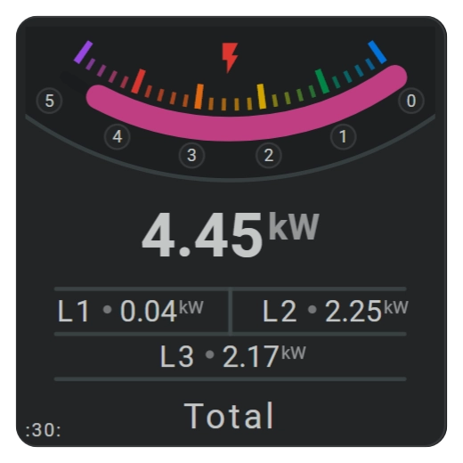
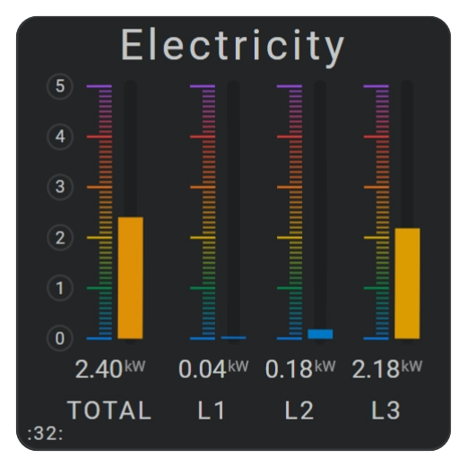

# Reusable YAML Card Examples

## :material-horseshoe: Real-world card examples

The two cards below show practical examples of the Reuse™ features provided by `same_as`, `calc()`, and `ref()`. Both examples include the full YAML configuration, so you can see how the repeated parts are reduced in a real card.

## :material-horseshoe: Example Card 30



Card 30 is an electricity card that uses the DSMR Reader integration.

It shows:

- total electricity consumption in the main horseshoe
- the consumption for each individual phase: L1, L2, and L3

This card has several repeated parts:

- the three horizontal lines
- the L1, L2, and L3 groups, each containing a state, a name, and a circle separator
- the shared color stops used by both the horseshoe and the icon

This example also uses named ids for all items. That makes the configuration easier to read and makes the `same_as` references more explicit.

### The card configuration

```yaml title="Entity definitions" linenums="1"
- type: custom:flex-horseshoe-card
  entities:
    - entity: sensor.dsmr_reading_electricity_currently_delivered
      name: 'Total'
      area: ':30:'
    - entity: sensor.dsmr_reading_phase_currently_delivered_l1
      name: 'L1'
    - entity: sensor.dsmr_reading_phase_currently_delivered_l2
      name: 'L2'
    - entity: sensor.dsmr_reading_phase_currently_delivered_l3
      name: 'L3'
    - entity: sensor.dsmr_reading_electricity_currently_delivered
```
```yaml title="External Palette definition" linenums="1"

  palettes:
    rainbow: /local/palettes/rainbow-palette-new.json  
```

!!! info "The constants section defines the styles and color stops used by `ref()`, plus numeric constants used by `calc()` for positioning."

```yaml title="Constants definition" linenums="1"
  constants:
    centerX: 50
    centerY: 50
    lineStep: 11
    lineLength: calc(4 * 20 + 5)       
    disabledLineStyle:
      stroke: var(--disabled-text-color)
      stroke-width: 2         
    defaultColorStops:
      mode: gradient
      gap: 3
      colors:
        0: var(--fhs-sys-rainbow-blue)
        1: var(--fhs-sys-rainbow-green)
        2: var(--fhs-sys-rainbow-yellow)
        3: var(--fhs-sys-rainbow-orange)
        4: var(--fhs-sys-rainbow-red)
        5: var(--fhs-sys-rainbow-purple)
```

!!! info "The three groups place related items at the right position on the card grid."
    Groups do not support `same_as` yet.
    <br>Groups can also scale or rotate elements.
    ```yaml
    groups:
      L1:
        xpos: 125
        ypos: 23
        scale:
          x: 1
          y: 1
        rotate: 90
    ```

```yaml title="Groups definition "linenums="1"
  layout:
    groups:
      L1:
        xpos: 23
        ypos: 72
      L2:
        xpos: 73
        ypos: 72
      L3:
        xpos: 48
        ypos: 83
```
```yaml title="Area and Icon definitions" linenums="1"

    areas:
      - id: all
        entity_index: 0
        xpos: 0
        ypos: 100
        styles:
          - font-size: 0.75em
          - text-transform: none     
          - text-anchor: start                       
    icons:
      - id: first
        entity_index: 0
        xpos: 50
        ypos: 10
        size: 1.5
        color_stops: ref(defaultColorStops)
```
```yaml title="hlines definition" linenums="1"
    hlines:
      - id: first
        xpos: calc(centerX)
        ypos: 64
        length: calc(4 * 20 + 5)
        styles:
          - ref(disabledLineStyle)
          - opacity: 0.8
      - id: second
        same_as: first
        same_as_dypos: calc(1 * lineStep)
      - id: third
        same_as: first
        same_as_dypos: calc(2 * lineStep)
```
```yaml title="vlines definition" linenums="1"
    vlines:
      - id: first
        xpos: 50
        ypos: 69.5
        length: 11
        styles:
          - stroke: var(--disabled-text-color);
```

!!! info "All three grouped circles are identical and are positioned around the center point of the card."
    The group places each circle at the right position on the card grid.

```yaml title="Circles definition" linenums="1"

    circles:
      - id: first
        group: L1 
        xpos: calc(centerX - 3)
        ypos: calc(centerY - 3)
        radius: 2
        styles:
          - fill: var(--primary-text-color);
          - opacity: 0.5;
      - id: second
        group: L2
        same_as: first
      - id: third
        group: L3
        same_as: first

      - id: bigone
        xpos: calc(centerX)
        ypos: calc(-centerY)
        radius: 175     # Radius in pixels
        styles:
          - fill: var(--primary-background-color);
          - opacity: 0.7;
          - stroke: var(--disabled-text-color);
          - stroke-width: 2
```

!!! info "All three grouped states are identical and are positioned around the center point of the card."
    The group places each state at the right position on the card grid.

```yaml title="States definition" linenums="1"
    states:
      - id: all
        entity_index: 0
        xpos: calc(centerX)
        ypos: 56
        styles:
          - font-size: 2.5em
          - font-weight: bold
      - id: first
        group: L1
        entity_index: 1
        xpos: calc(centerX)
        ypos: calc(centerY)
        styles:
          - text-anchor: start
          - font-size: 1.2em                 
      - id: second
        group: L2
        entity_index: 2
        same_as: first
      - id: third
        group: L3
        entity_index: 3
        same_as: first
```

!!! info "All three grouped names are identical and are positioned around the center point of the card."
    The group places each name at the right position on the card grid.

```yaml title="Names definition" linenums="1"
    names:
      - id: all
        entity_index: 0
        xpos: calc(centerX)
        ypos: 98
        ellipsis: 20
        styles:
          - font-size: 1.4em
          - text-transform: none
      - id: first
        entity_index: 1
        group: L1
        xpos: calc(centerX - 6)
        ypos: calc(centerY)
        styles:
          - text-anchor: end
          - font-size: 1.2em                
      - id: second
        entity_index: 2
        group: L2
        same_as: first
      - id: third
        entity_index: 3
        group: L3
        same_as: first
```
```yaml title="Horseshoe definition" linenums="1"
    horseshoes:
      - id: first
        entity_index: 0
        xpos: calc(centerX)
        ypos: -45
        radius: 70
        tickmarks_radius: 43
        arc_degrees: 70
        flip: both

        show:
          horseshoe: true
          scale_tickmarks: false
          horseshoe_style: colorstopgradient
          scale_style: fixed
          labels_at: ticks_major
          ticks: true
          label_badges: true                  
          label_background: none
        # 
        horseshoe_scale:
          min: 0
          max: 5
          width: 6
          color: var(--primary-background-color)
          ticksize: 0.1
          gap: 3
          styles:
            - opacity: 0.7
        #
        horseshoe_tickmarks:
          ticks_major:
            ticksize: 1
            color_mode: colorstopgradient
            width: 12
            offset: -3
            thickness: 3
            styles:
              - opacity: 0.9;
          ticks_minor:
            ticksize: 0.2
            color_mode: colorstopgradient
            thickness: 2
            width: 6
            offset: -12
            styles:
              - opacity: 0.7;
        #
        horseshoe_labels:
          distance_min: 0.3
          ticksize_min: 0.3
          orientation: horizontal
          background:
            width: 10
            gap: 3  
            styles:
              - opacity: 0.05
              - stroke: var(--primary-text-color)
          badges:
            radius: 6
            color: var(--card-background-color)
            border_color: var(--divider-color)
            padding: 0
            height: 10
          styles:
            - font-size: 0.7em
        #
        horseshoe_state:
          width: 12
        color_stops: ref(defaultColorStops)

```

## :material-horseshoe: Example Card 32



Card 32 is also an electricity card that uses the DSMR Reader integration.

It shows four vertical horseshoes: one for the total consumption and one for each phase.

This card has several repeated parts:

- the four vertical horseshoes
- the states for the horseshoes
- the names for the horseshoes

This example does not use groups. Instead, it uses simple shift-to-the-right positioning with `calc()`.

### The card configuration

```yaml title="Entity definitions" linenums="1"

- type: custom:flex-horseshoe-card
  entities:
    - entity: sensor.dsmr_reading_electricity_currently_delivered
      decimals: 2
      name: 'Total'
      area: ':32:'
    - entity: sensor.dsmr_reading_phase_currently_delivered_l1
      decimals: 2
      name: 'L1'
      area: 'Electricity'
    - entity: sensor.dsmr_reading_phase_currently_delivered_l2
      decimals: 2
      name: 'L2'
    - entity: sensor.dsmr_reading_phase_currently_delivered_l3
      decimals: 2
      name: 'L3'
    - entity: sensor.dsmr_reading_electricity_currently_delivered
      decimals: 2
```
```yaml title="External Palette definition" linenums="1"

  palettes:
    rainbow: /local/palettes/rainbow-palette-new.json  
```    
```yaml title="Constants definition" linenums="1"
  constants:
    radius0: 5000     # An extreme radius to emulate a straight horseshoe!!
    xpos0: 20         # First vertical horseshoe at xpos = 20
    ypos0: 45         # ... and ypos = 45
    dxPos1: 25        # Delta/shift xpos for first phase
    dxPos2: 21        # Delta/shift xpos for other phases
```
```yaml title="Areas definitions" linenums="1"
  layout:
    areas:
      - entity_index: 0
        xpos: 0
        ypos: 100
        styles:
          - font-size: 0.75em
          - text-transform: none     
          - text-anchor: start                       
      - entity_index: 1
        xpos: 50
        ypos: 8
        styles:
          - font-size: 1.7em
          - text-transform: none     
```
```yaml title="States definition" linenums="1"
    states:
      - entity_index: 0
        xpos: calc(xpos0)
        ypos: 85
        styles:
          - font-size: 1.0em
      - entity_index: 1
        same_as: 0
        same_as_dxpos: calc(dxPos1)
      - entity_index: 2
        same_as: 1
        same_as_dxpos: calc(dxPos2)
      - entity_index: 3
        same_as: 2
        same_as_dxpos: calc(dxPos2)
```

## :material-horseshoe: Related documentation

- Check syntax, processing order, and constraints in the [Reuse Reference](reuse-reference.md).
- Design repeated layouts with [Positioning and Groups](../core-concepts/positioning-and-groups.md).
- Configure the reused gradients with [Color Stops](../core-concepts/color-stops.md).
- Configure the scales and state arcs with the [Horseshoe Tool](../sections/horseshoes-section.md).
```yaml title="Names definition" linenums="1"
    names:
      - entity_index: 0
        xpos: calc(xpos0)
        ypos: 95
        styles:
          - font-size: 1.0em
      - entity_index: 1
        same_as: 0
        same_as_dxpos: calc(dxPos1)
      - entity_index: 2
        same_as: 1
        same_as_dxpos: calc(dxPos2)
      - entity_index: 3
        same_as: 2
        same_as_dxpos: calc(dxPos2)
```

!!! info "The very small arc of .7 degrees, combined with the large radius and a -90 degree rotation, makes the horseshoe look like a vertical progress bar."

```yaml title="Horseshoe definition ALL" linenums="1"
    horseshoes:
      - entity_index: 0
        xpos: calc(-radius0 + xpos0 + 5)
        ypos: 45
        radius: calc(radius0)
        rotate: -90       # Rotate horseshoe 90 degrees CCW
        arc_degrees: .7   # A larg radius requires a small arc
        flip: y           # Flip around y-axis so 0 is at bottom

        show:
          horseshoe: true
          scale_tickmarks: false
          horseshoe_style: colorstopgradient
          scale_style: fixed
          labels_at: ticks_major
          ticks: true
          label_badges: true                  
          label_background: none
        # 
        horseshoe_scale:
          min: 0
          max: 5
          width: 6
          color: var(--primary-background-color)
          ticksize: 0.1   # Ticks each 0.1 kWh
          gap: 3
          styles:
            - opacity: 0.7
        #
        horseshoe_tickmarks:
          ticks_major:
            ticksize: 1
            color_mode: colorstopgradient
            width: 12
            offset: -3
            thickness: 1
            styles:
              - stroke: var(--primary-text-color)
              - fill: var(--primary-text-color)
              - opacity: 0.9;
          ticks_minor:
            ticksize: 0.1
            color_mode: colorstopgradient
            thickness: 1
            width: 6
            offset: -12
            styles:
              - stroke: var(--primary-text-color)
              - fill: var(--primary-text-color)
              - opacity: 0.7;
        #
        horseshoe_labels:
          distance_min: 0.3
          ticksize_min: 0.3
          orientation: horizontal
          offset: -34
          badges:
            radius: 6
            color: var(--card-background-color)
            border_color: var(--divider-color)
            padding: 0
            height: 10  
          styles:
            - font-size: 0.7em
        #
        horseshoe_state:
          width: 12
          styles:
            - stroke-linecap: butt
        #
        color_stops:
          gap: 3
          colors:
            0: var(--fhs-sys-rainbow-blue)
            1: var(--fhs-sys-rainbow-green)
            2: var(--fhs-sys-rainbow-yellow)
            3: var(--fhs-sys-rainbow-orange)
            4: var(--fhs-sys-rainbow-red)
            5: var(--fhs-sys-rainbow-purple)
```

!!! success "Notice how little YAML is needed for the other three horseshoes!"
    The first copy reuses the "All" configuration, shifts it to the right, and removes the labels.
    <br>The other two copy the previous horseshoe and shift to the right from that position.
    <br><br>That reduces each additional horseshoe to only a few lines of YAML instead of repeating the full 79-line configuration.

```yaml title="Horseshoe definition L1/L2/L3" linenums="1"
      - entity_index: 1
        same_as: 0
        same_as_dxpos: calc(dxPos1)
        show:
          labels_at: none
      - entity_index: 2
        same_as: 1
        same_as_dxpos: calc(dxPos2)
      - entity_index: 3
        same_as: 2
        same_as_dxpos: calc(dxPos2)
```
