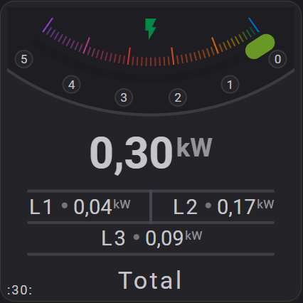

# Less YAML with Reuse™

Flexible Horseshoe Card layouts can grow quickly. Larger cards often contain several items that share the same positions, styles, colors, or layout rules, while differing in only one or two fields.

Repeating those values makes a configuration harder to read and maintain. Even a small visual adjustment may require changing the same setting in several places.

Reuse™ helps reduce that duplication.

Define the shared configuration once, then reuse it wherever it is needed. Before rendering, the card expands the reused definitions into complete internal items. The visual result stays the same, while the YAML remains shorter and easier to update.

For complete card configurations that use these features together, see [Reusable YAML Card Examples](reuse-card-examples.md).

## :material-horseshoe: The problem

A common layout pattern consists of several similar items. In the example below, the card contains three horizontal lines with the same position logic, length, and styling.



Without reuse, every line needs its own complete definition:

=== "Standard YAML"

    ```yaml linenums="1" hl_lines="2 9 16"
    hlines:
      - xpos: 50
        ypos: 64
        length: 85
        styles:
          stroke: var(--disabled-text-color)
          stroke-width: 2

      - xpos: 50
        ypos: 75 # 11 lower than the previous line
        length: 85
        styles:
          stroke: var(--disabled-text-color)
          stroke-width: 2

      - xpos: 50
        ypos: 86 # 11 lower than the previous line
        length: 85
        styles:
          stroke: var(--disabled-text-color)
          stroke-width: 2
    ```

This works, but repeated values make the layout slower to adjust. Changing the line length, style, starting position, or spacing requires editing multiple items.

YAML anchors can remove some duplication:

=== "YAML anchors"

    ```yaml linenums="1" hl_lines="2 10 13"
    hlines:
      - &hline_base
        xpos: 50
        ypos: 64
        length: 85
        styles:
          stroke: var(--disabled-text-color)
          stroke-width: 2

      - <<: *hline_base
        ypos: 75

      - <<: *hline_base
        ypos: 86
    ```

However, anchors have several limitations:

* They cannot calculate repeated spacing.
* Anchor names must be unique across the complete YAML file.
* The syntax can be difficult to scan in larger configurations.
* Overriding inherited values may trigger duplicate-key warnings in the Home Assistant YAML loader.

An example warning looks like this:

```text
Logger: annotatedyaml.constructors
Source: util/yaml/loader.py:65

YAML file /config/lovelace/views/whatever.yaml contains duplicate key "ypos".
```

For these reasons, the card includes its own reuse system.

## :material-horseshoe: The Reuse™ approach

The same layout can be written as one base line and two reused lines:

=== "With Reuse™"
  ```yaml linenums="1" hl_lines="1 8 14 18"
  constants:
    lineStep: 11
    defaultLineStyle:
      stroke: var(--disabled-text-color)
      stroke-width: 2

  hlines:
    - id: first
      xpos: 50
      ypos: 64
      length: 85
      styles: ref(defaultLineStyle)

    - id: second
      same_as: first
      same_as_dypos: calc(1 * lineStep)

    - id: third
      same_as: first
      same_as_dypos: calc(2 * lineStep)
  ```

The repetition pattern remains easy to recognize:

| Item     | Meaning                                 | Result     |
| :------- | :-------------------------------------- | :--------- |
| `first`  | Base line                               | `ypos: 64` |
| `second` | Reuses `first` and moves down one step  | `ypos: 75` |
| `third`  | Reuses `first` and moves down two steps | `ypos: 86` |

Before rendering, the card resolves these definitions into the equivalent complete configuration:

```yaml linenums="1" hl_lines="2 10 18"
hlines:
  - id: first
    xpos: 50
    ypos: 64
    length: 85
    styles:
      stroke: var(--disabled-text-color)
      stroke-width: 2

  - id: second
    xpos: 50
    ypos: 75
    length: 85
    styles:
      stroke: var(--disabled-text-color)
      stroke-width: 2

  - id: third
    xpos: 50
    ypos: 86
    length: 85
    styles:
      stroke: var(--disabled-text-color)
      stroke-width: 2
```

The written YAML stays compact, while every resolved item still contains the full configuration required for rendering.

### Main features

| Feature        | Purpose                                                           |
| :------------- | :---------------------------------------------------------------- |
| `same_as`      | Reuses an earlier item from the same section.                     |
| `same_as_d...` | Reuses an item and adds a numeric offset to one field.            |
| `constants`    | Stores reusable static values or configuration fragments.         |
| `calc()`       | Evaluates a static numeric expression during configuration setup. |
| `ref()`        | Inserts a value or configuration fragment from `constants`.       |

These features are processed once during card setup. They are not reevaluated on every render.

## :material-horseshoe: Reusing items with `same_as`

`same_as` inherits the configuration of an earlier item from the same section.

```yaml linenums="1" hl_lines="2 10"
circles:
  - id: base
    xpos: 50
    ypos: 50
    radius: 40
    styles:
      stroke: red
      fill: none

  - id: smaller
    same_as: base
    radius: 30
    styles:
      stroke: blue
      fill: none
```

The `smaller` circle inherits `xpos` and `ypos` from `base`, then replaces the radius and styles with its own values.

### Automatic and named IDs

Every reusable item needs an identifier. You can provide a named `id` or let the card assign one from the item index.

Named IDs make the relationship explicit:

```yaml linenums="1" hl_lines="2 7"
hlines:
  - id: first
    xpos: 50
    ypos: 64
    length: 85

  - id: second
    same_as: first
    ypos: 75
```

When no `id` is provided, the item index becomes its automatic identifier:

```yaml linenums="1" hl_lines="2 6 9"
hlines:
  - xpos: 50
    ypos: 64
    length: 85

  - same_as: 0
    ypos: 75

  - same_as: 0
    ypos: 86
```

Both `same_as: 0` and `same_as: "0"` refer to the first item.

Automatic IDs are convenient in short examples. Named IDs are usually easier to follow in larger configurations and remain clearer when items are reordered.

### Delta fields

A reused item can replace an inherited field directly:

```yaml linenums="1" hl_lines="2 7"
hlines:
  - id: first
    xpos: 50
    ypos: 64
    length: 85

  - id: second
    same_as: first
    ypos: 75
```

For repeated numeric adjustments, a delta field often shows the relationship more clearly:

```yaml linenums="1" hl_lines="2 7"
hlines:
  - id: first
    xpos: 50
    ypos: 64
    length: 85

  - id: second
    same_as: first
    same_as_dypos: 11
```

Delta fields follow this pattern:

```yaml
same_as_d<field>: <number>
```

The card adds the delta to the inherited value of the matching field.

| Delta field       | Target field | Meaning                         |
| :---------------- | :----------- | :------------------------------ |
| `same_as_dxpos`   | `xpos`       | Adds to the inherited `xpos`.   |
| `same_as_dypos`   | `ypos`       | Adds to the inherited `ypos`.   |
| `same_as_dlength` | `length`     | Adds to the inherited `length`. |
| `same_as_dradius` | `radius`     | Adds to the inherited `radius`. |

This pattern is generic and can be used with any inherited numeric field supported by the item.

For example, the inner circle below reuses the outer circle and reduces its radius by `5`:

```yaml linenums="1" hl_lines="2 7"
circles:
  - id: outer
    xpos: 50
    ypos: 50
    radius: 40

  - id: inner
    same_as: outer
    same_as_dradius: -5
```

The resolved radius of `inner` is `35`.

## :material-horseshoe: Static calculations with `calc()` and constants

YAML does not evaluate arithmetic expressions. The following value is treated as text rather than a calculation:

```yaml linenums="1" hl_lines="1"
xpos: 50 - 4
```

Use `calc()` when a numeric value should be calculated during card setup.

The example below positions two icons symmetrically around the center.

=== "Using fixed offsets"

    ```yaml linenums="1" hl_lines="3 8"
    icons:
      - id: left
        xpos: calc(50 - 4)
        ypos: 50

      - id: right
        xpos: calc(50 + 4)
        ypos: 50
    ```

=== "Using an offset constant"
    ```yaml linenums="1" hl_lines="2 7 12"
    constants:
      iconOffset: 4

    layout:
      icons:
        - id: left
          xpos: calc(50 - iconOffset)
          ypos: 50

        - id: right
          xpos: calc(50 + iconOffset)
          ypos: 50
    ```

Both versions resolve to the same positions:

| Item    | Calculation          | Result     |
| :------ | :------------------- | :--------- |
| `left`  | `xpos: calc(50 - 4)` | `xpos: 46` |
| `right` | `xpos: calc(50 + 4)` | `xpos: 54` |

!!! info "Static evaluation"
`calc()` is evaluated once while the configuration is processed. It is not a JavaScript template and does not run again during entity updates.

## :material-horseshoe: Constants and `ref()`

Use `constants` to store shared static values or configuration fragments.

Use `ref()` to insert one of those definitions elsewhere in the configuration.

```yaml linenums="1" hl_lines="2 3 4 17 20"
constants:
  centerX: 50
  iconOffset: 4
  lineStyle:
    stroke: var(--disabled-text-color)
    stroke-width: 2

layout:
  icons:
    - id: left
      xpos: calc(centerX - iconOffset)
      ypos: 50

    - id: right
      xpos: calc(centerX + iconOffset)
      ypos: 50

  hlines:
    - id: divider
      xpos: ref(centerX)
      ypos: 64
      length: 85
      styles: ref(lineStyle)
```

Shared values now have one source. Changing the center position, icon spacing, or line style requires updating only its constant.

## :material-horseshoe: Chained reuse or one base item

There are two common ways to build a repeated sequence.

=== "One base item"
    Refer every item back to the same base when each copy follows a fixed pattern:

    ```yaml linenums="1" hl_lines="11 15"
    constants:
      centerX: 50
      lineStep: 11

    layout:
      hlines:
        - id: first
          xpos: calc(centerX)
          ypos: 64
          length: calc(4 * 20 + 5)

        - id: second
          same_as: first
          same_as_dypos: calc(1 * lineStep)

        - id: third
          same_as: first
          same_as_dypos: calc(2 * lineStep)
    ```

    The positions are calculated from one shared source:

    ```text
    second = first + 1 step
    third  = first + 2 steps
    ```
=== "Chained reuse"
    Refer to the previous item when each new item should continue from the last result:

    ```yaml linenums="1" hl_lines="11 15"
    constants:
      centerX: 50
      lineStep: 11

    layout:
      hlines:
        - id: first
          xpos: calc(centerX)
          ypos: 64
          length: calc(4 * 20 + 5)

        - id: second
          same_as: first
          same_as_dypos: calc(lineStep)

        - id: third
          same_as: second
          same_as_dypos: calc(lineStep)
    ```

    In this version, each position builds on the previous one:

    ```text
    second = first + 11
    third  = second + 11
    ```

Using one base item is often clearer for fixed grids and regular spacing. Chained reuse works well for progressive sequences where each item naturally depends on the one before it.

## :material-horseshoe: Reusing larger items

Reuse becomes especially valuable when an item contains nested configuration.

A horizontal line has only a few fields. A horseshoe may include scale settings, state styling, tick marks, labels, color stops, widths, value limits, and display options.

The example below defines a shared horseshoe and reuses it for power and temperature gauges:

```yaml linenums="1" hl_lines="2 7 12 27 36"
constants:
  defaultColorStops:
    colors:
      0: '#49ce4b'    # Light green
      50: '#fed125'   # Yellow
      100: '#e9343d'  # Red

  powerColorStops:
    colors:
      0: '#49ce4b'
      2500: '#fed125'
      5000: '#e9343d'

  temperatureColorStops:
    colors:
      -10: '#3498db'
      20: '#49ce4b'
      40: '#e9343d'

layout:
  horseshoes:
    - id: base
      group: base
      radius: 45
      horseshoe_scale:
        min: 0
        max: 100
        width: 6
      horseshoe_state:
        width: 8
      show:
        horseshoe: true
        tickmarks: true
      color_stops: ref(defaultColorStops)

    - id: power
      group: power
      same_as: base
      entity_index: 1
      color_stops: ref(powerColorStops)
      horseshoe_scale:
        min: 0
        max: 5000

    - id: temperature
      group: temperature
      same_as: base
      entity_index: 2
      color_stops: ref(temperatureColorStops)
      horseshoe_scale:
        min: -10
        max: 40
```

The reused horseshoes contain only their differences. Shared geometry and presentation remain in `base`, making broad visual changes easier and safer.

!!! success "Larger repeated blocks benefit the most"
Reusing a short line definition saves a small amount of YAML. Reusing a horseshoe with several nested settings can remove much more duplication and reduce the risk of inconsistent updates.

## :material-horseshoe: When to use reuse

Reuse works best when a layout contains a clear pattern, such as:

* repeated lines, circles, icons, names, or states
* several horseshoes with the same visual structure
* shared styles or color stops
* regular spacing between items
* positions derived from a shared center
* several values based on the same constant

Avoid introducing reuse when it makes a simple item harder to understand. A unique element with only a few fields is often clearer as ordinary YAML.

## :material-horseshoe: Related documentation

* [Combining `calc()` with `same_as`](reuse-calc-same-as.md)
* [Reusable YAML Card Examples](reuse-card-examples.md)
* [Reuse Reference](reuse-reference.md)
* [Groups](../sections/groups-section.md)
* [Color Stops](../core-concepts/color-stops.md)
