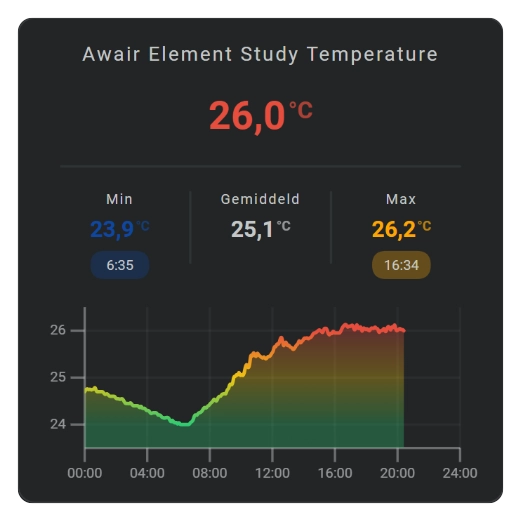
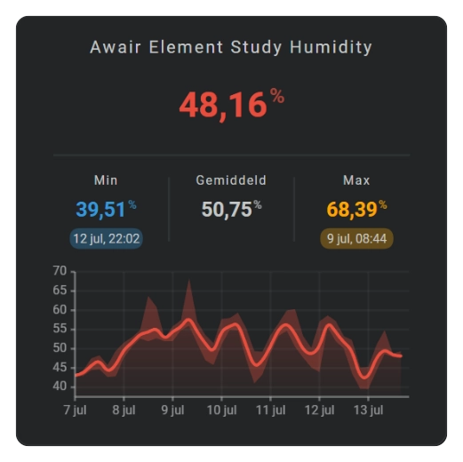
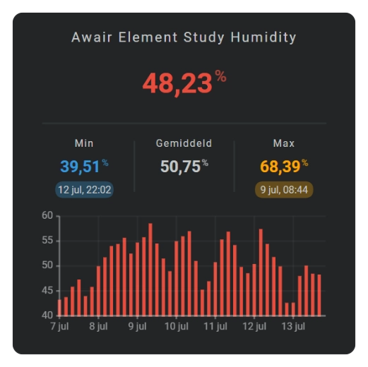

# Sparkline Cartesian charts and automatic axes

Line, area, and bar charts show time horizontally and sensor values vertically. Select the history period and number of bins first, and then choose how those bins should be displayed. The scale, grid, ticks, and labels are selected automatically for the configured graph size and visible values.

The Y-axis follows the values that are visible in the selected chart. Increasing the number of bins can expose shorter peaks and may therefore produce a different Y range. A nearly constant series receives a finer scale, while sudden peaks or dips expand the range.

The X-axis follows the configured period:

- A rolling window moves with the available bins.
- A current calendar period covers the complete calendar range while the graph grows up to the current bin.
- Local midnight is shown as a date; other ticks use the appropriate local time format.

Move the pointer or a finger across a supported chart to inspect the nearest bin. The tooltip shows the bin date or time and the formatted minimum, average, and maximum values.

## :material-horseshoe: Line chart

### Basic usage

A line chart connects the aggregate value of each populated bin. It is useful for displaying a compact trend while keeping individual changes visible.

```yaml linenums="1"
sparkline:
  state_values:
    aggregate_func: avg
    smoothing: true
  show:
    chart_type: line
    line: true
```

Enable points when the individual bins should remain visible:

```yaml linenums="1"
sparkline:
  show:
    chart_type: line
    line: true
    points: true
```

### Configuration fields

| Field | Required | Description |
| :---- | :------: | :---------- |
| `show.chart_type` | :material-check: | Use `line` to select the line chart. |
| `show.line` | :material-close: | Shows or hides the line layer. |
| `show.points` | :material-close: | Shows one point for each populated bin. |
| `state_values.aggregate_func` | :material-close: | Selects the value represented by the line. |
| `state_values.smoothing` | :material-close: | Selects smooth or straight connections between bins. |
| `line.show_dots` | :material-close: | Shows dots as part of the line configuration. |
| `line.line_width` | :material-close: | Sets the width of the line. |
| `line.styles` | :material-close: | Applies SVG styles to the line. |

### Styling

Use `line.styles` to style the path:

```yaml linenums="1"
line:
  styles:
    - fill: none
    - stroke: var(--primary-color)
    - stroke-width: 1
    - stroke-linecap: round
    - stroke-linejoin: round
```

Point size and appearance can be configured with the applicable point or dot settings.

### Axes, grid, labels, and tooltip

| Display element | Support |
| :-------------- | :------ |
| X-axis | Yes, automatic. |
| Y-axis | Yes, automatic. |
| Grid | X and Y. |
| Tick marks | X and Y. |
| Labels | X and Y. |
| Tooltip and indicator | Yes. |

## :material-horseshoe: Area chart

### Basic usage

An area chart uses the same aggregate path as a line chart and fills the space between that path and the graph baseline.

| Area Day Chart | Area Week Chart with min/max values |
|:-:|:-:|
|  |  |

```yaml linenums="1"
sparkline:
  state_values:
    aggregate_func: avg
    smoothing: true
  show:
    chart_type: area
    line: true
    area: true
    fill: fade
```

Line and area charts can also display the minimum and maximum range of every bin. The automatic Y-axis includes those values so that the complete visible range remains inside the graph.

### Configuration fields

| Field | Required | Description |
| :---- | :------: | :---------- |
| `show.chart_type` | :material-check: | Use `area` to select the area chart. |
| `show.line` | :material-close: | Shows the aggregate line above the area. |
| `show.area` | :material-close: | Shows the filled area layer. |
| `show.fill` | :material-close: | Selects the applicable fill behavior, including `fade`. |
| `show.points` | :material-close: | Shows one point for each populated bin. |
| `state_values.aggregate_func` | :material-close: | Selects the value represented by the area boundary. |
| `state_values.smoothing` | :material-close: | Selects a smooth or straight area boundary. |
| `area.show_dots` | :material-close: | Shows dots as part of the area configuration. |
| `area.styles` | :material-close: | Applies SVG styles to the area. |

### Styling

Use `area.styles` for the fill color and opacity:

```yaml linenums="1"
area:
  styles:
    - fill: var(--primary-color)
    - opacity: 0.25
```

`fill: fade` applies a vertical opacity transition. Positive and negative parts are handled independently when the Y range crosses zero.

### Axes, grid, labels, and tooltip

| Display element | Support |
| :-------------- | :------ |
| X-axis | Yes, automatic. |
| Y-axis | Yes, automatic. |
| Grid | X and Y. |
| Tick marks | X and Y. |
| Labels | X and Y. |
| Tooltip and indicator | Yes. |

## :material-horseshoe: Dots chart

### Basic usage

A dots chart shows the aggregate value of every populated bin as a separate point without connecting those points with a line.

!!! warning "Not yet available in the current FHS implementation"
    The original sparkline implementation supports `chart_type: dots`, but this chart type still needs to be integrated into the current FHS graph update, rendering, axis, and pointer handling.

```yaml linenums="1"
sparkline:
  state_values:
    aggregate_func: avg
  show:
    chart_type: dots
```

Use `show.points` when points should be added to a line or area chart instead of displayed as a standalone dots chart.

### Configuration fields

| Field | Required | Description |
| :---- | :------: | :---------- |
| `show.chart_type` | :material-check: | Use `dots` to select the standalone dots chart. |
| `state_values.aggregate_func` | :material-close: | Selects the value represented by every dot. |
| `line_color` | :material-close: | Defines the dot colors when no entity color or color stop applies. |
| `color_stops` | :material-close: | Defines value-based dot colors. |

### Styling

The dedicated dots styling fields will be documented together with the FHS software integration. Points added to line or area charts continue to use their existing point and dot settings.

### Axes, grid, labels, and tooltip

| Display element | Support |
| :-------------- | :------ |
| X-axis | Yes, automatic. |
| Y-axis | Yes, automatic. |
| Grid | X and Y. |
| Tick marks | X and Y. |
| Labels | X and Y. |
| Tooltip and indicator | Yes. |

## :material-horseshoe: Bar chart

### Basic usage

A bar chart shows one centered bar for every populated bin. More bins produce narrower bars; fewer bins produce wider bars.



```yaml linenums="1"
sparkline:
  state_values:
    aggregate_func: avg
  show:
    chart_type: bar
  bar:
    column_spacing: 1
```

The center of each bar uses the same X position as its time bin and tooltip. Bars can extend above or below zero when the visible range contains negative values.

### Configuration fields

| Field | Required | Description |
| :---- | :------: | :---------- |
| `show.chart_type` | :material-check: | Use `bar` to select the bar chart. |
| `state_values.aggregate_func` | :material-close: | Selects the value represented by each bar. |
| `bar.column_spacing` | :material-close: | Sets the space between adjacent bars. |
| `bar.styles` | :material-close: | Applies SVG styles to the bars. |

### Styling

Bar colors can use the configured line colors, entity color, or color stops. Use `bar.styles` for additional SVG presentation.

### Axes, grid, labels, and tooltip

| Display element | Support |
| :-------------- | :------ |
| X-axis | Yes, automatic. |
| Y-axis | Yes, automatic. |
| Grid | X and Y. |
| Tick marks | X and Y. |
| Labels | X and Y. |
| Tooltip and indicator | Yes. |

## :material-horseshoe: Showing automatic axes

Use `show` to select which automatically calculated display elements are visible:

```yaml linenums="1"
sparkline:
  show:
    grid:
      x: true
      y: true
    axis:
      x: true
      y: true
    tickmarks:
      x: true
      y: true
    labels:
      x: true
      y: true
```

Grid divisions, tick positions, and label positions adjust automatically. Existing configurations that use a boolean, such as `axis: true`, continue to show both supported axes.

## :material-horseshoe: Logarithmic Y-axis

Set `state_values.logarithmic: true` for data whose useful variation spans multiple orders of magnitude. This changes the vertical value scale; the horizontal time scale remains unchanged.

Use logarithmic mode only with a suitable value range and verify the resulting graph with the target sensor before using it as a dashboard default.

## :material-horseshoe: Tooltip styling

Configure the tooltip presentation under `tooltip.styles`:

```yaml linenums="1"
sparkline:
  tooltip:
    styles:
      - font-size: 0.65em
```

## :material-horseshoe: Related documentation

- [Sparkline Graphs](sparklines-section.md)
- [Sparkline History Periods and Bins](sparkline-history-periods.md)
- [Sparkline Specialized Charts](sparkline-specialized-charts.md)
- [CSS Styling](../core-concepts/css-styling.md)
