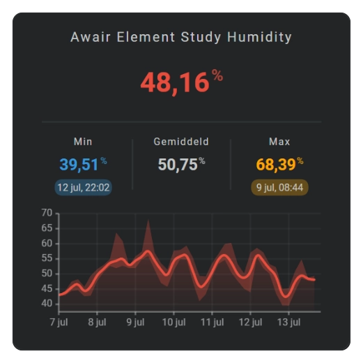
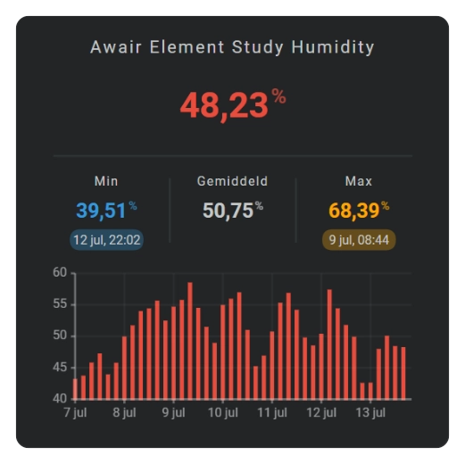

# Sparkline Cartesian charts and automatic axes

Line, area, dots, and bar charts show time horizontally and sensor values vertically. Select the history period and number of bins first, and then choose how those bins should be displayed. The scale, grid, ticks, and labels are selected automatically for the configured graph size and visible values.

The Y-axis follows the values that are visible in the selected chart. Increasing the number of bins can expose shorter peaks and may therefore produce a different Y range. A nearly constant series receives a finer scale, while sudden peaks or dips expand the range.

The X-axis follows the configured period:

- A rolling window moves with the available bins.
- A current calendar period covers the complete calendar range while the graph grows up to the current bin.
- Local midnight is shown as a date; other ticks use the appropriate local time format.

Move the pointer or a finger across a supported chart to inspect the nearest time interval. The tooltip shows the date or time and the formatted minimum, average, and maximum values.

## :material-horseshoe: Line chart

### Basic usage

A line chart connects sensor values over time. Use it to show trends while keeping changes in direction easy to see.

```yaml linenums="1"
sparkline:
  state_values:
    aggregate_func: avg
    smoothing: true
  show:
    chart_type: line
    line: true
```

Enable points to mark the individual values along the line:

```yaml linenums="1"
sparkline:
  show:
    chart_type: line
    line: true
    points: true
```

### Configuration fields

| Field | Required | Description |
| :---- | :------: | :---------- |
| `show.chart_type` | :material-check: | Use `line` to select the line chart. |
| `show.line` | :material-close: | Shows or hides the line. |
| `show.points` | :material-close: | Shows a point for each displayed time interval. |
| `state_values.aggregate_func` | :material-close: | Selects which value is shown for each time interval. |
| `state_values.smoothing` | :material-close: | Selects smooth or straight connections between values. |
| `line.show_dots` | :material-close: | Shows dots as part of the line configuration. |
| `line.line_width` | :material-close: | Sets the width of the line. |
| `line.styles` | :material-close: | Applies SVG styles to the line. |

### Styling

Use `line.styles` to change the line appearance:

```yaml linenums="1"
line:
  styles:
    - fill: none
    - stroke: var(--primary-color)
    - stroke-width: 1
    - stroke-linecap: round
    - stroke-linejoin: round
```

Point size and appearance can be configured with the applicable point or dot settings.

### Axes, grid, labels, and tooltip

| Display element | Support |
| :-------------- | :------ |
| X-axis | Yes, automatic. |
| Y-axis | Yes, automatic. |
| Grid | X and Y. |
| Tick marks | X and Y. |
| Labels | X and Y. |
| Tooltip and indicator | Yes. |

## :material-horseshoe: Area chart

### Basic usage

An area chart shows sensor history as a filled graph. Use it when the size and direction of changes should stand out more clearly than with a line alone.

| Area Day Chart | Area Week Chart with min/max values |
|:-:|:-:|
|  |  |

```yaml linenums="1"
sparkline:
  state_values:
    aggregate_func: avg
    smoothing: true
  show:
    chart_type: area
    line: true
    area: true
    fill: fade
```

Line and area charts can also show the lowest and highest values in each time interval. The automatic Y-axis adjusts to keep the complete visible range inside the graph.

### Configuration fields

| Field | Required | Description |
| :---- | :------: | :---------- |
| `show.chart_type` | :material-check: | Use `area` to select the area chart. |
| `show.line` | :material-close: | Shows the line above the filled area. |
| `show.area` | :material-close: | Shows the filled area. |
| `show.fill` | :material-close: | Selects the applicable fill behavior, including `fade`. |
| `show.points` | :material-close: | Shows a point for each displayed time interval. |
| `state_values.aggregate_func` | :material-close: | Selects which value is shown for each time interval. |
| `state_values.smoothing` | :material-close: | Selects smooth or straight connections between values. |
| `area.show_dots` | :material-close: | Shows dots as part of the area configuration. |
| `area.styles` | :material-close: | Applies SVG styles to the area. |

### Styling

Use `area.styles` for the fill color and opacity:

```yaml linenums="1"
area:
  styles:
    - fill: var(--primary-color)
    - opacity: 0.25
```

`fill: fade` applies a vertical opacity transition. Positive and negative parts are handled independently when the Y range crosses zero.

### Axes, grid, labels, and tooltip

| Display element | Support |
| :-------------- | :------ |
| X-axis | Yes, automatic. |
| Y-axis | Yes, automatic. |
| Grid | X and Y. |
| Tick marks | X and Y. |
| Labels | X and Y. |
| Tooltip and indicator | Yes. |

## :material-horseshoe: Dots chart

### Basic usage

A dots chart shows individual values as separate points. Use it to see changes and outliers without connecting the values with a line.

| Dots chart |
| :-:|
| {width=300} |

```yaml linenums="1"
sparkline:
  state_values:
    aggregate_func: avg
  show:
    chart_type: dots
```

Use `show.points` when points should be added to a line or area chart instead of displayed as a standalone dots chart.

### Configuration fields

| Field | Required | Description |
| :---- | :------: | :---------- |
| `show.chart_type` | :material-check: | Use `dots` to select the standalone dots chart. |
| `state_values.aggregate_func` | :material-close: | Selects which value is shown for each time interval. |
| `line_color` | :material-close: | Defines the dot colors when no entity color or color stop applies. |
| `color_stops` | :material-close: | Defines value-based dot colors. |

### Styling

Use `line_color` to set a fixed color, or use `color_stops` to color each dot according to its value.

### Axes, grid, labels, and tooltip

| Display element | Support |
| :-------------- | :------ |
| X-axis | Yes, automatic. |
| Y-axis | Yes, automatic. |
| Grid | X and Y. |
| Tick marks | X and Y. |
| Labels | X and Y. |
| Tooltip and indicator | Yes. |

## :material-horseshoe: Bar chart

### Basic usage

A bar chart shows sensor values as separate vertical bars. More time intervals produce narrower bars; fewer intervals produce wider bars.

| Bar chart |
| :-:|
| {width=300} |

```yaml linenums="1"
sparkline:
  state_values:
    aggregate_func: avg
  show:
    chart_type: bar
  bar:
    column_spacing: 1
```

Bars can extend above or below zero when the selected history contains negative values.

### Configuration fields

| Field | Required | Description |
| :---- | :------: | :---------- |
| `show.chart_type` | :material-check: | Use `bar` to select the bar chart. |
| `state_values.aggregate_func` | :material-close: | Selects which value is shown for each time interval. |
| `bar.column_spacing` | :material-close: | Sets the space between adjacent bars. |
| `bar.styles` | :material-close: | Applies SVG styles to the bars. |

### Styling

Bar colors can use the configured line colors, entity color, or color stops. Use `bar.styles` to change the appearance of the bars.

### Axes, grid, labels, and tooltip

| Display element | Support |
| :-------------- | :------ |
| X-axis | Yes, automatic. |
| Y-axis | Yes, automatic. |
| Grid | X and Y. |
| Tick marks | X and Y. |
| Labels | X and Y. |
| Tooltip and indicator | Yes. |

## :material-horseshoe: Showing grid, axes, tickmarks and labels

Use `show` to select which automatically calculated display elements are visible:

```yaml linenums="1"
sparkline:
  show:
    grid:
      x: true
      y: true
    axis:
      x: true
      y: true
    tickmarks:
      x: true
      y: true
    labels:
      x: true
      y: true
```

Grid divisions, tick positions, and label positions adjust automatically. Existing configurations that use a boolean, such as `axis: true`, continue to show both supported axes.

## :material-horseshoe: Logarithmic Y-axis

Set `state_values.logarithmic: true` for data whose useful variation spans multiple orders of magnitude. This changes the vertical value scale; the horizontal time scale remains unchanged.

Use logarithmic mode only with a suitable value range and verify the resulting graph with the target sensor before using it as a dashboard default.

## :material-horseshoe: Tooltip styling

Configure the tooltip presentation under `tooltip.styles`:

```yaml linenums="1"
sparkline:
  tooltip:
    styles:
      - font-size: 0.65em
```

## :material-horseshoe: Related documentation

- [Sparkline Graphs](sparklines-section.md)
- [Sparkline History Periods and Bins](sparkline-history-periods.md)
- [Sparkline Specialized Charts](sparkline-specialized-charts.md)
- [CSS Styling](../core-concepts/css-styling.md)
