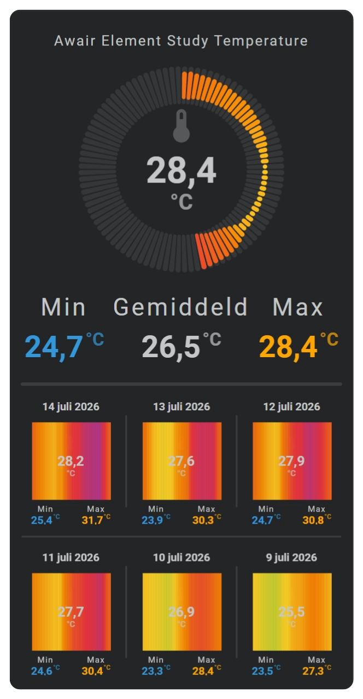
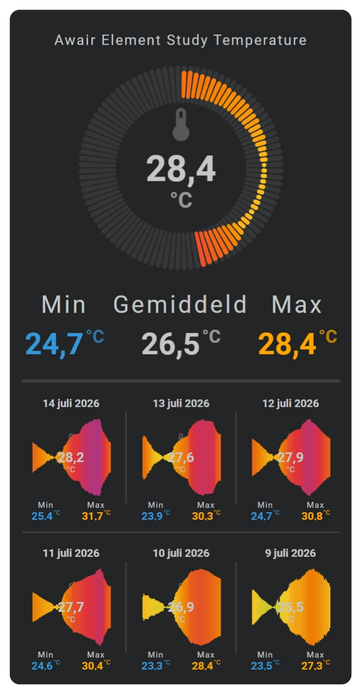
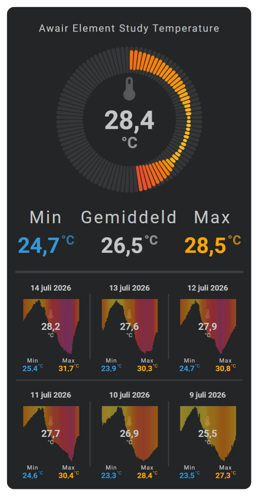
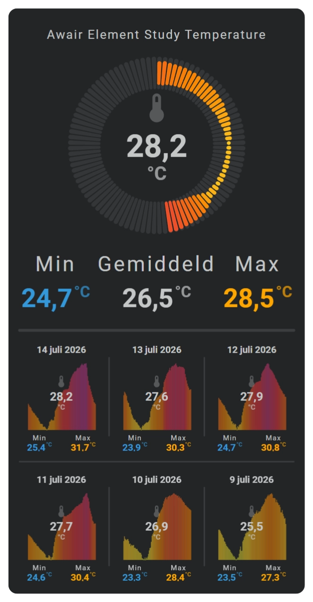
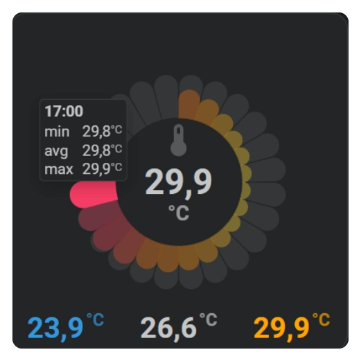

# Sparkline specialized charts

Specialized charts use the configured period, bins, aggregate values, and color stops but present those values without a conventional line or area. Equalizer and graded charts emphasize levels, while barcode charts emphasize value changes through color.

## :material-horseshoe: Shared color behavior

Specialized charts can calculate a color for every displayed bin or level. `colorstops_transition` controls whether the transition between configured colors is hard or smoothly interpolated.

```yaml linenums="1"
sparkline:
  colorstops_transition: smooth
  color_stops:
    colors:
      - value: 0
        color: '#49ce4b'
      - value: 50
        color: '#fed125'
      - value: 100
        color: '#e9343d'
```

See [Color Stops](../core-concepts/color-stops.md) for reusable color-stop templates and threshold definitions.

## :material-horseshoe: Equalizer chart

### Basic usage

An equalizer divides the visible Y range into a configured number of levels and renders the active levels for every time bin.

```yaml linenums="1"
sparkline:
  show:
    chart_type: equalizer
  equalizer:
    value_buckets: 10
    square: false
```

### Configuration fields

| Field | Required | Description |
| :---- | :------: | :---------- |
| `show.chart_type` | :material-check: | Use `equalizer` to select the equalizer chart. |
| `equalizer.value_buckets` | :material-close: | Sets the number of vertical value levels. |
| `equalizer.square` | :material-close: | Uses square levels when enabled. |
| `equalizer.column_spacing` | :material-close: | Sets the space between time bins. |
| `equalizer.row_spacing` | :material-close: | Sets the space between value levels. |

### Styling

Equalizer levels use the configured entity color, line colors, or color stops. Per-bin color stops allow the levels to communicate both magnitude and threshold state.

### Axes, grid, labels, and tooltip

| Display element | Support |
| :-------------- | :------ |
| X-axis | Yes, automatic. |
| Y-axis | Yes, automatic. |
| Grid | X and Y. |
| Tick marks | X and Y. |
| Labels | X and Y. |
| Tooltip and indicator | No. |

## :material-horseshoe: Graded chart

### Basic usage

A graded chart converts every bin value into one of the ranks defined by its color stops. It is useful when the meaning of the grade is more important than the exact numeric position.

```yaml linenums="1"
sparkline:
  show:
    chart_type: graded
  graded:
    square: false
```

Define ranks in the color-stop entries when their visual order differs from their numeric definition order.

### Configuration fields

| Field | Required | Description |
| :---- | :------: | :---------- |
| `show.chart_type` | :material-check: | Use `graded` to select the graded chart. |
| `graded.square` | :material-close: | Uses square grade indicators when enabled. |
| `equalizer.value_buckets` | :material-close: | Sets the number of visible grade levels. |
| `color_stops.colors` | :material-check: | Supplies the values, colors, and optional ranks. |

### Styling

The configured color-stop ranks determine the visible grade and its color. Use color-stop templates when multiple cards share the same grading scale.

### Axes, grid, labels, and tooltip

| Display element | Support |
| :-------------- | :------ |
| X-axis | No. |
| Y-axis | No. |
| Grid | No. |
| Tick marks | No. |
| Labels | No. |
| Tooltip and indicator | No. |

## :material-horseshoe: Barcode chart

### Basic usage

A barcode renders one narrow colored segment for every time bin. Time runs from left to right, while the value is communicated by the color of each segment.

Below some of the variations. The top sparkline shows the current day with a radial barcode / audio / rice_grain visualization. The bottom 6 sparklines show the past week with their average (center) and min/max values at the bottom.

| Barcode | Barcode - Audio variant |
|:-:|:-:|
|  |  |

| Barcode - Stalactites variant | Barcode - Stalagmites variant |
|:-:|:-:|
|  |  |

```yaml linenums="1"
sparkline:
  show:
    chart_type: barcode
    chart_variant: audio
  colorstops_transition: smooth
  color_stops:
    colors:
      - value: 0
        color: '#3498db'
      - value: 50
        color: '#2ecc71'
      - value: 100
        color: '#e74c3c'
```

Each segment uses its own bin value. The current entity state is not applied to the complete historical barcode.

Omit `chart_variant` for full-height segments. Use `audio` for centered value bars, `stalactites` for bars growing down from the top, or `stalagmites` for bars growing up from the bottom.

### Configuration fields

| Field | Required | Description |
| :---- | :------: | :---------- |
| `show.chart_type` | :material-check: | Use `barcode` to select the barcode chart. |
| `show.chart_variant` | :material-close: | Selects `audio`, `stalactites`, or `stalagmites`; omit it for full-height segments. |
| `color_stops.colors` | :material-close: | Defines the value-based color of every segment. |
| `colorstops_transition` | :material-close: | Selects hard or smooth transitions between colors. |
| `barcode.styles` | :material-close: | Applies SVG styles to the barcode segments. |

### Styling

Use `barcode.styles` for the segment presentation. Color stops remain responsible for the data-driven color of each bin.

### Axes, grid, labels, and tooltip

| Display element | Support |
| :-------------- | :------ |
| X-axis | Yes, automatic. |
| Y-axis | No. |
| Grid | X only. |
| Tick marks | X only. |
| Labels | X only. |
| Tooltip and indicator | Yes. |

## :material-horseshoe: Radial barcode chart

### Basic usage

A radial barcode arranges the configured time bins around a circle. The complete configured period occupies the full ring from the first bin through the last bin.

| Radial Barcode chart - Sunburst variant - flower viz |
| :-:|
| {width=300} |

```yaml linenums="1"
sparkline:
  show:
    chart_type: radial_barcode
    chart_variant: sunburst
    chart_viz: flower

  radial_barcode:
    size: 5
    line_width: 0
    background:
      styles:
        - opacity: 0.15
    foreground:
      styles:
        - opacity: 1
    face:
      show_hour_marks: true
      hour_marks_count: 24
```

Move the pointer or a finger over the ring to inspect a segment. The active foreground segment is emphasized, the other foreground segments are dimmed relative to their configured opacity, and the tooltip shows the selected bin.

Omit `chart_viz` for regular ring segments. Use `flower`, `flower2`, or `rice_grain` to change the segment shape.

Omit `chart_variant` for a fixed-width ring. Use `sunburst`, `sunburst_centered`, `sunburst_outward`, or `sunburst_inward` to let each segment's radial size represent its value.

### Configuration fields

| Field | Required | Description |
| :---- | :------: | :---------- |
| `show.chart_type` | :material-check: | Use `radial_barcode` to select the radial barcode chart. |
| `show.chart_viz` | :material-close: | Selects `flower`, `flower2`, or `rice_grain`; omit it for regular ring segments. |
| `show.chart_variant` | :material-close: | Selects a centered, outward, or inward sunburst value layout. |
| `radial_barcode.size` | :material-close: | Sets the radial width of the barcode ring. |
| `radial_barcode.line_width` | :material-close: | Adds line width to the radial segments. |
| `radial_barcode.background.styles` | :material-close: | Styles the complete reference ring. |
| `radial_barcode.foreground.styles` | :material-close: | Styles the data-driven foreground segments. |
| `radial_barcode.face.show_day_night` | :material-close: | Shows the day and night face. |
| `radial_barcode.face.show_hour_marks` | :material-close: | Shows hour marks. |
| `radial_barcode.face.show_hour_numbers` | :material-close: | Shows absolute or relative hour numbers. |
| `radial_barcode.face.hour_marks_count` | :material-close: | Sets the number of hour marks. |

### Styling

Use `foreground.styles` for the colored data segments and `background.styles` for the reference ring behind them. Interaction changes the foreground emphasis temporarily and restores the configured styles when interaction ends.

Color stops calculate the color of every foreground segment from that segment's own bin value.

### Axes, grid, labels, and tooltip

| Display element | Support |
| :-------------- | :------ |
| X-axis | No. |
| Y-axis | No. |
| Grid | No. |
| Tick marks | No. |
| Labels | No. |
| Tooltip | Yes, per radial segment. |
| Indicator | No. |

## :material-horseshoe: Related documentation

- [Sparkline Graphs](sparklines-section.md)
- [Sparkline History Periods and Bins](sparkline-history-periods.md)
- [Sparkline Cartesian Charts and Axes](sparkline-cartesian-charts.md)
- [Color Stops](../core-concepts/color-stops.md)
- [CSS Styling](../core-concepts/css-styling.md)
