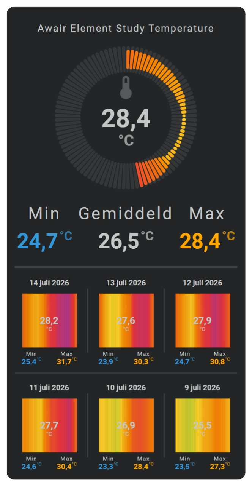
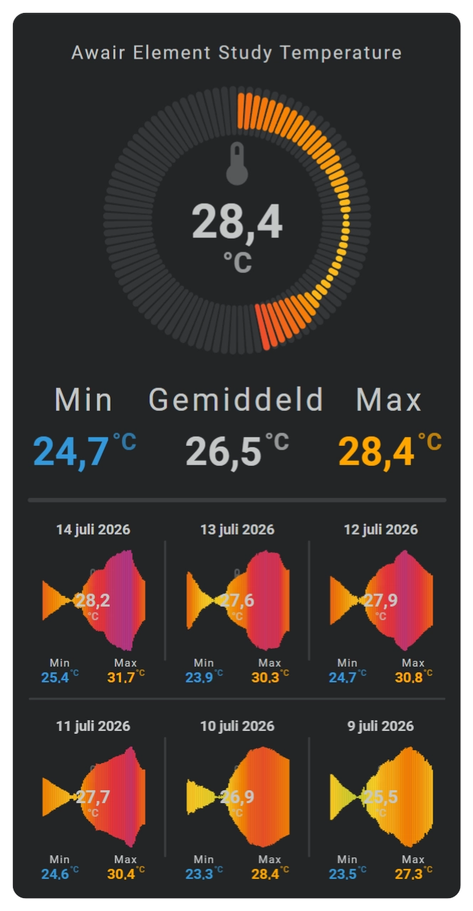
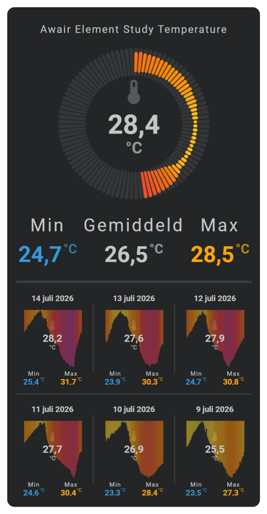
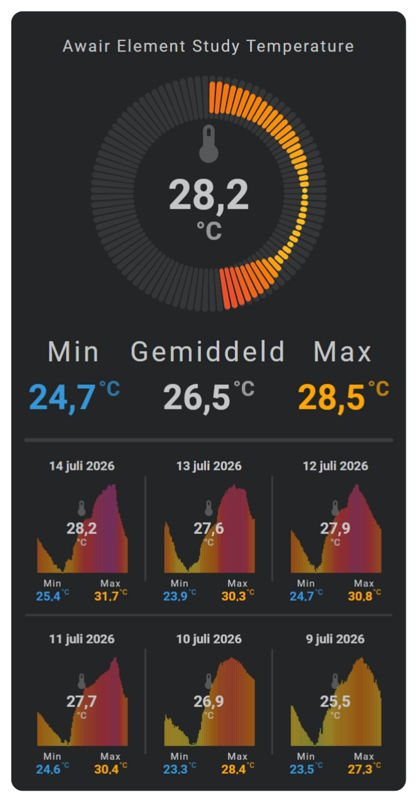
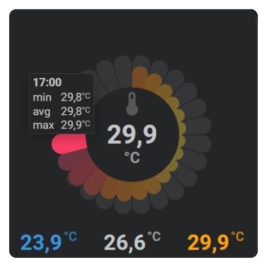

# Sparkline specialized charts

Specialized charts present history without a conventional line or area. Equalizer and graded charts emphasize numeric levels, state bands show how named states change over time, and barcode charts emphasize value changes through color.

## :material-horseshoe: Shared color behavior

Specialized charts can calculate a color for every displayed bin or level. `colorstops_transition` controls whether the transition between configured colors is hard or smoothly interpolated.

```yaml linenums="1"
sparkline:
  colorstops_transition: smooth
  color_stops:
    colors:
      - value: 0
        color: '#49ce4b'
      - value: 50
        color: '#fed125'
      - value: 100
        color: '#e9343d'
```

See [Color Stops](../core-concepts/color-stops.md) for reusable color-stop templates and threshold definitions.

## :material-horseshoe: Equalizer chart

### Basic usage

An equalizer divides the visible Y range into a configured number of levels and renders the active levels for every time bin.

| Equalizer chart |
| :-:|
| {width=300} |


```yaml linenums="1"
sparkline:
  show:
    chart_type: equalizer
  equalizer:
    value_buckets: 10
    square: false
```

### Configuration fields

| Field | Required | Default | Description |
| :---- | :------: | :------ | :---------- |
| `show.chart_type` | :material-check: | | Use `equalizer` to select the equalizer chart. |
| `equalizer.value_buckets` | :material-close: | `10` | Sets the number of vertical value levels. |
| `equalizer.square` | :material-close: | `false` | Uses square levels when enabled. |
| `equalizer.column_spacing` | :material-close: | `1` | Sets the space between time bins. |
| `equalizer.row_spacing` | :material-close: | `1` | Sets the space between value levels. |

### Styling

Equalizer levels use the configured entity color, line colors, or color stops. Per-bin color stops allow the levels to communicate both magnitude and threshold state.

### Axes, grid, labels, and tooltip

| Display element | Support |
| :-------------- | :------ |
| X-axis | Yes, automatic. |
| Y-axis | Yes, automatic. |
| Grid | X and Y. |
| Tick marks | X and Y. |
| Labels | X and Y. |
| Tooltip and indicator | No. |

## :material-horseshoe: Graded chart

### Basic usage

A graded chart converts every bin value into one of the ranks defined by its color stops. It is useful when the meaning of the grade is more important than the exact numeric position.

```yaml linenums="1"
sparkline:
  show:
    chart_type: graded
  graded:
    square: false
```

Define ranks in the color-stop entries when their visual order differs from their numeric definition order.

### Configuration fields

| Field | Required | Default | Description |
| :---- | :------: | :------ | :---------- |
| `show.chart_type` | :material-check: | | Use `graded` to select the graded chart. |
| `graded.square` | :material-close: | `false` | Uses square grade indicators when enabled. |
| `equalizer.value_buckets` | :material-close: | `10` | Sets the number of visible grade levels. |
| `color_stops.colors` | :material-check: | | Supplies the values, colors, and optional ranks. |

### Styling

The configured color-stop ranks determine the visible grade and its color. Use color-stop templates when multiple cards share the same grading scale.

### Axes, grid, labels, and tooltip

| Display element | Support |
| :-------------- | :------ |
| X-axis | No. |
| Y-axis | No. |
| Grid | No. |
| Tick marks | No. |
| Labels | No. |
| Tooltip and indicator | No. |

## :material-horseshoe: State bands chart

### Basic usage

A state bands chart displays every mapped entity state on its own row. The horizontal length of a segment shows how long that state remained active. Rounded connections make transitions between rows visible without changing the foreground segments.

| State bands chart |
| :-:|
| {width=300} |


```yaml linenums="1"
sparkline:
  show:
    chart_type: state_bands
    grid:
      x: true
      y: true
    axis:
      x: true
      y: true
    labels:
      x: true
      y: true

  state_map:
    type: state_value
    map:
      - state: low
        value: 0
        label: Low
      - state: moderate
        value: 1
        label: Moderate
      - state: high
        value: 2
        label: High
      - state: very_high
        value: 3
        label: Very high

  color_stops:
    colors:
      - value: 0
        color: lightgray
      - value: 1
        color: '#f1c40f'
      - value: 2
        color: '#e67e22'
      - value: 3
        color: '#e74c3c'
```

The `value` determines the vertical row and selects the matching color stop. Omit `label` to use the translated Home Assistant state label where one is available. State bands always use discrete colors; smooth color interpolation does not apply.

The configured history period determines the visible X range. State changes retain their exact timestamps instead of being aggregated into display bins. The current state extends the latest segment, and repeated updates with the same state do not create duplicate segments.

### Configuration fields

| Field | Required | Default | Description |
| :---- | :------: | :------ | :---------- |
| `show.chart_type` | :material-check: | | Use `state_bands` to select the state bands chart. |
| `state_map.type` | :material-check: | | Use `state_value` to map named states to numeric rows. |
| `state_map.map` | :material-check: | | Defines each source state, numeric row value, and optional display label. |
| `color_stops.colors` | :material-close: | `[]` | Assigns a color to each mapped numeric value. Without color stops, the normal graph color is used. |
| `state_bands.radius` | :material-close: | `0.5` | Sets the corner radius of foreground segments. |
| `state_bands.update_interval` | :material-close: | `5min` | Controls how often the current segment advances when the entity state does not change. |
| `state_bands.styles` | :material-close: | `stroke-width: 0` | Styles the foreground state segments. |
| `state_bands.background.padding` | :material-close: | `0.75` | Sets the visible border around foreground segments. |
| `state_bands.background.connection_width` | :material-close: | `0.375` | Sets the width of the transition connections between rows. |
| `state_bands.background.styles` | :material-close: | `opacity: 0.3` | Styles the connected background layer. |

### Styling

The foreground uses the color stop assigned to each mapped value. The separate background follows the same row colors and connects consecutive segments. Use `state_bands.styles` for the foreground and `state_bands.background.styles` for the connected layer behind it.

### Axes, grid, labels, and tooltip

| Display element | Support |
| :-------------- | :------ |
| X-axis | Yes, automatic time axis. |
| Y-axis | Yes, categorical state rows. |
| Grid | X ticks and Y row separators. |
| Tick marks | X and Y. |
| Labels | X times and Y state labels. |
| Tooltip and indicator | Yes, per state segment. |

Move the pointer or a finger across the graph to inspect a state period. The indicator snaps to the center of the active segment, while the tooltip shows its state, start, end, and duration.

## :material-horseshoe: Barcode chart

### Basic usage

A barcode renders one narrow colored segment for every time bin. Time runs from left to right, while the value is communicated by the color of each segment.

Below some of the variations. The top sparkline shows the current day with a radial barcode / audio / rice_grain visualization. The bottom 6 sparklines show the past week with their average (center) and min/max values at the bottom.

| Barcode | Barcode - Audio variant |
|:-:|:-:|
|  |  |

| Barcode - Stalactites variant | Barcode - Stalagmites variant |
|:-:|:-:|
|  |  |

```yaml linenums="1"
sparkline:
  show:
    chart_type: barcode
    chart_variant: audio
  colorstops_transition: smooth
  color_stops:
    colors:
      - value: 0
        color: '#3498db'
      - value: 50
        color: '#2ecc71'
      - value: 100
        color: '#e74c3c'
```

Each segment uses its own bin value. The current entity state is not applied to the complete historical barcode.

Omit `chart_variant` for full-height segments. Use `audio` for centered value bars, `stalactites` for bars growing down from the top, or `stalagmites` for bars growing up from the bottom.

### Configuration fields

| Field | Required | Default | Description |
| :---- | :------: | :------ | :---------- |
| `show.chart_type` | :material-check: | | Use `barcode` to select the barcode chart. |
| `show.chart_variant` | :material-close: | Not set | Selects `audio`, `stalactites`, or `stalagmites`; omit it for full-height segments. |
| `color_stops.colors` | :material-close: | `[]` | Defines the value-based color of every segment. |
| `colorstops_transition` | :material-close: | `smooth` | Selects hard or smooth transitions between colors. |
| `barcode.styles` | :material-close: | `{}` | Applies SVG styles to the barcode segments. |

### Styling

Use `barcode.styles` for the segment presentation. Color stops remain responsible for the data-driven color of each bin.

### Axes, grid, labels, and tooltip

| Display element | Support |
| :-------------- | :------ |
| X-axis | Yes, automatic. |
| Y-axis | No. |
| Grid | X only. |
| Tick marks | X only. |
| Labels | X only. |
| Tooltip and indicator | Yes. |

## :material-horseshoe: Radial barcode chart

### Basic usage

A radial barcode arranges the configured time bins around a circle. The complete configured period occupies the full ring from the first bin through the last bin.

| Radial Barcode chart - Sunburst variant - flower viz |
| :-:|
| {width=300} |

```yaml linenums="1"
sparkline:
  show:
    chart_type: radial_barcode
    chart_variant: sunburst
    chart_viz: flower

  radial_barcode:
    size: 5
    line_width: 0
    background:
      styles:
        - opacity: 0.15
    foreground:
      styles:
        - opacity: 1
    face:
      show_hour_marks: true
      hour_marks_count: 24
```

Move the pointer or a finger over the ring to inspect a segment. The active foreground segment is emphasized, the other foreground segments are dimmed relative to their configured opacity, and the tooltip shows the selected bin.

Omit `chart_viz` for regular ring segments. Use `flower`, `flower2`, or `rice_grain` to change the segment shape.

Omit `chart_variant` for a fixed-width ring. Use `sunburst`, `sunburst_centered`, `sunburst_outward`, or `sunburst_inward` to let each segment's radial size represent its value.

### Configuration fields

| Field | Required | Default | Description |
| :---- | :------: | :------ | :---------- |
| `show.chart_type` | :material-check: | | Use `radial_barcode` to select the radial barcode chart. |
| `show.chart_viz` | :material-close: | Not set | Selects `flower`, `flower2`, or `rice_grain`; omit it for regular ring segments. |
| `show.chart_variant` | :material-close: | Not set | Selects a centered, outward, or inward sunburst value layout; omit it for a fixed-width ring. |
| `radial_barcode.size` | :material-close: | `5` | Sets the radial width of the barcode ring. |
| `radial_barcode.line_width` | :material-close: | `0` | Adds line width to the radial segments. |
| `radial_barcode.background.styles` | :material-close: | `opacity: 0.3` | Styles the complete reference ring. |
| `radial_barcode.foreground.styles` | :material-close: | `{}` | Styles the data-driven foreground segments. |
| `radial_barcode.face.show_day_night` | :material-close: | `false` | Shows the day and night face. |
| `radial_barcode.face.show_hour_marks` | :material-close: | `false` | Shows hour marks. |
| `radial_barcode.face.show_hour_numbers` | :material-close: | `false` | Shows absolute or relative hour numbers. |
| `radial_barcode.face.hour_marks_count` | :material-close: | `24` | Sets the number of hour marks. |

### Styling

Use `foreground.styles` for the colored data segments and `background.styles` for the reference ring behind them. Interaction changes the foreground emphasis temporarily and restores the configured styles when interaction ends.

Color stops calculate the color of every foreground segment from that segment's own bin value.

### Axes, grid, labels, and tooltip

| Display element | Support |
| :-------------- | :------ |
| X-axis | No. |
| Y-axis | No. |
| Grid | No. |
| Tick marks | No. |
| Labels | No. |
| Tooltip | Yes, per radial segment. |
| Indicator | No. |

## :material-horseshoe: Related documentation

- [Sparkline Graphs](sparklines-section.md)
- [Sparkline History Periods and Bins](sparkline-history-periods.md)
- [Sparkline Cartesian Charts and Axes](sparkline-cartesian-charts.md)
- [Color Stops](../core-concepts/color-stops.md)
- [CSS Styling](../core-concepts/css-styling.md)
