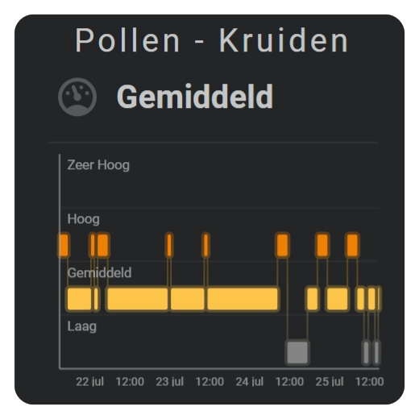

# Sparkline graphs

The sparkline section displays Home Assistant state history as a compact graph within the card layout. Choose the time period, level of detail, and chart type that best fits the entity. You can then enable axes, grid lines, labels, points, colors, and an interactive tooltip as needed.

|                                                          Area                                                         |                                                           Barcode - Audio                                                          |                                                                Bars                                                                |
| :-------------------------------------------------------------------------------------------------------------------: | :--------------------------------------------------------------------------------------------------------------------------------: | :--------------------------------------------------------------------------------------------------------------------------------: |
|     |        |                    |
|                                                          Dots                                                         |                                                              Equalizer                                                             |                                                             State band                                                             |
|  |  |  |

## :material-horseshoe: Basic usage

Add graphs to `layout.sparklines` and connect each one to an entity through `entity_index`.

```yaml linenums="1"
layout:
  sparklines:
    - entity_index: 0
      xpos: 50
      ypos: 50
      width: 80
      height: 35

      period:
        type: rolling_window
        rolling_window:
          duration:
            hour: 24
          bins:
            per_hour: auto
            density: medium

      sparkline:
        state_values:
          aggregate_func: avg
        show:
          chart_type: area
```

The entity index refers to the card-level `entities` list. Statistics and tooltip values use the formatting settings of the connected entity.

## :material-horseshoe: Choose a setup

Start by deciding what the graph should help you understand:

| Goal                                           | Recommended setup                                   |
| :--------------------------------------------- | :-------------------------------------------------- |
| Show the latest trend                          | Use `rolling_window` with a `line` or `area` chart. |
| Show today's progress                          | Use `calendar` with `offset: 0`.                    |
| Compare a completed day                        | Use `calendar` with a negative offset.              |
| Preserve short peaks                           | Increase the number of bins per hour.               |
| Show a calmer overall trend                    | Use fewer bins per hour with `aggregate_func: avg`. |
| Show threshold changes instead of exact height | Use `barcode` or `radial_barcode` with color stops. |
| Show when named states were active             | Use `state_bands` with a state map.                 |

For the current calendar period, the X-axis spans the full period while the graph fills up to the current time. A rolling window moves continuously and always shows the latest configured duration.

## :material-horseshoe: Chart types

| Chart type       | Geometry             | Typical use                                             |
| :--------------- | :------------------- | :------------------------------------------------------ |
| `line`           | Cartesian            | A compact view of changes over time.                    |
| `area`           | Cartesian            | A trend with a filled area for greater visual emphasis. |
| `dots`           | Cartesian            | One separate point for each time bin.                   |
| `bar`            | Cartesian            | One vertical bar for each time bin.                     |
| `equalizer`      | Binned levels        | A stacked level display for every bin.                  |
| `graded`         | Binned levels        | Grade-based or traffic-light-style values.              |
| `state_bands`    | Categorical timeline | The duration and transitions of mapped states.          |
| `barcode`        | Linear bins          | A dense color history without a Y-axis.                 |
| `radial_barcode` | Circular bins        | Time bins arranged around a circle.                     |

### Display support

| Chart type       | X-axis | Y-axis |   Grid  |      Axis labels     | Tooltip |
| :--------------- | :----: | :----: | :-----: | :------------------: | :-----: |
| `line`           |   Yes  |   Yes  | X and Y |        X and Y       |   Yes   |
| `area`           |   Yes  |   Yes  | X and Y |        X and Y       |   Yes   |
| `dots`           |   Yes  |   Yes  | X and Y |        X and Y       |   Yes   |
| `bar`            |   Yes  |   Yes  | X and Y |        X and Y       |   Yes   |
| `equalizer`      |   Yes  |   Yes  | X and Y |        X and Y       |    No   |
| `graded`         |   No   |   No   |    No   |          No          |    No   |
| `state_bands`    |   Yes  |   Yes  | X and Y | X times and Y states |   Yes   |
| `barcode`        |   Yes  |   No   |  X only |        X only        |   Yes   |
| `radial_barcode` |   No   |   No   |    No   |          No          |   Yes   |

Points can be added to line and area charts. Choose the standalone `dots` chart when every time bin should appear as an individual point without a connecting line.

Line, area, bar, grid, and axis behavior are described in [Cartesian Charts and Axes](sparkline-cartesian-charts.md). Equalizer, graded, state bands, barcode, and radial barcode charts are covered in [Specialized Charts](sparkline-specialized-charts.md).

## :material-horseshoe: Position and size

| Field          | Default | Description                                                                                               |
| :------------- | :------ | :-------------------------------------------------------------------------------------------------------- |
| `entity_index` |         | Selects the entity used by the graph.                                                                     |
| `xpos`         | `50`    | Positions the horizontal center in FHS card coordinates.                                                  |
| `ypos`         | `50`    | Positions the vertical center in FHS card coordinates.                                                    |
| `width`        | `25`    | Defines the graph width in FHS card coordinates.                                                          |
| `height`       | `25`    | Defines the graph height in FHS card coordinates.                                                         |
| `margin`       | `0`     | Reserves inner space around the graph; accepts one value or separate top, right, bottom, and left values. |
| `same_as`      |         | Reuses another sparkline definition.                                                                      |

Margins reserve space within the configured graph area. Cartesian labels and tick marks use this space. Increasing the graph’s outer size does not change the requested history period or number of bins.

## :material-horseshoe: Common sparkline fields

| Field                         | Description                                                              |
| :---------------------------- | :----------------------------------------------------------------------- |
| `period`                      | Chooses realtime, rolling-window, or calendar data.                      |
| `state_values`                | Controls aggregation, smoothing, value factors, and logarithmic display. |
| `show`                        | Chooses the chart type and which graph elements are visible.             |
| `line_color`                  | Defines graph colors when no entity color or color stop applies.         |
| `color_stops`                 | Defines value-based graph colors.                                        |
| `colorstops_transition`       | Uses hard or smooth transitions between color stops.                     |
| `tooltip.styles`              | Adjusts the appearance of the interactive tooltip.                       |
| `show.legend`                 | Shows one color marker and label for every declared series.                |
| `legend`                      | Positions and styles the separate legend area.                            |
| `line` and `area`             | Control the styling of line and area charts.                             |
| `state_map` and `state_bands` | Map named states and control the appearance of a state bands chart.      |

## :material-horseshoe: Show options

| Field                           | Description                                         |
| :------------------------------ | :-------------------------------------------------- |
| `chart_type`                    | Chooses the visible chart type.                     |
| `line`                          | Shows the line layer where supported.               |
| `area`                          | Shows the area layer where supported.               |
| `grid.x` and `grid.y`           | Display the automatic grid for each supported axis. |
| `axis.x` and `axis.y`           | Display each supported axis independently.          |
| `tickmarks.x` and `tickmarks.y` | Display tick marks for each supported axis.         |
| `labels.x` and `labels.y`       | Display labels for each supported axis.             |
| `points`                        | Adds one point for each graph bin.                  |
| `fill`                          | Chooses the supported fill or fade behavior.        |

Not every option is available for every chart type. Radial barcode charts, for example, use a circular layout and therefore do not display a conventional X-axis or vertical indicator.

For line, area, and bar charts, both axes are calculated automatically. Use the individual `x` and `y` settings to choose which elements are visible; there is no need to define tick intervals or scale boundaries manually.

Existing configurations that use a boolean value, such as `axis: true`, continue to display both supported axes.

## :material-horseshoe: Color stops and statistics

Each bin keeps the values needed to calculate its aggregate and statistics. The tooltip can display the bin’s date or time together with its minimum, average, and maximum values. Number formatting and units come from the connected entity.

Statistics and active graph settings can also be added to the card's `entities` list. This makes values such as the displayed minimum, selected history duration, automatically calculated bin size, and aggregation function available to ordinary states and texts. See [Sparkline values as entities](../core-concepts/entity-definitions.md#sparkline-values-as-entities) for the available names and a complete example.

Color stops may apply to an entire path or to individual bins, depending on the chart type. Barcode and radial barcode charts calculate a color for each bin, while line and area charts can use a gradient across the visible value range.

See [Color Stops](../core-concepts/color-stops.md) for reusable color definitions and transition modes.

## :material-horseshoe: Related documentation

* [Sparkline History Periods and Bins](sparkline-history-periods.md)
* [Sparkline Cartesian Charts and Axes](sparkline-cartesian-charts.md)
* [Sparkline Specialized Charts](sparkline-specialized-charts.md)
* [Entity Definitions](../core-concepts/entity-definitions.md)
* [Color Stops](../core-concepts/color-stops.md)
