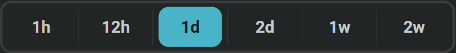
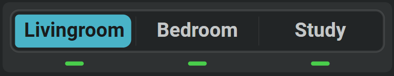
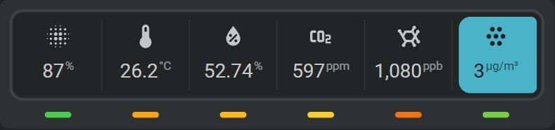

# FHS input select

An FHS input select adds a list of choices directly to a Flexible Horseshoe Card. Use it to choose a room, sensor, chart type, display style, history period, or any other named option used by the card.

The selected option is stored in the current browser and does not require a Home Assistant helper. Use a Home Assistant [Input select](https://www.home-assistant.io/integrations/input_select/) instead when automations, other dashboards, or other devices need the same selection.

An FHS input select can hold a single data item, of hold rich content such as icons, states, shapes, horseshoes and sparkline graphs.

Single item example:



Two items, text and indicator line example:




Multiple items, icon, state and indicator line example:



!!! note "The indicator line is shifted downwards in these two examples"
    That is part of the extended configuration settings. By default all content is equally positioned and spaced in the select control button.


## :material-horseshoe: Basic configuration

Add the input to the card's `entities` list. Its entity ID must start with `fhs_input_select.`.

```yaml linenums="1"
entities:
  - entity: fhs_input_select.chart_type
    options:
      - line
      - area
      - bar
      - dots
    initial: line
    scope: card
```

Connect a select control to the input:

```yaml linenums="1"
layout:
  controls:
    - id: chart-type
      type: select
      entity_index: 0
      xpos: 50
      ypos: 85
      width: 90
      height: 12
      show:
        item_variant: segmented
        item_viz: viz_button
        item_style: outlined_round
```

The control displays the options from the input and stores the selected option as its state. Add an `option_map` to the control only when you want to show different labels, icons, or richer content.

## :material-horseshoe: Configuration options

| Option | Description |
| --- | --- |
| `entity` | A unique entity ID starting with `fhs_input_select.`. |
| `options` | The list of values the user can choose from. |
| `initial` | Option selected when the input is created. The first option is used when omitted. |
| `scope: card` | Keeps a separate selection for this card. |
| `scope: global` | Shares the selection with FHS cards in the current browser. |
| `persist: true` | Restores a global selection after the browser reloads. |
| `name` | Name shown by tools that display the entity name. |
| `icon` | Icon shown by tools that display the entity icon. |

See [Entities](../../card-basics/entities.md) for slots and other entity settings.

!!! note

    Quote option names such as `on`, `off`, `yes`, and `no` when they must remain text values in YAML.

## :material-horseshoe: Use the selected option in a card

The selected option is available directly as the input state. This example lets the input choose the sparkline chart type:

```yaml linenums="1"
sparkline:
  show:
    chart_type: |
      [[[
        return entities[0].state;
      ]]]
```

The same pattern can select a room, switch between card layouts, or choose which sensor a card displays.

## :material-horseshoe: List of actions

A select control changes the selected option directly. Buttons and other actionable tools can use this action:

| Action | Result |
| --- | --- |
| `fhs_input_select.select_option` | Selects one option from the configured list. |

```yaml linenums="1"
tap_action:
  action: perform-action
  perform_action: fhs_input_select.select_option
  target:
    entity_id: fhs_input_select.chart_type
  data:
    option: area
```

## :material-horseshoe: Keep the selection after reloading

Use `scope: global` with `persist: true` when the selected option should remain active after reloading the dashboard:

```yaml linenums="1"
entities:
  - entity: fhs_input_select.chart_type
    options:
      - line
      - area
      - bar
      - dots
    initial: line
    scope: global
    persist: true
```

Every FHS card in the current browser that defines `fhs_input_select.chart_type` receives the same selection. Other browsers and devices keep their own selection.

## :material-horseshoe: Related

- [Select control](select-tool.md)
- [Browser-local inputs](browser-local-inputs.md)
- [JavaScript templates](../../dynamic/javascript-templates.md)
