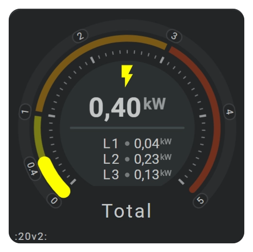

# Horseshoe gauges

The horseshoe section adds one or more circular or partial-circle gauges to the card layout. Each gauge combines a value scale with an active state layer and can include backgrounds, color stops, tick marks, and labels that follow the same geometry.

Horseshoes use the card coordinate system. On a `100 × 100` card, the position `50, 50` marks the center. Wider or taller cards can use coordinates above `100` along their longer dimension.

| The old and mighty Horseshoe | | |
| - | - | - |

| More advanced Horseshoes | | |
| - | - | - |
|  |  |  |
|  |  |  |
|  |  |  |

| Wide(r) cards showing textual states | |
| - | - |
|  |  |
|  |  |

## :material-horseshoe: Basic usage

Add gauges to `layout.horseshoes`, connect each one to an entity through `entity_index`, and define its numeric range under `horseshoe_scale`.

```yaml linenums="1"
layout:
  horseshoes:
    - entity_index: 0
      xpos: 50
      ypos: 50
      radius: 42
      arc_degrees: 260

      horseshoe_scale:
        min: 0
        max: 100

      horseshoe_state:
        width: 12
```

The entity index refers to the matching item in the card-level `entities` list. See [Entity Definitions](../../card-basics/entities.md) for details on configuring entities.

## :material-horseshoe: Horseshoe anatomy

A horseshoe consists of several layers that can be shown, hidden, and styled independently.

| Layer                | Configuration                                       | Purpose                                                        |
| :------------------- | :-------------------------------------------------- | :------------------------------------------------------------- |
| Horseshoe background | `horseshoe_background`                              | Adds an optional arc behind the full gauge.                    |
| Scale                | `horseshoe_scale`                                   | Defines the value range, geometry, width, and base appearance. |
| State                | `horseshoe_state`                                   | Shows the current entity value or mapped state.                |
| Tick background      | `horseshoe_tickmarks.background`                    | Adds an optional background behind the tick layer.             |
| Tick marks           | `horseshoe_tickmarks.ticks_major` and `ticks_minor` | Places numeric divisions along the scale.                      |
| Label background     | `horseshoe_labels.background`                       | Adds an optional background behind the labels.                 |
| Labels               | `horseshoe_labels`                                  | Places numeric values or mapped-state text around the scale.   |

Scale and state behavior are covered in [Horseshoe Scale and State](horseshoe-scale-and-state.md). For tick marks and labels, see [Horseshoe Tick Marks and Labels](horseshoe-tick-marks-and-labels.md).

## :material-horseshoe: Position and geometry

| Field              | Default                       | Description                                               |
| :----------------- | :---------------------------- | :-------------------------------------------------------- |
| `entity_index`     |                               | Selects an entity from the card-level `entities` list.    |
| `xpos`             | `50`                          | Positions the horizontal center in FHS card coordinates.  |
| `ypos`             | `50`                          | Positions the vertical center in FHS card coordinates.    |
| `radius`           | `45`                          | Defines the radius used by the scale and state layers.    |
| `tickmarks_radius` | `43`                          | Defines the base radius used for tick marks.              |
| `arc_degrees`      | `260`                         | Controls the total visible arc in degrees.                |
| `start_angle`      | Calculated from `arc_degrees` | Sets the angle at which the horseshoe begins.             |
| `bar_mode`         | `normal`                      | Chooses how the state arc grows across the scale.         |
| `zero_ratio`       | Calculated from the scale     | Sets the zero position for supported bidirectional modes. |
| `flip`             |                               | Flips the rendered layout along the selected axis.        |
| `same_as`          |                               | Reuses another horseshoe definition.                      |

A horseshoe can also inherit its position from a group. See [Positioning and Groups](../../card-basics/positioning-and-sizing.md) and [Groups Section](../../card-basics/groups.md).

## :material-horseshoe: Show options

Visibility and presentation settings are grouped under `show`.

| Field                  | Default | Description                                       |
| :--------------------- | :------ | :------------------------------------------------ |
| `horseshoe`            | `true`  | Shows or hides the entire horseshoe.              |
| `horseshoe_style`      | `fixed` | Chooses fixed or color-stop-based state coloring. |
| `horseshoe_background` | `none`  | Chooses the horseshoe background mode.            |
| `tickmarks`            |         | Shows the configured major and minor tick marks.  |
| `tick_background`      | `none`  | Chooses the tick background mode.                 |
| `labels_at`            | `none`  | Chooses which scale values receive a label.       |
| `label_background`     | `none`  | Chooses the label background mode.                |
| `label_badges`         |         | Shows label badges when they are configured.      |

Older configurations may still contain `ticks` or `scale_tickmarks`. New configurations should use the current horseshoe fields documented on these pages.

## :material-horseshoe: Color stops

Color stops can affect the horseshoe, backgrounds, tick marks, and labels. Use `colorstop` to display one color at a time, `colorstopgradient` to move through the configured colors at their numeric positions, or `lineargradient` to distribute all configured colors evenly over the rendered range.

```yaml linenums="1"
show:
  horseshoe_style: colorstopgradient

color_stops:
  colors:
    0: '#3498db'
    60: '#2ecc71'
    80: '#f1c40f'
    100: '#e74c3c'
```

Reusable definitions, light and dark mode colors, and transition behavior are explained in [Color Stops](../../appearance/color-stops.md).

## :material-horseshoe: Styling

Each horseshoe layer has its own `styles` collection, allowing the scale, state, backgrounds, ticks, and labels to be styled separately.

```yaml linenums="1"
horseshoe_scale:
  styles:
    - opacity: 0.35

horseshoe_state:
  styles:
    - opacity: 1
    - filter: drop-shadow(0 0 1px var(--primary-color))
```

Common SVG properties include `fill`, `stroke`, `stroke-width`, `opacity`, `fill-opacity`, and `stroke-opacity`. See [CSS Styling](../../appearance/styling.md) and [Color Filters](../../appearance/color-filters.md) for shared styling behavior.

## :material-horseshoe: Related documentation

* [Horseshoe Scale and State](horseshoe-scale-and-state.md)
* [Horseshoe Tick Marks and Labels](horseshoe-tick-marks-and-labels.md)
* [Color Stops](../../appearance/color-stops.md)
* [Animations](../../interaction/animations.md)
* [Reusable YAML Card Examples](../../reuse/reuse-introduction.md)
