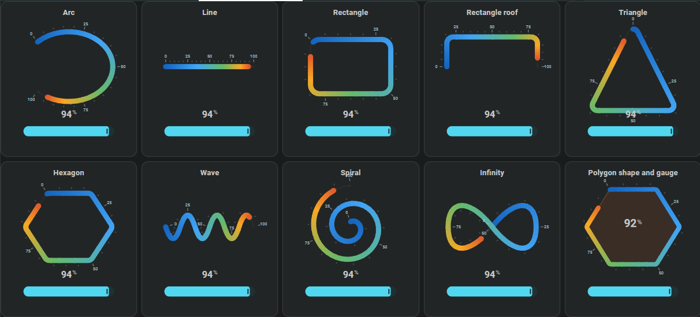

# Horseshoe path shapes

The visible path determines the shape a Horseshoe follows. An arc is the normal circular form, but the same value/progress can also follow a line, rectangle, polygon, wave, spiral, or infinity path.

This page shows how to choose a path shape, use only part of a closed path, change its direction and top position, and keep related paths aligned.



## :material-horseshoe: Choose a path

Set `path.type` to the shape you want:

```yaml linenums="1"
entities:
  - entity: sensor.example_1  # Entity used by this example

layout:
  horseshoes:
    - entity_index: 0  # Use entity 0 from entities: (0 = first entity)
      xpos: 50  # Horizontal position; 50 = center of the card
      ypos: 50  # Vertical position; 50 = center of the card

      path:
        type: polygon
        sides: 6  # Number of sides of the polygon
        width: 76  # Total outside width of the polygon path
        height: 66  # Total outside height of the polygon path
        radius: 4  # Round the polygon corners by 4 card units

      horseshoe_scale:
        min: 0  # Value at the start of the scale
        max: 100  # Value at the end of the scale
```
Supported path types are:

- `arc`
- `line`
- `rectangle`
- `polygon`
- `wave`
- `spiral`
- `infinity`

## :material-horseshoe: Use only part of a rectangle or polygon

Rectangle and polygon path positions are numbered clockwise. Use `start` and `end` to select the part of the path that should be used.

For a Rectangle:

- `0` — top-left
- `1` — top-right
- `2` — bottom-right
- `3` — bottom-left
- `4` — back at the top-left

Decimal values choose a point along the following side.

```yaml linenums="1"
entities:
  - entity: sensor.example  # Entity displayed by this Horseshoe

layout:
  horseshoes:
    - entity_index: 0  # Use the first entity configured above
      horseshoe_scale: {}  # Required scale block; uses the default 0–100 linear scale
      xpos: 50  # Horizontal center of the Horseshoe
      ypos: 50  # Vertical center of the Horseshoe
      path:
        type: rectangle
        width: 70  # Total outside width of the rectangle path
        height: 50  # Total outside height of the rectangle path
        start: 0.5
        end: 3.5
```
One simple numbered diagram is useful here; separate screenshots for every start/end combination are not necessary.

## :material-horseshoe: Change the direction

Use `direction` to choose which way the path is followed from `start` to `end`:

```yaml linenums="1"
entities:
  - entity: sensor.example  # Entity displayed by this Horseshoe

layout:
  horseshoes:
    - entity_index: 0  # Use the first entity configured above
      horseshoe_scale: {}  # Required scale block; uses the default 0–100 linear scale
      xpos: 50  # Horizontal center of the Horseshoe
      ypos: 50  # Vertical center of the Horseshoe
      path:
        type: rectangle
        width: 70  # Total outside width of the rectangle path
        height: 50  # Total outside height of the rectangle path
        start: 0.5
        end: 3.5
        direction: counterclockwise
```
Position numbering itself stays clockwise; direction only changes the route taken.

## :material-horseshoe: Choose what faces upward

Use `top` on Rectangle/polygon paths when a different corner or side should face the top of the card.

- `top: 0` puts corner `0` at the top.
- `top: 0.5` puts the middle of side `0` to `1` at the top.

## :material-horseshoe: Size and round a polygon

Use width and height to control the polygon footprint, and add a radius only when its corners should be softened.

```yaml linenums="1"
entities:
  - entity: sensor.example  # Entity displayed by this Horseshoe

layout:
  horseshoes:
    - entity_index: 0  # Use the first entity configured above
      horseshoe_scale: {}  # Required scale block; uses the default 0–100 linear scale
      xpos: 50  # Horizontal center of the Horseshoe
      ypos: 50  # Vertical center of the Horseshoe
      path:
        type: polygon
        sides: 6  # Number of sides of the polygon
        width: 76  # Total outside width of the polygon path
        height: 66  # Total outside height of the polygon path
        radius: 4  # Round the polygon corners by 4 card units
        top: 0.5
```
Use `width` and `height` for the outside size and `radius` to round the corners; `0` keeps them sharp.

## :material-horseshoe: Configure line, wave, spiral, and infinity paths

Each path type uses only the geometry that belongs to that shape. For example, a line uses length/angle, a wave uses wave count/amplitude, and a spiral uses its inner/outer radius, angular travel, and number of points.

Keep the shape settings together under `path:` so the complete path can be understood in one place.

## :material-horseshoe: Configuration options

Choose a path type first, then use only the geometry for that shape. This keeps each path locally understandable instead of mixing unrelated rectangle, polygon, wave, and spiral fields in one table.

### Choose the path type

| Field | Type | Required | Default | Description |
| --- | --- | :---: | --- | --- |
| `type` | `arc`, `line`, `rectangle`, `polygon`, `wave`, `spiral`, `infinity` | No | `arc` | Selects the visible path shape followed by the Horseshoe. |

### Arc path

| Field | Type | Required | Default | Description |
| --- | --- | :---: | --- | --- |
| `radius` | number | No | `45` | Radius when the arc is circular. |
| `radius_x` | number | No | `radius` | Horizontal radius; set this separately for an elliptical arc. |
| `radius_y` | number | No | `radius` | Vertical radius; set this separately for an elliptical arc. |
| `arc_degrees` | number | No | `260` | Amount of the circle that is used. Positive/negative values choose the angular direction. |
| `start_angle` | number | No | Calculated | Starting angle. When omitted, the card centers the default opening from `arc_degrees`. |

### Line path

| Field | Type | Required | Default | Description |
| --- | --- | :---: | --- | --- |
| `length` | number | No | `80` | Total length of the path. |
| `angle` | number | No | `0` | Rotates the line in degrees; `0` is horizontal. |

### Rectangle path

| Field | Type | Required | Default | Description |
| --- | --- | :---: | --- | --- |
| `width` | number | No | `80` | Outside width of the rectangle path. |
| `height` | number | No | `80` | Outside height of the rectangle path. |
| `radius` | number / mapping | No | `0` | Rounds all or selected corners; `0` keeps sharp corners. |
| `start` | number | No | `0` | Start position on the clockwise 0-to-4 rectangle numbering. |
| `end` | number | No | `4` | End position on the same numbering. |
| `top` | number | No | `0.5` | Path position that faces upward; `0.5` puts the middle of the top side at the top. |
| `direction` | `clockwise`, `counterclockwise` | No | `clockwise` | `clockwise` follows increasing side positions; `counterclockwise` travels the opposite way from `start` to `end` without changing the position numbering. |

### Polygon path

| Field | Type | Required | Default | Description |
| --- | --- | :---: | --- | --- |
| `sides` | integer | Yes | — | Number of sides; must be `3` or greater. |
| `width` | number | Yes | — | Outside width of the polygon path. |
| `height` | number | Yes | — | Outside height of the polygon path. |
| `radius` | number | No | `0` | Rounds the polygon corners; the maximum useful radius depends on its size and number of sides. |
| `start` | number | No | `0` | Start position on the clockwise polygon numbering. |
| `end` | number | No | `sides` | End position; the closing position equals the number of sides. |
| `top` | number | No | Even sides: `0.5`; odd sides: `0` | Chooses whether a side or corner normally faces upward. |
| `direction` | `clockwise`, `counterclockwise` | No | `clockwise` | `clockwise` follows increasing side positions; `counterclockwise` travels the opposite way from `start` to `end`. |

### Wave path

| Field | Type | Required | Default | Description |
| --- | --- | :---: | --- | --- |
| `length` | number | No | `80` | Total length from the start to the end of the wave. |
| `angle` | number | No | `0` | Rotates the complete wave; `0` is horizontal. |
| `waves` | number | No | `3` | Number of complete wave cycles. |
| `amplitude` | number | No | `8` | Distance the wave moves away from its center line. |

### Spiral path

| Field | Type | Required | Default | Description |
| --- | --- | :---: | --- | --- |
| `radius_inner` | number | No | `5` | Radius where the spiral starts. |
| `radius_outer` | number | No | `40` | Radius reached at the outer end. |
| `start_angle` | number | No | `-90` | Direction of the first spiral point in degrees. |
| `degrees` | number | No | `720` | Total angular travel; `720` is two full turns. |
| `points` | integer | No | `48` | Number of generated points used to form the spiral; more points make the curve finer. |

### Infinity path

| Field | Type | Required | Default | Description |
| --- | --- | :---: | --- | --- |
| `radius_x` | number | No | `40` | Horizontal size of each side of the infinity path. |
| `radius_y` | number | No | `25` | Vertical size of the infinity path. |

## :material-horseshoe: Related

- [Horseshoe overview](horseshoe-overview.md)
- [Value and progress](horseshoe-scale-and-state.md)
- [Polygon shape](../shapes/polygon-tool.md)
- [Rectangle shape](../shapes/rectangle-tool.md)
