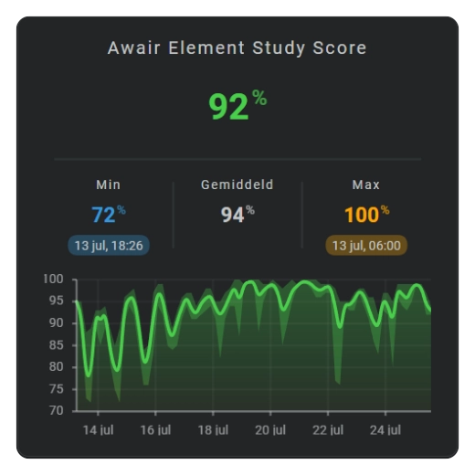

# Area chart

An area chart combines a trend line with a filled area. Use it when the magnitude of the value should have more visual weight.

It works well for temperature, humidity, power, air quality, and other continuous measurements where both direction and magnitude should be immediately visible.

<!-- Add an area chart screenshot here. -->


See: [Sparkline History Template Card #060]

  [Sparkline History Template Card #060]: https://github.com/AmoebeLabs/home-assistant-config/blob/master/lovelace/fhs_sys_templates/templates/51-cards/060-069/fhs-card-060-sensor-history-min-avg-max.yaml


## :material-horseshoe: Basic configuration

This example shows the average value over the latest 24 hours:

```yaml linenums="1"
layout:
  sparklines:
    - id: temperature-area
      entity_index: 0
      xpos: 50
      ypos: 50
      width: 80
      height: 35

      period:
        type: rolling_window
        rolling_window:
          duration:
            hour: 24
          bins:
            per_hour: auto
            density: medium

      sparkline:
        state_values:
          aggregate_func: avg
        show:
          chart_type: area
          line: true
          area: true
          fill: fade
```

## :material-horseshoe: Configuration options

| Option | Type | Required | Default | Description |
| --- | --- | --- | --- | --- |
| `show.chart_type` | string | No | `line` | Set to `area` to display an area chart. |
| `show.item_style` | string | No | `auto` | Chooses a fixed color, one color from the current state, or a gradient across the graph. |
| `show.line` | boolean | No | `true` | Shows or hides the line along the area. |
| `show.area` | boolean | No | `false` | Shows or hides the filled surface. |
| `show.fill` | string | No | solid | Uses a solid fill or `fade`. |
| `show.points` | boolean | No | `false` | Adds a point for every displayed interval. |
| `area.show.minmax` | boolean | No | `false` | Shows the minimum-to-maximum range in every interval. |
| `area.color_filter` | mapping | No | Not set | Adjusts the selected area color. |
| `area.minmax.color_filter` | mapping | No | Not set | Adjusts the min/max color independently from the area. |
| `line.line_width` | number | No | `1` | Sets the width of the trend line. |
| `state_values.smoothing` | boolean | No | `true` | Uses smooth or straight connections. |

## :material-horseshoe: Basic area chart

```yaml linenums="1"
sparkline:
  show:
    chart_type: area
    line: true
    area: true
```

## :material-horseshoe: Fade the fill

```yaml linenums="1"
sparkline:
  show:
    chart_type: area
    fill: fade
```

## :material-horseshoe: Show the value range

```yaml linenums="1"
sparkline:
  area:
    show:
      minmax: true
```

The range shows the minimum and maximum values represented by each time bin.

## :material-horseshoe: Choose the area color

Keep the area at one configured color with `fixed`:

```yaml linenums="1"
sparkline:
  show:
    chart_type: area
    item_style: fixed
  area:
    styles:
      fill: steelblue
```

Use `colorstop` or `colorstopinterpolated` when the complete area should follow the current entity state. Use `colorstopgradient` when the colors should follow the complete vertical value range.

```yaml linenums="1"
sparkline:
  show:
    chart_type: area
    item_style: colorstopgradient
  color_stops:
    colors:
      - value: 0
        color: green
      - value: 50
        color: orange
      - value: 100
        color: red
```

The area fill and its optional minimum-to-maximum range use the same selected color. A visible line uses its corresponding line paint. See [Color stops](../../appearance/color-stops.md).

Use `area.color_filter` to adjust the complete area color. Add `area.minmax.color_filter` when its minimum-to-maximum range needs a separate adjustment:

```yaml linenums="1"
area:
  color_filter:
    brightness: 1.2
  minmax:
    color_filter:
      brightness: 0.7
```

The area and min/max filters are independent. Filtering the area does not change the min/max range.

See [Color filters](../../appearance/color-filters.md) for all available adjustments.

## :material-horseshoe: Related

- [Line chart](line-chart.md)
- [Bar chart](bar-chart.md)
- [History periods and bins](sparkline-history-periods-and-bins.md)
