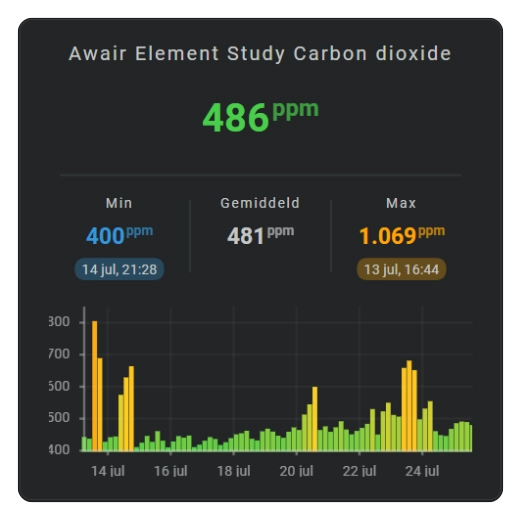

# Bar chart

A bar chart shows every time bin as a separate vertical bar. Positive and negative values extend from the zero line in opposite directions.

Use it for hourly energy, rainfall, production, counts, or another history where individual intervals should remain visually distinct.

<!-- Add a bar chart screenshot here. -->


See: [Sparkline History Template Card #060]

  [Sparkline History Template Card #060]: https://github.com/AmoebeLabs/home-assistant-config/blob/master/lovelace/fhs_sys_templates/templates/51-cards/060-069/fhs-card-060-sensor-history-min-avg-max.yaml

## :material-horseshoe: Basic configuration

This example shows one average value for every hour in the latest day:

```yaml linenums="1"
layout:
  sparklines:
    - id: hourly-values
      entity_index: 0
      xpos: 50
      ypos: 50
      width: 80
      height: 35

      period:
        type: rolling_window
        rolling_window:
          duration:
            hour: 24
          bins:
            per_hour: 1

      sparkline:
        state_values:
          aggregate_func: avg
        show:
          chart_type: bar
        bar:
          column_spacing: 0.5
```

## :material-horseshoe: Configuration options

| Option | Type | Required | Default | Description |
| --- | --- | --- | --- | --- |
| `show.chart_type` | string | No | `line` | Set to `bar` to display a bar chart. |
| `show.fill` | string | No | solid | Uses a solid fill or a separate `fade` for every bar. |
| `bar.orientation` | string | No | `vertical` | Uses `vertical` for history bars or `horizontal` for a real-time value bar. |
| `bar.column_spacing` | number | No | `1` | Sets the space between neighboring bars. |
| `state_values.aggregate_func` | string | No | `avg` | Chooses the value represented by each bar. |
| `bins.per_hour` | number or `auto` | No | `auto` | Chooses how many bars can appear within each hour. |
| `series[].color` | color | No | automatic palette | Gives each series a recognizable fixed color. |

!!! tip "Keep automatic bins"

    Leave `bins.per_hour` set to `auto` for normal use. Flexible Horseshoe Card then chooses a suitable bar interval automatically. Set a number only when you deliberately need a fixed number of bars per hour.

## :material-horseshoe: Basic bar chart

```yaml linenums="1"
sparkline:
  show:
    chart_type: bar

  bar:
    column_spacing: 0.5
```

## :material-horseshoe: Fade each bar

```yaml linenums="1"
sparkline:
  show:
    chart_type: bar
    fill: fade
```

The fade follows the length and direction of each bar.

## :material-horseshoe: Show a current value horizontally

A horizontal bar gives a current value a compact progress-style display. Use it with a `real_time` period; history bars remain vertical so their time bins stay aligned from left to right.

```yaml linenums="1"
layout:
  sparklines:
    - entity_index: 0
      xpos: 50
      ypos: 50
      width: 40
      height: 2

      period:
        type: real_time

      sparkline:
        show:
          chart_type: bar
        bar:
          orientation: horizontal
```

The value fills the configured width from left to right. Keep `orientation: vertical` when each historical time bin should appear as a separate bar.

## :material-horseshoe: Related

- [Area chart](area-chart.md)
- [Dots chart](dots-chart.md)
- [History periods and bins](sparkline-history-periods-and-bins.md)
- [Axes and grid](axes-and-grid.md)
