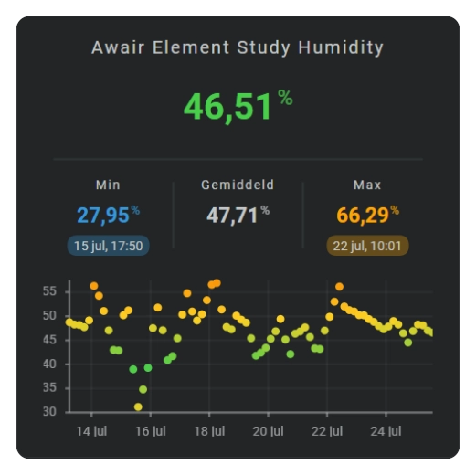

# Dots chart

A dots chart shows every time bin as a separate point without connecting the values.

Use it when individual observations matter more than a continuous trend or when gaps between values should remain visible.

<!-- Add a dots chart screenshot here. -->


## :material-horseshoe: Basic configuration

This example shows the latest day and lets FHS choose a suitable number of points:

```yaml linenums="1"
layout:
  sparklines:
    - id: humidity-dots
      entity_index: 0
      xpos: 50
      ypos: 50
      width: 80
      height: 35

      period:
        type: rolling_window
        rolling_window:
          duration:
            hour: 24
          bins:
            per_hour: auto
            density: medium

      sparkline:
        state_values:
          aggregate_func: avg
        show:
          chart_type: dots
        dots:
          radius: 1
```

## :material-horseshoe: Configuration options

| Option | Type | Required | Default | Description |
| --- | --- | --- | --- | --- |
| `show.chart_type` | string | No | `line` | Set to `dots` to display a dots chart. |
| `dots.radius` | number | No | `2` | Sets the radius of every point. |
| `state_values.aggregate_func` | string | No | `avg` | Chooses the value represented by each point, such as `avg`, `min`, or `max`. |
| `bins.per_hour` | number or `auto` | No | `auto` | Chooses how many points can appear within each hour. |
| `show.axis.x`, `show.axis.y` | boolean | No | `false` | Shows the time or value axis. |
| `show.labels.x`, `show.labels.y` | boolean | No | `false` | Shows labels along the enabled axes. |
| `series[].color` | color | No | automatic palette | Gives each series a recognizable fixed color. |

!!! tip "Keep automatic bins"

    Leave `bins.per_hour` set to `auto` for normal use. FHS then chooses a suitable interval from the graph width, duration, chart type, and `bins.density`. Set a number only when you deliberately need a fixed number of points per hour.

## :material-horseshoe: Basic dots chart

```yaml linenums="1"
sparkline:
  show:
    chart_type: dots

  dots:
    radius: 1
```

The history period and bins determine how many dots are shown.

## :material-horseshoe: Choose the detail level

Smaller dots allow more bins to remain readable. Larger dots emphasize individual values.

```yaml linenums="1"
sparkline:
  dots:
    radius: 0.75
```

## :material-horseshoe: Related

- [Line chart](line-chart.md)
- [Bar chart](bar-chart.md)
- [History periods and bins](sparkline-history-periods-and-bins.md)
