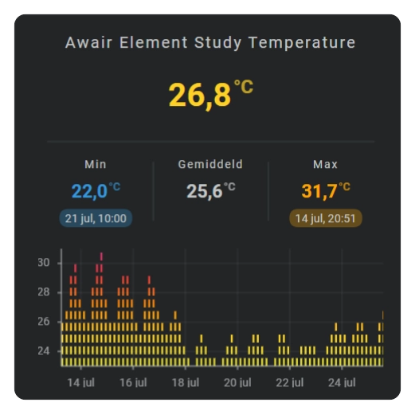

# Equalizer chart

An equalizer shows the height of every time bin as a stack of levels. Use it when you want a block-based view of numeric changes over time.

<!-- Add an equalizer chart screenshot here. -->


See: [Sparkline History Template Card #060]

  [Sparkline History Template Card #060]: https://github.com/AmoebeLabs/home-assistant-config/blob/master/lovelace/fhs_sys_templates/templates/51-cards/060-069/fhs-card-060-sensor-history-min-avg-max.yaml


## :material-horseshoe: Basic configuration

This example displays the latest 24 hours as ten stacked value levels:

```yaml linenums="1"
layout:
  sparklines:
    - id: temperature-equalizer
      entity_index: 0
      xpos: 50
      ypos: 50
      width: 80
      height: 35

      period:
        type: rolling_window
        rolling_window:
          duration:
            hour: 24
          bins:
            per_hour: auto
            density: medium

      sparkline:
        state_values:
          aggregate_func: avg
        show:
          chart_type: equalizer
        equalizer:
          value_buckets: 10
          square: false
          column_spacing: 1
          row_spacing: 1
```

## :material-horseshoe: Configuration options

| Option | Type | Required | Default | Description |
| --- | --- | --- | --- | --- |
| `show.chart_type` | string | No | `line` | Set to `equalizer` to display a numeric level chart. |
| `equalizer.value_buckets` | number | No | `10` | Chooses the number of vertical levels. |
| `equalizer.square` | boolean | No | `false` | Uses square or rounded level shapes. |
| `equalizer.column_spacing` | number | No | `1` | Sets the space between time intervals. |
| `equalizer.row_spacing` | number | No | `1` | Sets the space between vertical levels. |
| `color_stops` | mapping | No | none | Colors the displayed levels according to their value. |
| `colorstops_transition` | string | No | `smooth` | Uses `hard` or `smooth` transitions between colors. |

## :material-horseshoe: Basic equalizer

```yaml linenums="1"
sparkline:
  show:
    chart_type: equalizer

  equalizer:
    value_buckets: 10
    square: false
    column_spacing: 1
    row_spacing: 1
```

`value_buckets` chooses the number of vertical levels. Column and row spacing control the gaps between the blocks.

## :material-horseshoe: Add value colors

```yaml linenums="1"
sparkline:
  colorstops_transition: smooth
  color_stops:
    colors:
      0: "#42a5f5"
      20: "#66bb6a"
      30: "#f9a825"
      40: "#d32f2f"
```

Each displayed level follows the configured value colors.

## :material-horseshoe: Related

- [Graded chart](graded.md)
- [Color stops](../../appearance/color-stops.md)
- [History periods and bins](sparkline-history-periods-and-bins.md)
- [Axes and grid](axes-and-grid.md)
