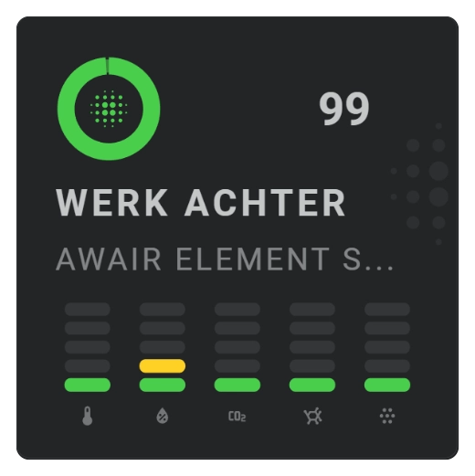

# Graded chart

A graded chart divides numeric history into ordered color bands. Use it when threshold ranges, such as an Awair score from poor to excellent, matter more than an exact numeric height.

<!-- Add a graded chart screenshot here. -->


## :material-horseshoe: Basic configuration

This example displays Awair score ranges over time:

```yaml linenums="1"
layout:
  sparklines:
    - id: awair-score
      entity_index: 0
      xpos: 50
      ypos: 50
      width: 80
      height: 35

      period:
        type: rolling_window
        rolling_window:
          duration:
            hour: 24
          bins:
            per_hour: auto
            density: medium

      sparkline:
        show:
          chart_type: graded
        graded:
          square: false
        color_stops:
          colors:
            - value: 0
              color: "#d32f2f"
            - value: 50
              color: "#ed8003"
            - value: 70
              color: "#f9a825"
            - value: 90
              color: "#66bb6a"
```

## :material-horseshoe: Configuration options

| Option | Type | Required | Default | Description |
| --- | --- | --- | --- | --- |
| `show.chart_type` | string | No | `line` | Set to `graded` to display ordered value ranges. |
| `graded.square` | boolean | No | `false` | Uses square or rounded grade shapes. |
| `color_stops.colors[].value` | number | Yes | - | Sets the lower bound of a value range. |
| `color_stops.colors[].color` | color | Yes | - | Chooses the visible color for that state. |
| `bins.per_hour` | number or `auto` | No | `auto` | Chooses how much history each displayed grade represents. |

!!! tip "Keep automatic bins"

    Leave `bins.per_hour` set to `auto` for normal use. Adjust `bins.density` when you want more or less detail without fixing the interval yourself.

## :material-horseshoe: Basic graded chart

```yaml linenums="1"
sparkline:
  show:
    chart_type: graded

  graded:
    square: false

  color_stops:
    colors:
      - value: 0
        color: "#d32f2f"
      - value: 50
        color: "#ed8003"
      - value: 70
        color: "#f9a825"
      - value: 90
        color: "#66bb6a"
```

Each `value` starts a new grade. List the values from low to high so the chart shows the ranges in the same order as the score.

## :material-horseshoe: When to use graded

Use a graded chart for air quality, pollen concentration, warnings, comfort levels, or another numeric scale with clear threshold ranges. Use an [equalizer](equalizer.md) when the graph should represent numeric height instead.

## :material-horseshoe: Related

- [Equalizer chart](equalizer.md)
- [State bands](state-bands.md)
- [Color stops](../../appearance/color-stops.md)
