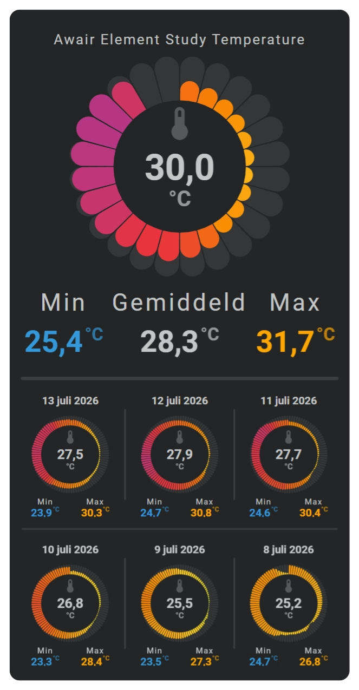

# Radial barcode chart

A radial barcode arranges colored time bins around a circle. Use it for compact circular history displays and clock-like daily views.

Like a linear barcode, color carries the value or state. The radial layout also lets you choose how each interval extends inward or outward and which shape it uses.

<!-- Add radial barcode variant screenshots here. -->




## :material-horseshoe: Basic configuration

This example arranges the latest 24 hours around a circular flower:

```yaml linenums="1"
layout:
  sparklines:
    - id: temperature-radial
      entity_index: 0
      xpos: 50
      ypos: 50
      width: 70
      height: 70

      period:
        type: rolling_window
        rolling_window:
          duration:
            hour: 24
          bins:
            per_hour: auto
            density: medium

      sparkline:
        show:
          chart_type: radial_barcode
          chart_variant: sunburst_outward
          chart_viz: flower
        radial_barcode:
          size: 15
          line_width: 0.02
          column_spacing: 0.2
        color_stops:
          colors:
            0: "#1565c0"
            18: "#42a5f5"
            24: "#66bb6a"
            28: "#f9a825"
            35: "#d32f2f"
```

## :material-horseshoe: Configuration options

| Option | Type | Required | Default | Description |
| --- | --- | --- | --- | --- |
| `show.chart_type` | string | No | `line` | Set to `radial_barcode` to display a radial barcode. |
| `show.chart_variant` | string | No | standard ring | Chooses alignment and inward or outward direction. |
| `show.chart_viz` | string | No | standard segment | Chooses the shape used for every interval. |
| `radial_barcode.size` | number | No | `5` | Sets the radial depth available to the intervals. |
| `radial_barcode.line_width` | number | No | `0` | Sets the stroke width used by the interval shapes. |
| `radial_barcode.column_spacing` | number | No | `1` | Sets the angular space between intervals. |
| `color_stops` | mapping | No | none | Assigns colors to numeric ranges or named states. |
| `bins.per_hour` | number or `auto` | No | `auto` | Chooses how many history intervals fit around the circle. |

!!! tip "Keep automatic bins"

    Leave `bins.per_hour` set to `auto` for normal use. Flexible Horseshoe Card then uses the available circumference, duration, and density to choose a suitable number of radial segments.

## :material-horseshoe: Basic radial barcode

```yaml linenums="1"
sparkline:
  show:
    chart_type: radial_barcode
    chart_variant: sunburst_outward
    chart_viz: flower

  radial_barcode:
    size: 15
    line_width: 0.02
    column_spacing: 0.2

  color_stops:
    colors:
      0: "#1565c0"
      18: "#42a5f5"
      24: "#66bb6a"
      28: "#f9a825"
      35: "#d32f2f"
```

## :material-horseshoe: Choose the chart appearance

Choose the chart type, then how values should occupy its ring, and finally the visible form of every segment.

{{ loop_video(
  "fhs-demo-card-sparkline-radial-barcode-showcase.webm",
  "Interactive Radial Barcode showcase build with Flexible Horseshoe Card in Home Assistant",
  "A complete demonstration of the Sparkline Radial Barcode chart possibilities.",
  "fhs-card-awair-selectable--dark.png",
  "2026-08-28",
  "PT0M20S",
  "720px") }}

### Chart

| `chart_type` value | Visible result |
| --- | --- |
| `radial_barcode` | Arranges the history around a circle. |

### Variant

| `chart_variant` value | Visible result |
| --- | --- |
| `fixed` | A regular ring: every segment has the same radial depth. |
| `sunburst` or `sunburst_centered` | Values grow equally toward the inside and outside of the ring. |
| `sunburst_outward` | Values grow outward from the inner edge of the ring. |
| `sunburst_inward` | Values grow inward from the outer edge of the ring. |

### Visualization

| `chart_viz` value | Visible result |
| --- | --- |
| `bar` | Straight radial bars. This is the normal barcode appearance. |
| `flower` | Rounded petal-like segments. |
| `flower2` | A second rounded flower appearance. |
| `rice_grain` | Rounded seed-like segments. |

Use the radial barcode showcase to compare the shapes and directions visually.

## :material-horseshoe: Related

- [Barcode](barcode.md)
- [Color stops](../../appearance/color-stops.md)
- [History periods and bins](sparkline-history-periods-and-bins.md)
- [Examples](../../examples/overview.md)
