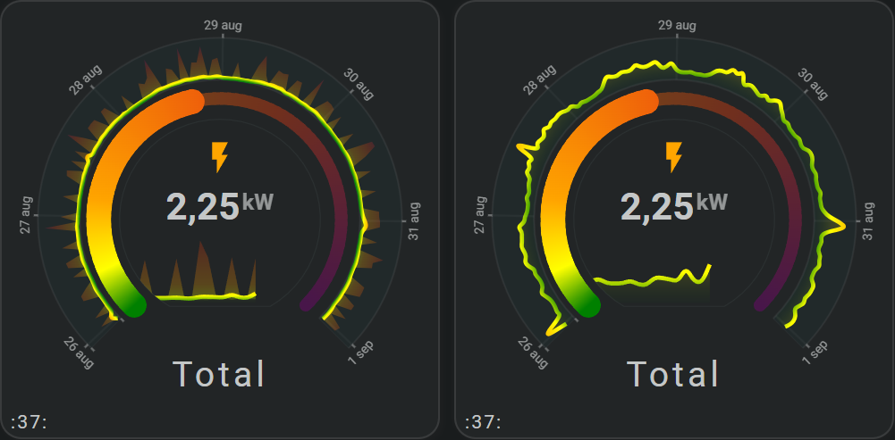

# Radial chart

A radial chart shows time around a circle or partial arc. The distance from the center represents the value, while the position along the arc represents time.

Choose a line for a continuous trend, an area for more visual weight, or dots for separate time bins. The same history periods, automatic bins, tooltips, series, axes, and value scales used by other sparkline charts remain available.

<!-- Add a radial line, area, and dots screenshot here. -->


## :material-horseshoe: Basic configuration

This example shows the latest 24 hours as a radial area chart:

```yaml linenums="1"
layout:
  sparklines:
    - id: temperature-radial
      entity_index: 0
      xpos: 50
      ypos: 50
      width: 80
      height: 80

      period:
        type: rolling_window
        rolling_window:
          duration:
            hour: 24
          bins:
            per_hour: auto
            density: medium

      sparkline:
        show:
          chart_type: radial
          chart_variant: area
          background: true
          line: true
          fill: fade

        radial:
          arc_degrees: 270
          rotate: -135
          size: 15
          background:
            styles:
              fill: var(--secondary-background-color)
              stroke: var(--divider-color)
              stroke-width: 0.5
              opacity: 0.3
```

## :material-horseshoe: Configuration options

| Option | Type | Required | Default | Description |
| --- | --- | --- | --- | --- |
| `show.chart_type` | string | No | `line` | Set to `radial` to display a radial chart. |
| `show.chart_variant` | string | No | `line` | Displays the history as `line`, `area`, or `dots`. |
| `radial.arc_degrees` | number | No | `360` | Sets how much of the circle is used, from more than `0` through `360` degrees. |
| `radial.rotate` | number | No | `0` | Rotates the start of the history around the center. |
| `radial.size` | number | No | `50` | Sets the radial width used between the minimum and maximum value. |
| `show.background` | boolean | No | `true` | Shows the radial plot background. |
| `radial.background.styles` | styles | No | theme colors | Sets the fill, stroke, stroke width, opacity, and other SVG styles of the background. |
| `show.line` | boolean | No | `true` | Shows or hides the line for line and area variants. |
| `show.fill` | string | No | solid | Uses a solid area fill or `fade`. |
| `line.show_minmax` | boolean | No | `false` | Shows the minimum-to-maximum range for every bin of a line variant. |
| `area.show_minmax` | boolean | No | `false` | Shows the minimum-to-maximum range for every bin of an area variant. |
| `dots.radius` | number | No | `2` | Sets the radius of dots and optional points. |
| `state_values.smoothing` | boolean | No | `true` | Uses smooth or straight line connections. |
| `bins.per_hour` | number or `auto` | No | `auto` | Chooses how many time bins fit along the configured arc. |
| `series[].color` | color | No | automatic palette | Gives each series a recognizable fixed color. |

!!! tip "Keep automatic bins"

    Leave `bins.per_hour` set to `auto` for normal use. Flexible Horseshoe Card uses the visible arc length, chart variant, duration, and density to choose a suitable interval.

## :material-horseshoe: Choose the appearance

| `chart_variant` value | Visible result |
| --- | --- |
| `line` | Connects the values around the arc. |
| `area` | Fills the space between the value line and the visible zero value. |
| `dots` | Shows one separate point for every time bin. |

An area can keep its outline and fade toward the zero value:

```yaml linenums="1"
sparkline:
  show:
    chart_type: radial
    chart_variant: area
    line: true
    fill: fade
```

## :material-horseshoe: Show the value range

A line or area can show the complete range represented by every time bin. Use the setting that belongs to the selected variant:

=== "Line"

    ```yaml linenums="1"
    sparkline:
      show:
        chart_type: radial
        chart_variant: line

      line:
        show_minmax: true
    ```

=== "Area"

    ```yaml linenums="1"
    sparkline:
      show:
        chart_type: radial
        chart_variant: area

      area:
        show_minmax: true
    ```

## :material-horseshoe: Choose the arc

`arc_degrees` changes the visible span. `rotate` moves its starting point without changing the history or bins.

```yaml linenums="1"
sparkline:
  radial:
    arc_degrees: 180
    rotate: -90
```

Use `360` for a complete circle. A value of `180` creates a half-circle, and `270` leaves room for content or controls below the chart.

## :material-horseshoe: Choose the radial width

`size` controls how much space the values use toward the center. A smaller value keeps the complete chart in a narrow ring, which is useful inside or alongside a horseshoe.

```yaml linenums="1"
sparkline:
  radial:
    size: 15
```

The maximum value stays at the outside of the chart. The minimum value moves to the inside edge of the configured ring.

## :material-horseshoe: Show axes and labels

The X-axis follows time around the outer arc. The Y-axis runs from the center toward the edge.

```yaml linenums="1"
sparkline:
  show:
    chart_type: radial
    chart_variant: line
    grid:
      x: true
      y: true
    axis:
      x: true
      y: true
    tickmarks:
      x: true
      y: true
    labels:
      x: true
      y: true
```

Hide `labels.y` when the values should use the complete radial width. The grid, axis, and tick marks can remain visible and evenly spaced.

```yaml linenums="1"
sparkline:
  show:
    grid:
      y: true
    tickmarks:
      y: true
    labels:
      y: false
```

See [Axes and grid](axes-and-grid.md#use-the-complete-value-range) for the same choice on other sparkline charts.

## :material-horseshoe: Compare several series

All series in one radial chart share the arc, time bins, tooltip, and drawing area. Each series can choose its own radial appearance and color.

```yaml linenums="1"
sparkline:
  show:
    chart_type: radial
    chart_variant: line
    legend: true

series:
  - id: temperature
    entity_index: 0
    name: Temperature
    color: "#42a5f5"

  - id: humidity
    entity_index: 1
    name: Humidity
    color: "#66bb6a"
    y_axis_id: secondary
    sparkline:
      show:
        chart_variant: dots
      dots:
        radius: 0.75
```

Use only radial variants within one radial series list. See [Multiple series](multiple-series.md) for names, legends, period offsets, and Y-axis choices.

## :material-horseshoe: Related

- [Radial barcode](radial-barcode.md)
- [History periods and bins](sparkline-history-periods-and-bins.md)
- [Multiple series](multiple-series.md)
- [Axes and grid](axes-and-grid.md)
