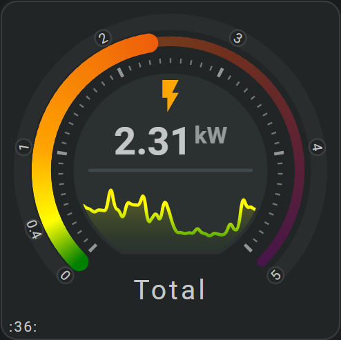
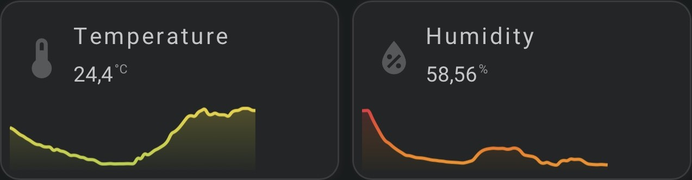
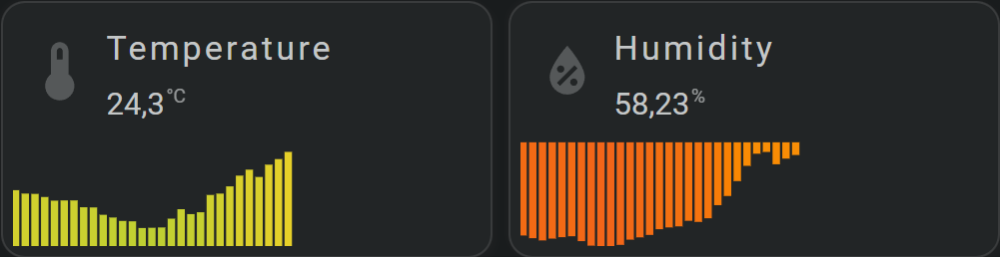
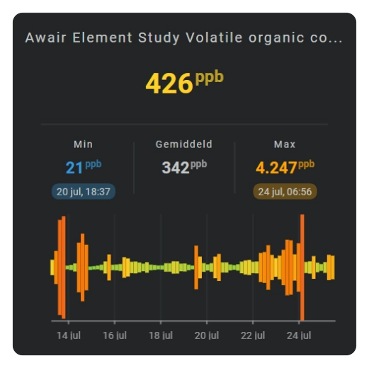

# Sparkline graphs

A Sparkline shows how an entity changed over time inside a card. You choose which history period to show and how that history should be drawn, from a minimal line or area to bars, color bands, radial graphs, and other chart forms.

This page builds a basic Sparkline and introduces the main Sparkline topics: history periods, chart types, multiple series, axes and labels, and day/night information.

### From a minimal Sparkline...

An area sparkline over a 24 hour period as part of a horseshoe:



An area sparkline from today as period as part of a simple card with icon, name and state:



An bars sparkline (Card #062) from today as period as part of a simple card with icon, name and state:




### ...to graphs with more information

Sparklines can also show axes, labels, multiple series, day/night information, value ranges, and several different graph forms.

| Area | Barcode | Bars |
| :---: | :---: | :---: |
|  |  |  |
| Dots | Equalizer | State bands |
|  |  |  |

## :material-horseshoe: Add a basic Sparkline

A basic Sparkline turns one entity’s recent history into a compact graph inside the card.

```yaml linenums="1"
entities:
  - entity: sensor.living_room_temperature  # Home Assistant entity used by this card

layout:
  sparklines:
    - id: temperature-history  # Name this item so it can be referenced later
      entity_index: 0  # Use the first entity configured above
      xpos: 50  # Horizontal position; 50 = center of the card
      ypos: 50  # Vertical position; 50 = center of the card
      width: 80  # Width of the graph
      height: 35  # Height of the graph

      period:
        type: rolling_window  # Always show the latest moving time range
        rolling_window:
          duration:
            hour: 24  # Show 24 hours of history
          bins:
            per_hour: auto  # Let the card choose a readable time interval automatically
            density: medium  # Choose low, medium, or high detail when intervals are automatic

      sparkline:
        state_values:
          aggregate_func: avg  # Use the avg value from each time interval
        show:
          chart_type: line  # Draw the history as a connected line
```

This shows the latest 24 hours as a line. The card chooses a suitable interval automatically.

## :material-horseshoe: Choose the history period

Use the period that matches the history you want to see:

- latest 24 hours or another moving range;
- today;
- yesterday or another earlier calendar period;
- realtime/current value only;
- more or less detail inside the same period.

See [History period](sparkline-history-periods-and-bins.md).

## :material-horseshoe: Choose how the graph is shown

The chart type changes the visual form, not the entity or period.

| `sparkline.show.chart_type` | What it shows |
| --- | --- |
| `line` — [Line](line-chart.md) | A connected trend line. |
| `area` — [Area](area-chart.md) | A trend with a filled area. |
| `bar` — [Bar](bar-chart.md) | One bar per interval. |
| `dots` — [Dots](dots-chart.md) | One point per interval. |
| `equalizer` — [Equalizer](equalizer.md) | Stacked value levels. |
| `state_bands` — [State bands](state-bands.md) | Named states over time. |
| `graded` — [Graded](graded.md) | Ordered value grades/ranges. |
| `barcode` — [Barcode](barcode.md) | Color-coded history without a value height. |
| `radial` — [Radial](radial-chart.md) | Line, area, or dots around an arc. |
| `radial_barcode` — [Radial barcode](radial-barcode.md) | Color-coded history around a circle. |

## :material-horseshoe: Show multiple series

Use `series:` when one graph should contain several entities or several periods from the same entity. In that form the history sources are defined inside `series`, so the top-level `entity_index` used by a single-source Sparkline is not needed.

See [Multiple series](multiple-series.md) for names, colors, legends, period overrides, and Y-axes.

## :material-horseshoe: Add axes, grid, and labels

Axes are optional. Add only the parts that help read the graph:

```yaml linenums="1"
entities:
  - entity: sensor.temperature  # Entity whose history is graphed

layout:
  sparklines:
    - xpos: 50  # Horizontal center of the graph
      ypos: 50  # Vertical center of the graph
      width: 80  # Graph width in card coordinates
      height: 35  # Graph height in card coordinates
      entity_index: 0  # Use the first entity configured above
      sparkline:
        show:
          chart_type: line  # Draw the history as a connected line
          grid:
            x: true  # Show time-grid lines
            y: true  # Show value-grid lines
          axis:
            x: true  # Show the time axis
            y: true  # Show the value axis
          tickmarks:
            x: true  # Show tick marks on the time axis
            y: true  # Show tick marks on the value axis
          labels:
            x: true  # Show labels on the time axis
            y: true  # Show labels on the value axis
```
See [Axes and grid](axes-and-grid.md).

## :material-horseshoe: Show day and night

Add daylight/nighttime as a background or separate band when that helps explain a daily pattern. See [Day and night](day-and-night.md).

## :material-horseshoe: Use Sparkline values elsewhere in the card

A Sparkline can make calculated values available to other tools in the same card. Add the values you want to `entities:` as `fhs_sparkline.*` entities, then use their `entity_index` like any other entity configured for the card.

These are **FHS-generated entities**. They exist only inside the card and are not Home Assistant entities.

For a Sparkline with `id: temperature_history`, the entity name is built from the Sparkline ID and the value you want to use:

```yaml linenums="1"
entities:
  - entity: sensor.temperature  # Home Assistant entity whose history is shown by the Sparkline
  - entity: fhs_sparkline.temperature_history_min  # FHS entity containing the Sparkline minimum
  - entity: fhs_sparkline.temperature_history_avg  # FHS entity containing the Sparkline average
  - entity: fhs_sparkline.temperature_history_max  # FHS entity containing the Sparkline maximum

layout:
  sparklines:
    - id: temperature_history  # This ID becomes part of each fhs_sparkline entity name
      entity_index: 0  # Use sensor.temperature as the Sparkline history source

  states:
    - entity_index: 1  # Show the generated minimum value
      xpos: 20  # Horizontal position; 50 = center of the card
      ypos: 85  # Vertical position; 50 = center of the card
    - entity_index: 2  # Show the generated average value
      xpos: 50  # Horizontal position; 50 = center of the card
      ypos: 85  # Vertical position; 50 = center of the card
    - entity_index: 3  # Show the generated maximum value
      xpos: 80  # Horizontal position; 50 = center of the card
      ypos: 85  # Vertical position; 50 = center of the card
```

The available value suffixes are:

| Suffix | Value |
| --- | --- |
| `min` | Lowest value in the Sparkline data. |
| `avg` | Average value in the Sparkline data. |
| `max` | Highest value in the Sparkline data. |
| `min_time` | Time at which the minimum value occurs. |
| `max_time` | Time at which the maximum value occurs. |
| `duration` | Duration of the active historical period. |
| `bin_duration` | Duration represented by one displayed history bin. |
| `aggregate_func` | Aggregation function used for the history bins, such as `avg`, `min`, or `max`. |

### Values from an explicit series

When the Sparkline contains a `series:` list, each series has its own `id`. That series ID is added between the Sparkline ID and the value suffix.

This example defines a series with `id: bedroom` and exposes its minimum as `fhs_sparkline.room_history_bedroom_min`:

```yaml linenums="1"
entities:
  - entity: sensor.living_room_temperature  # History source for the first series
  - entity: sensor.bedroom_temperature  # History source for the second series
  - entity: fhs_sparkline.room_history_bedroom_min  # FHS entity containing the bedroom-series minimum

layout:
  sparklines:
    - id: room_history  # Sparkline ID used in the generated FHS entity name
      series:
        - id: living_room  # First series ID
          entity_index: 0  # Use sensor.living_room_temperature
        - id: bedroom  # Second series ID
          entity_index: 1  # Use sensor.bedroom_temperature

  states:
    - entity_index: 2  # Show the generated minimum for the bedroom series
      xpos: 50  # Horizontal position; 50 = center of the card
      ypos: 85  # Vertical position; 50 = center of the card
```

The naming pattern for an explicit series is `fhs_sparkline.<sparkline_id>_<series_id>_<value>`.

See [Multiple series](multiple-series.md) for how to configure series themselves.

## :material-horseshoe: Configuration reference

A Sparkline can get its history from one top-level entity or from an explicit `series` list. Keep those two entry methods separate; after the history source is chosen, the same graph options apply to both.

### One history source

| Field | Type | Required | Default | Description |
| --- | --- | :---: | --- | --- |
| `entity_index` | entity index | No | `0` | Entity whose history is shown; for a single-source Sparkline, omitting this field uses the first configured entity. |

### Multiple history sources or periods

| Field | Type | Required | Default | Description |
| --- | --- | :---: | --- | --- |
| `series` | list | Yes | — | Defines two or more graph series, or several periods of the same entity. Each series contains its own source/settings. |

### Options for every Sparkline

| Field | Type | Required | Default | Description |
| --- | --- | :---: | --- | --- |
| `xpos` | number | No | `50` | Horizontal position of the graph center. |
| `ypos` | number | No | `50` | Vertical position of the graph center. |
| `width` | number | No | `25` | Graph width. |
| `height` | number | No | `25` | Graph height. |
| `margin` | number / mapping | No | `0` | Adds space between the graph data and the graph area's edges when labels or marks need room. |
| `period` | mapping | No | Calendar / 24 hours | Chooses which history range is loaded and how it is divided into intervals. |
| `sparkline` | mapping | No | Defaults applied | Chooses chart type, value aggregation, colors, and chart-specific appearance. |
| `x_axis` | mapping | No | Default axis appearance | Configures the time axis when it is shown. |
| `y_axis` | mapping | No | Default axis appearance | Configures the value axis when it is shown. |
| `sparkline.legend` | mapping | No | Hidden | Configures the series legend; `sparkline.show.legend` makes it visible. |
| `same_as` | string | No | Not set | Reuses another Sparkline definition and lets this item override only the differences. |

## :material-horseshoe: Related documentation

- [History period](sparkline-history-periods-and-bins.md)
- [Chart types](#choose-how-the-graph-is-shown)
- [Multiple series](multiple-series.md)
- [Axes and grid](axes-and-grid.md)
- [Day and night](day-and-night.md)
- [Color stops](../../appearance/color-stops.md)
