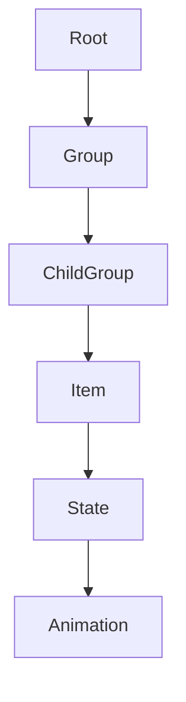
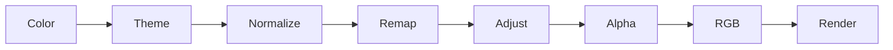

# Flexible Horseshoe Card

# Color Engine Architecture (Draft v2)

> Architecture Decision Document (ADD)

---

# 1. Vision

The Color Engine provides a generic, browser-independent way to resolve and transform
colors for every visual element inside the Flexible Horseshoe Card.

Instead of depending on CSS filters, all transformations are performed internally
using Culori (OKLCH / OKLab).

Goals:

- One color system
- One inheritance model
- One processing pipeline
- Theme awareness
- Browser independence
- Reusable everywhere

---

# 2. Core Principles

- Colors are semantic data, not CSS effects.
- `color_filter` follows the same cascade model as `styles`.
- Users describe _what_ they want.
- The engine decides _how_ to process it.
- Rendering always receives resolved RGB colors.

---

# 3. Hierarchy

```text
Root Configuration
        ↓
Group
        ↓
Child Group
        ↓
Item
        ↓
State / Segment
        ↓
Animation
```

Root behaves as the visual root context.

No dedicated `card:` object is required.

---

# 4. Cascade

Each level may:

- inherit parent filters
- disable inheritance
- add filters
- override filters

Example:

```yaml
color_filter:
  monochrome: '#2B93A6'

groups:
  warning:
    color_filter:
      inherit: false
```

---

# 5. Processing Pipeline

```text
Resolve source color
        ↓
Resolve theme mode
        ↓
Normalize
        ↓
Remap
        ↓
Adjustments
        ↓
Opacity
        ↓
Convert to RGB
        ↓
Render
```

Pipeline order is internal and fixed.

Users never configure processing order.

---

# 6. Theme Modes (already implemented)

Extended color stop definitions may support multiple modes.

```yaml
color_stops:
  modes:
    light:
      - value: 0
        color: green
      - value: 100
        color: red

    dark:
      - value: 0
        color: red
      - value: 100
        color: green
```

Selection:

```
hass.themes.darkMode
```

# Specific for fill and stroke for example

Select per property that the filter should apply to.
But what about if you want the filter to apply to all colors. So color, fill, stroke, ? more?

```yaml
color_filter:
  fill:
    grayscale: 1

  stroke:
    saturation: 0.4
```

```Javascript
applyColorFilterToStyle(styles, colorFilter) {
  for (const [property, filter] of Object.entries(colorFilter)) {
    styles[property] = applyColorFilter(styles[property], filter);
  }
}
```

---

# 7. Built-in Filters

## Grayscale

Convert colors to grayscale.

- grayscale mapping
- custom lightness range

same question as before> separate lightness and lightness_map, or support both forms, dus as grayscale.

```yaml
grayscale: 1
lightness_map:
  min: 0.25
  max: 0.85
```

## Monochrome

```yaml
color_filter:
  monochrome: '#2B93A6'
```

Preserve relative lightness.

Use cases:

- branding
- print
- simplified dashboards

## Duotone

```yaml
color_filter:
  duotone:
    dark: '#1B4965'
    light: '#C2E7F0'
```

Preserve relative lightness while mapping every color
between two selected colors.

## Theme Monochrome

```yaml
color_filter:
  theme_monochrome: primary
```

## Theme Duotone

```yaml
color_filter:
  theme_duotone:
    dark: primary
    light: accent
```

---

# 8. Adjustments

May be combined freely.

```yaml
color_filter:
  brightness: 1.1
  contrast: 1.05
  saturation: 0.8
  opacity: 0.7
```

The engine always applies them in a consistent order.

---

# 9. Groups

Groups become visual contexts.

```yaml
groups:
  energy:
    color_filter:
      monochrome: '#2B93A6'

  warning:
    color_filter:
      inherit: false
```

This allows complete visual zones to share behavior.

---

# 10. Root Configuration

Root styles and root color filters act as the card context.

```yaml
styles: ...

color_filter:
  monochrome: '#2B93A6'
```

---

# 11. Recipes

## Monochrome

```yaml
color_filter:
  monochrome: '#2B93A6'
```

## Duotone

```yaml
color_filter:
  duotone:
    dark: '#1B4965'
    light: '#C2E7F0'
```

## Grayscale setting and mapping

```yaml
color_filter:
  grayscale: 0.4
```

```yaml
color_filter:
  grayscale_map:
    min: 0.25
    max: 0.85
```

or, if possible combined, so always named grayscale. Which can be a numerical value, and a min/max map.

## Exclude one group

```yaml
groups:
  warning:
    color_filter:
      inherit: false
```

## Theme aware color stops

```yaml
color_stops:
  modes:
    light:
      - value: 0
        color: green

    dark:
      - value: 0
        color: red
```

---

# 12. Future Filters

- grayscale
- grayscale mapping
- monochrome
- duotone
- theme monochrome
- theme duotone
- brightness
- contrast
- saturation
- hue rotation
- opacity
- tint
- invert

---

# 13. Mermaid





---

# 14. Implementation Notes

- Cache resolved colors.
- Rebuild on theme changes.
- Rebuild color stops when modes change.
- Render layer never performs defaults.
- Render layer only consumes resolved colors.

---

# 15. Summary

The Color Engine provides a generic color architecture with:

- one cascade
- one processing pipeline
- theme awareness
- browser independence
- reusable transformations
- support for branding, accessibility and advanced visualization.
